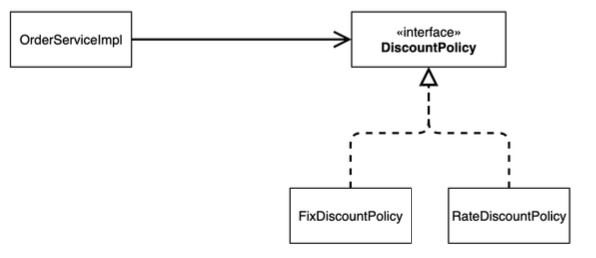
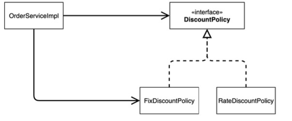
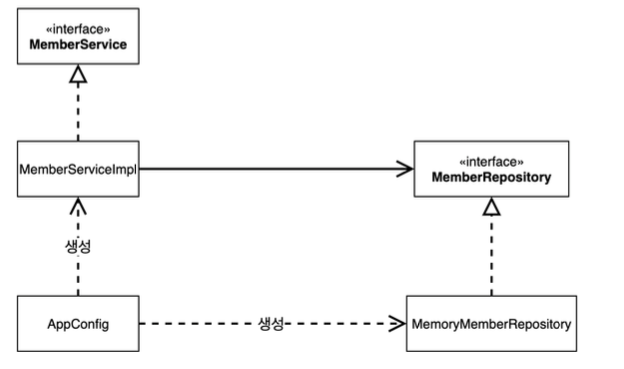
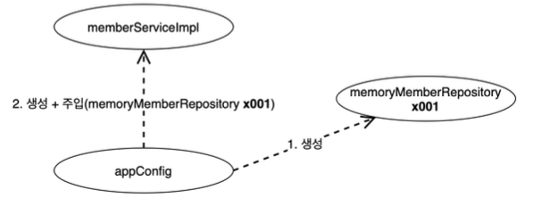
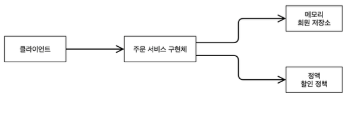

# extends project

~~~java
 public class OrderServiceImpl implements OrderService {
 //    private final DiscountPolicy discountPolicy = new FixDiscountPolicy();
     private final DiscountPolicy discountPolicy = new RateDiscountPolicy();
 }
~~~

**문제**

* 역할과 구현 분리 -> o
* 다형성 활용, 인터페이스 구현 객체 분리 -> o
* OCP, DIP -> x
* DIP 클라이언트는 인터페이스에 의존한것 같은데 ?
    * 실제로는 인터페이스와 구현 클래스에도 의존한다.
* OCP변경 x 확장 o
    * 코드는 기능을 확장해서 변경하려면, 클라이언트 코드에 영향을 준다.

**기대했던 의존 관계**

**실제 의존 관계**

-> 클라이언트인 orderServiceImpl이 DiscountPolicy에도 의존하고 FixDiscount(구현객체)에도 의존하고 있다.

## DIP

~~~java
 public class OrderServiceImpl implements OrderService {
     //private final DiscountPolicy discountPolicy = new RateDiscountPolicy();
     private DiscountPolicy discountPolicy;
}
~~~

* 이렇게 선언하면 Null pointer exception이 발생한다.
-> 누군가가 클라이언트인 orderserviceImpl에 DiscountPolicy의 구현 객체를 대신 생성해주고 주입해주어야 된다.

## 관심사 분리

공연에 예를 들어보면 극중에서 맡은 역할을 하는 배우가 상대 배우까지 섭외하는 일을 하고 있는 것이다. 2가지 역할 및 책임을 지고 있는 배우의 역할 및 책임을 분담 시켜줄 필요가 있다.

**AppConfig 등장**

애플리케이션의 전체 동작 방식을 구성(config)하기 위해, **구현 객체를 생성**하고, **연결**하는 책임을 가지는 별도의 설정 클래스를 만들자.

~~~java
package hello.core.member;
 public class MemberServiceImpl implements MemberService {
     private final MemberRepository memberRepository;
     public MemberServiceImpl(MemberRepository memberRepository) {
         this.memberRepository = memberRepository;
}
     public void join(Member member) {
         memberRepository.save(member);
}
     public Member findMember(Long memberId) {
         return memberRepository.findById(memberId);
} }
~~~

* Appconfig는 구현 객체를 생성한다.
* Appconfig는 생성한 객체 인스턴스의 레퍼런스를 constructor를 통해서 injection해준다.

❗️`MemberServiceImpl` 은 이제부터 **의존관계에 대한 고민은 외부**에 맡기고 **실행에만 집중**하면 된다.

class diagram

* DIP 완성: Impl은 repo인 추상에만 의존하면 된다.
* 객체를 생성하고 연결하는 역할과 실행하는 역할이 명확히 분리

instance diagram

수정된 코드 상황

~~~java
  private final MemberRepository memberRepository;
     private final DiscountPolicy discountPolicy;
     public OrderServiceImpl(MemberRepository memberRepository, DiscountPolicy
 discountPolicy) {
         this.memberRepository = memberRepository;
         this.discountPolicy = discountPolicy;
     }
 AppConfig appConfig = new AppConfig();
         MemberService memberService = appConfig.memberService();
         OrderService orderService = appConfig.orderService();
~~~

* AppConfig는 공연 기획자이다.
* 이제 각 배우들은 담당 기능을 실행하는 책임만 지면 된다.

### IoC,DI,container

#### IOC(inversion of control)

* 기존 프로그램은 클라이언트 구현 객체가 스스로 필요한 서버 구현 객체를 생성, 연결, 실행 -> 구현 객체가 조종

* AppConfig 등장 후 구현 객체는 자신의 로직을 실행하는 역할만 담당.

* 모든 제어권은 AppConfig만 가지고 있다. OrderServiceImpl도 AppConfig가 생성.
AppConfig는 OrderService의 다른 구현 객체를 생성하고 실행 가능(OrderImpl이 아니어도 된다.)

* 외부에서 관리하는 것을 제어의 역전

#### DI

* OrderServiceImpl은 DiscountPolicy 인터페이스에 의존

* 의존관계는 정적인 클래스 의존 관계와, 실행 시점에 결정되는 동적인 의존 관계를 분리해서 생각해야됨

**정적인 클래스 의존**
import만 보고 판단할 수 있다.

**동적인 클래스 의존**
실제 생성된 객체 인스턴스의 참조가 연결된 의존 관계

* 런타임에 외부에서 실제 구현 객체를 생성하고 클라이언트에 전달해서 클라이언트와 서버의 실제 의존관계가 연결되는 것을 의존관계 주입

#### IOC 컨테이너, DI 컨테이너

* AppConfig 처럼 객체를 생성하고 관리, 의존 관계 mapping해 주는것을 **DI container**라고 부른다

~~~java
@Configuration
public class AppConfig {
    @Bean
    public MemberService memberService() {
        return new MemberServiceImpl(memberRepository());
    }
    @Bean
    public OrderService orderService() {
        return new OrderServiceImpl(
                memberRepository(),
                discountPolicy());
}
    @Bean
    public MemberRepository memberRepository() {
        return new MemoryMemberRepository();
    }
    @Bean
    public DiscountPolicy discountPolicy() {
        return new RateDiscountPolicy();
    }
~~~

spring을 사용하면 이런 식으로 구현하면 된다.

~~~java
        ApplicationContext applicationContext = new
AnnotationConfigApplicationContext(AppConfig.class);
        MemberService memberService =
applicationContext.getBean("memberService", MemberService.class);
        OrderService orderService = applicationContext.getBean("orderService",
OrderService.class);
   ApplicationContext applicationContext = new
 AnnotationConfigApplicationContext(AppConfig.class);
         MemberService memberService =
 applicationContext.getBean("memberService", MemberService.class);
~~~

**스프링 컨테이너**
* `ApplicationContext` 를 스프링 컨테이너라 한다.
* 기존에는 AppConfig를 사용해서 직접 객체를 생성하고 DI했지만, 이제는 스프링 컨테이너를 사용한다.

* @Bean이라 적힌 메서드를 모두 호출해서 객체를 스프링 컨테이너에 등록

* 스프링 빈은 메서드의 명을 스프링 빈의 이름으로 사용

* 이전에는 AppConfig를 사용해서 직접 조회, 스프링 빈을 찾아야 된다. getBean()을 사용해서 찾을 수 있따.