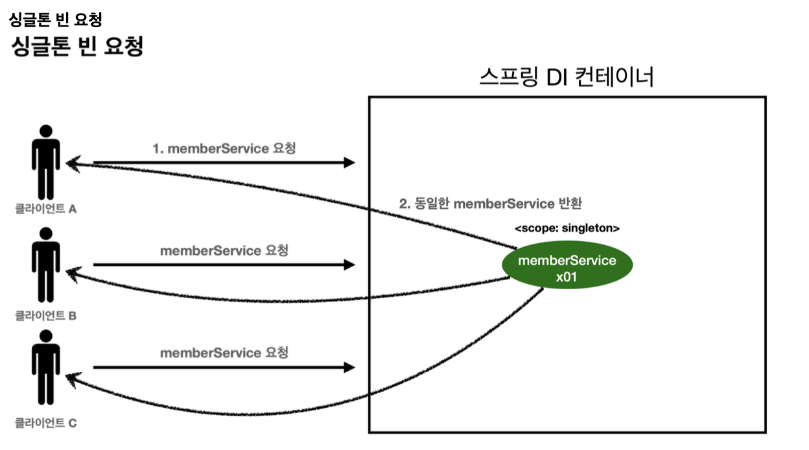
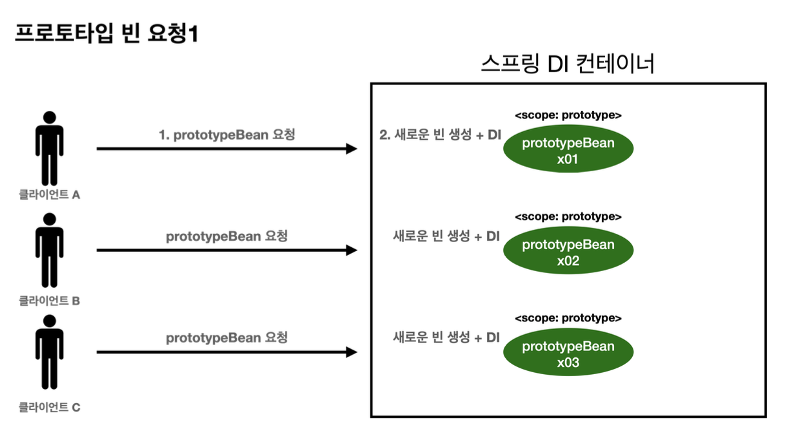
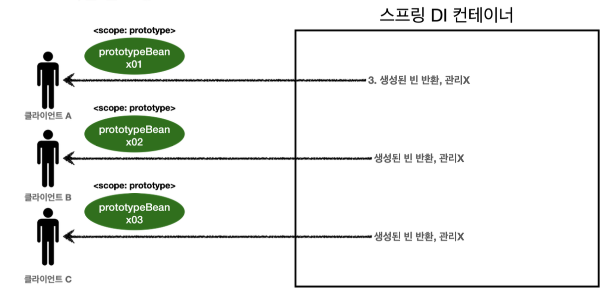
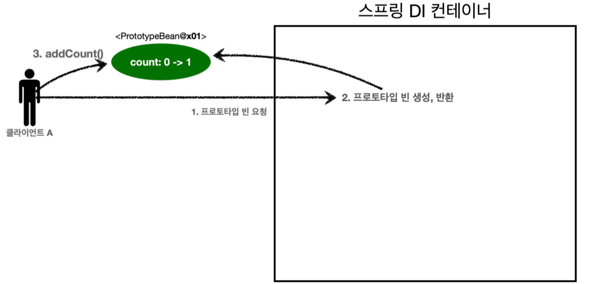
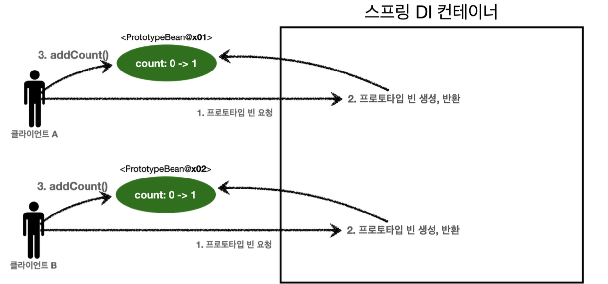
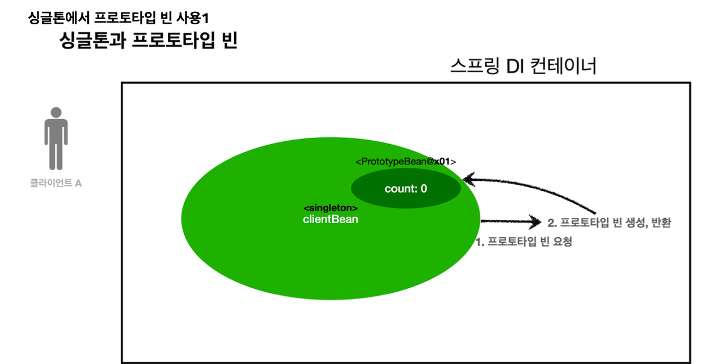
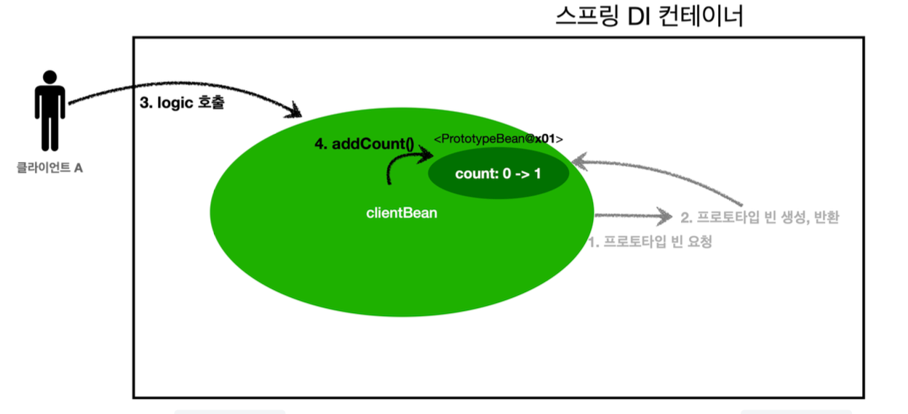
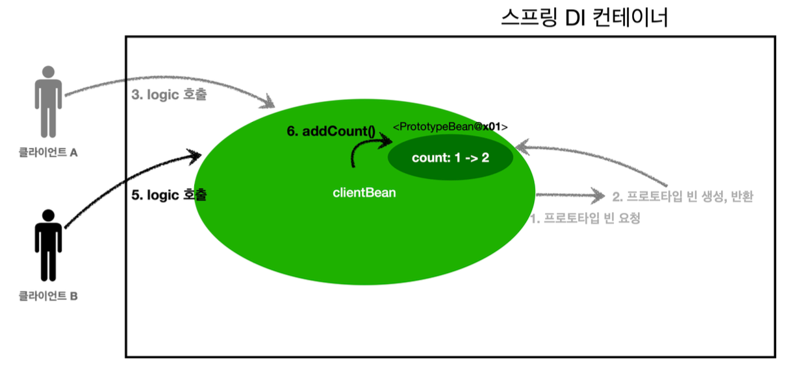
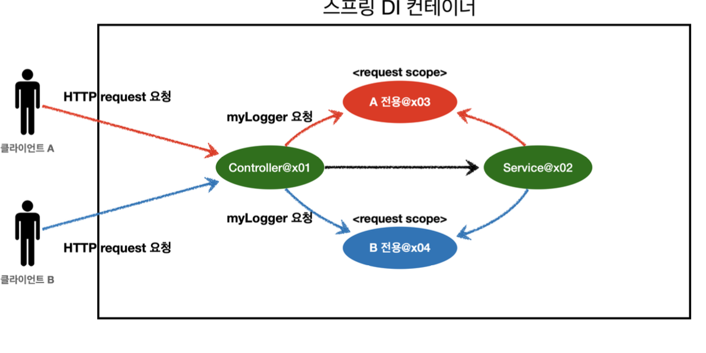
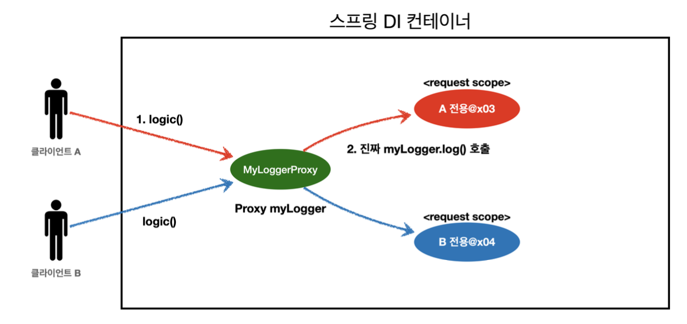

# Bean Scope?

빈이 존재할 수 있는 범위

**다양한 스코프**

* 싱글톤 : 가장 넓은 범위
* 프로토타입 : 빈의 생성과 의존관계 주입까지만 관여 매우 짧음
* 웹 관련
    * request : 웹 요청이 들어오고 나갈때
    * session :웹 세션이 생성되고 종료될 때
    * application :웹의 서블릿 컨텍스트와 같은 범위

## prototype scope

싱글톤 빈 요청

1. 싱글톤 스코프의 빈을 스프링 컨테이너에 요청
2. 스프링 컨테이너는 본인이 관리하는 스프링 빈 반환
3. 같은 객체 인스턴스의 스프링 빈 반환

프로토타입 빈 요청

1. 프로토타입 스코프의 빈을 스프링 컨테이너에 요청
2. 스프링 컨테이너는 이 시점에 프로토타입 빈을 생성, 필요한 의존관계 주입

프로토타입 빈 요청2

3. 생성한 컨테이너는 생성한 프로토타입 빈을 클라이언트에 반환
4. 새로운 프로토타입 빈을 생성해서 반환

**정리**

스프링 컨테이너는 프초토타입 빈을 생성, 의존관계 주입, 초기화까지만 처리한다. -> 클라이언트에 반환 후 더 이상 스프링 컨테이너는 프로토타입 빈을 관리하지 않는다.
(종료 메서드가 호출되지 않는다.)

~~~java

         AnnotationConfigApplicationContext ac = new
 AnnotationConfigApplicationContext(SingletonBean.class);
         SingletonBean singletonBean1 = ac.getBean(SingletonBean.class);
         SingletonBean singletonBean2 = ac.getBean(SingletonBean.class);
         System.out.println("singletonBean1 = " + singletonBean1);
         System.out.println("singletonBean2 = " + singletonBean2);
         assertThat(singletonBean1).isSameAs(singletonBean2);
ac.close(); //종료 }
     @Scope("singleton")
     static class SingletonBean {
         @PostConstruct
         public void init() {
             System.out.println("SingletonBean.init");
         }
@PreDestroy
         public void destroy() {
             System.out.println("SingletonBean.destroy");
} }
~~~

~~~
 SingletonBean.init
 singletonBean1 = hello.core.scope.PrototypeTest$SingletonBean@54504ecd
 singletonBean2 = hello.core.scope.PrototypeTest$SingletonBean@54504ecd
 org.springframework.context.annotation.AnnotationConfigApplicationContext -
 Closing SingletonBean.destroy
~~~ 
실행결과를 보면
1. 초기화 실행
2. 같은 인스턴스의 빈을 조회
3. 종료 메서드까지 정상 호출됨

~~~java
AnnotationConfigApplicationContext(PrototypeBean.class); System.out.println("find prototypeBean1");
PrototypeBean prototypeBean1 = ac.getBean(PrototypeBean.class); System.out.println("find prototypeBean2");
PrototypeBean prototypeBean2 = ac.getBean(PrototypeBean.class); System.out.println("prototypeBean1 = " + prototypeBean1); System.out.println("prototypeBean2 = " + prototypeBean2); assertThat(prototypeBean1).isNotSameAs(prototypeBean2); ac.close(); //종료
     }
     @Scope("prototype")
     static class PrototypeBean {
         @PostConstruct
         public void init() {
             System.out.println("PrototypeBean.init");
         }
         @PreDestroy
         public void destroy() {
             System.out.println("PrototypeBean.destroy");
         }
~~~

~~~
find prototypeBean1
 PrototypeBean.init
 find prototypeBean2
 PrototypeBean.init
 prototypeBean1 = hello.core.scope.PrototypeTest$PrototypeBean@13d4992d
 prototypeBean2 = hello.core.scope.PrototypeTest$PrototypeBean@302f7971
 org.springframework.context.annotation.AnnotationConfigApplicationContext -
Closing
~~~
실행결과

1. 싱글톤 빈은 스프링 컨테이너 생성 시점에 초기화 메서드가 실행, 프로토타입 스코프의 빈은 스프링 컨테이너에서 빈을 조회 생성되고 초기화 메서드도 실행한다.

2. 2번 조회 -> 2번 초기화

**특징**

1. 스프링 컨테이너에 요청 -> 새로 생성된다.
2. 스프링 컨테이너는 프로토타입 빈의 생성과 의존관계 주입 그리고 초기화까지만 관여
3. 종료 메서드 호출 x
4. 종료 메서드에 대한 호출도 클라이언트가 직접

### 싱글톤 빈과 함께 사용시 문제점

1. 클라이언트A는 스프링 컨테이너에 프로토타입 빈을 요청
2. 스프링 컨테이너는 프로토타입 빈을 새로 생성하고 반환x01 하지만 count 필드 값은 0
3. 클라이언트는 조회한 프로토타입 빈에 addCount()를 호출 -> count에다가 + 1

-> 결과적으로 프로토타입 빈 count = 1

1. B는 컨테이너에 프로토타입 빈을 요청
2. x02의 count 필드 값은 0이다.
3. 클라이언트는 조회한 프로토타입 빈에 addCount를 호출 -> count +1

-> 결과적으로 x02 count 1이다.

싱글톤과 프로토타입 빈

1. `clientBean` 은 의존관계 자동 주입을 사용한다. 주입 시점에 스프링 컨테이너에 프로토타입 빈을 요청한 다.
2. 스프링 컨테이너는 프로토타입 빈을 생성해서 `clientBean` 에 반환한다. 프로토타입 빈의 count 필드 값
은 0이다.
이제 `clientBean` 은 프로토타입 빈을 내부 필드에 보관한다. (정확히는 참조값을 보관한다.)

3. 클라이언트 A는 `clientBean.logic()` 을 호출한다.
4. `clientBean` 은 prototypeBean의 `addCount()` 를 호출해서 프로토타입 빈의 count를 증가한다.
count값이 1이 된다.

* **여기서 중요한 점이 있는데, clientBean이 내부에 가지고 있는 프로토타입 빈은 이미 과거에 주입이 끝난 빈이 다. 주입 시점에 스프링 컨테이너에 요청해서 프로토타입 빈이 새로 생성이 된 것이지, 사용 할 때마다 새로 생성되는 것이 아니다!!**

* `clientBean` 은 prototypeBean의 `addCount()` 를 호출해서 프로토타입 빈의 count를 증가한다. 원
래 count 값이 1이었으므로 2가 된다.

**참고:** 여러 빈에서 같은 프로토타입 빈을 주입 받으면, **주입 받는 시점에 각각 새로운 프로토타입 빈이 생성**된다. 예를 들어서 clientA, clientB가 각각 의존관계 주입을 받으면 각각 다른 인스턴스의 프로토타입 빈을 주입 받는다.

❗️ 물론 사용할 때 마다 새로 생성되는 것은 아니다.

### prototype - 사용할 때 마다 항상 새로운 프로토타입 빈을 생성

~~~java
 ClientBean clientBean1 = ac.getBean(ClientBean.class);
         int count1 = clientBean1.logic();
         assertThat(count1).isEqualTo(1);
         ClientBean clientBean2 = ac.getBean(ClientBean.class);
         int count2 = clientBean2.logic();
         assertThat(count2).isEqualTo(1);
  @Autowired
         private ApplicationContext ac;
         public int logic() {
             PrototypeBean prototypeBean = ac.getBean(PrototypeBean.class);
             prototypeBean.addCount();
             int count = prototypeBean.getCount();
             return count;
} }
     @Scope("prototype")
     static class PrototypeBean {
         private int count = 0;
         public void addCount() {
             count++;
}
         public int getCount() {
             return count;
}
         @PostConstruct
         public void init() {
             System.out.println("PrototypeBean.init " + this);
         }
         @PreDestroy
         public void destroy() {
             System.out.println("PrototypeBean.destroy");
         }
 PrototypeBean prototypeBean = ac.getBean(PrototypeBean.class);
    prototypeBean.addCount();
    int count = prototypeBean.getCount();
    return count;
~~~
* 실행해보면 `ac.getBean()` 을 통해서 항상 새로운 프로토타입 빈이 생성되는 것을 확인할 수 있다.
* DI를 받는게 아니라 이렇게 직접 필요한 의존관계를 찾는 것을 Dependency Lookup의존 관계 탐색이라한다.
* **DL** 정도의 기능만 제공하는 무언가 가 있으면 된다.

~~~java
public int logic() {
     PrototypeBean prototypeBean = prototypeBeanProvider.getObject();
     prototypeBean.addCount();
     int count = prototypeBean.getCount();
     return count;
}
~~~

* `ObjectProvider` 의 `getObject()` 를 호출하면 내부에서는 스프링 컨테이너를 통해 해당 빈을 찾아서 반환 한다. (**DL**)

**정리**
* 그러면 프로토타입 빈을 언제 사용할까? 매번 사용할 때 마다 의존관계 주입이 완료된 새로운 객체가 필요하면 사 용하면 된다. 그런데 실무에서 웹 애플리케이션을 개발해보면, 싱글톤 빈으로 대부분의 문제를 해결할 수 있기 때 문에 프로토타입 빈을 직접적으로 사용하는 일은 매우 드물다.

## 웹 스코프

**특징**

* 웹 스코프는 웹 환경에서만 동작한다.
* 웹 스코프는 프로토타입과 다르게 스프링이 해당 스코프의 종료시점까지 관리한다. 따라서 종료 메서드가 호출된다.

**웹 스코프 종류**

* **request:** HTTP 요청 하나가 들어오고 나갈 때 까지 유지되는 스코프, 각각의 HTTP 요청마다 별도의 빈 인스턴 스가 생성되고, 관리된다.
* **session:** HTTP Session과 동일한 생명주기를 가지는 스코프
* **application:** 서블릿 컨텍스트( `ServletContext` )와 동일한 생명주기를 가지는 스코프
* **websocket:** 웹 소켓과 동일한 생명주기를 가지는 스코프

~~~java
@Component
 @Scope(value = "request", proxyMode = ScopedProxyMode.TARGET_CLASS)
 public class MyLogger {
}
~~~ 
proxy 방식
* `proxyMode = ScopedProxyMode.TARGET_CLASS` 를 추가해주자. 
    * 적용 대상이 인터페이스가 아닌 클래스면 `TARGET_CLASS` 를 선택
    * 적용 대상이 인터페이스면 `INTERFACES` 를 선택

**특징 정리**
* 프록시 객체 덕분에 클라이언트는 마치 싱글톤 빈을 사용하듯이 편리하게 request scope를 사용할 수 있다. 
* 사실 Provider를 사용하든, 프록시를 사용하든 핵심 아이디어는 진짜 객체 조회를 꼭 필요한 시점까지 지연처리 한다는 점이다.
* 단지 애노테이션 설정 변경만으로 원본 객체를 프록시 객체로 대체할 수 있다. 이것이 바로 다형성과 DI 컨테이너 가 가진 큰 강점이다.
* 꼭 웹 스코프가 아니어도 프록시는 사용할 수 있다.

**주의점**
* 마치 싱글톤을 사용하는 것 같지만 다르게 동작하기 때문에 결국 주의해서 사용해야 한다.
* 이런 특별한 scope는 꼭 필요한 곳에만 최소화해서 사용하자, 무분별하게 사용하면 유지보수하기 어려워진다.