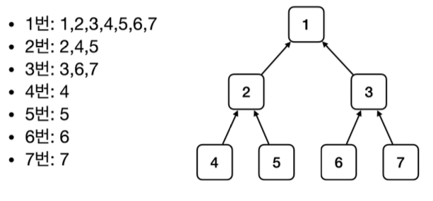

# create Spring Container

~~~java
//스프링 컨테이너 생성
ApplicationContext applicationContext = new AnnotationConfigApplicationContext(AppConfig.class);
~~~

1. ApplicationContext를 스프링 컨테이너라 한다.
2. ApplicationContext는 인터페이스이다.
3. xml, 자바 설정 클래스로 만들 수 있다.
4. AppConfig를 사용했던 방식이 애노테이션 기반의 설정 클래스로 스프링 컨테이너를 만든 것이다.

**빈 이름**

* 빈 이름은 메서드 이름을 사용한다.
* 빈 이름을 직접 부여할 수도 있다.

* 스프링 컨테이너는 설정 정보를 참고해서 DI를 한다.

스프링 컨테이너를 생성하고, AppConfig를 참고해서 스프링 빈도 등록하고, 의존관계도 설정

~~~java
@Test
@DisplayName("모든 빈 출력하기") void findAllBean() {
         String[] beanDefinitionNames = ac.getBeanDefinitionNames();
         for (String beanDefinitionName : beanDefinitionNames) {
             Object bean = ac.getBean(beanDefinitionName);
             System.out.println("name=" + beanDefinitionName + " object=" +
bean);
}
}
@DisplayName("애플리케이션 빈 출력하기") void findApplicationBean() {
        String[] beanDefinitionNames = ac.getBeanDefinitionNames();
        for (String beanDefinitionName : beanDefinitionNames) {
            BeanDefinition beanDefinition =
ac.getBeanDefinition(beanDefinitionName);
//Role ROLE_APPLICATION: 직접 등록한 애플리케이션 빈
//Role ROLE_INFRASTRUCTURE: 스프링이 내부에서 사용하는 빈
if (beanDefinition.getRole() == BeanDefinition.ROLE_APPLICATION) {
bean);
}
}

~~~
모든 빈 출력하기
* `ac.getBeanDefinitionNames()` : 스프링에 등록된 모든 빈 이름을 조회한다. 
* `ac.getBean()` : 빈 이름으로 빈 객체(인스턴스)를 조회한다.

애플리케이션 빈 출력하기
* 스프링이 내부에서 사용하는 빈은 제외하고, 내가 등록한 빈만 출력해보자. 
* 스프링이 내부에서 사용하는 빈은 `getRole()` 로 구분할 수 있다.
    * `ROLE_APPLICATION` : 일반적으로 사용자가 정의한 빈 
    * `ROLE_INFRASTRUCTURE` : 스프링이 내부에서 사용하는 빈

~~~java
@Test
@DisplayName("빈 이름으로 조회") void findBeanByName() {
         MemberService memberService = ac.getBean("memberService",
 MemberService.class);
         assertThat(memberService).isInstanceOf(MemberServiceImpl.class);
     }
@Test
@DisplayName("이름 없이 타입만으로 조회") void findBeanByType() {
         MemberService memberService = ac.getBean(MemberService.class);
         assertThat(memberService).isInstanceOf(MemberServiceImpl.class);
     }
~~~
구체 타입으로 조회하면 변경시 유연성이 떨어짐

## 스프링 빈 - 상속 관계
* 부모타입으로 조회하면, 자식 타입도 함께 조회
* Object 타입으로 조회하면, 모든 스프링 빈을 조회

~~~java
@Test
@DisplayName("부모 타입으로 조회시, 자식이 둘 이상 있으면, 중복 오류가 발생한다") void findBeanByParentTypeDuplicate() {
        //DiscountPolicy bean = ac.getBean(DiscountPolicy.class);
        assertThrows(NoUniqueBeanDefinitionException.class, () ->
ac.getBean(DiscountPolicy.class));
}
@Test
@DisplayName("부모 타입으로 조회시, 자식이 둘 이상 있으면, 빈 이름을 지정하면 된다") void findBeanByParentTypeBeanName() {
        DiscountPolicy rateDiscountPolicy = ac.getBean("rateDiscountPolicy",
DiscountPolicy.class);
        assertThat(rateDiscountPolicy).isInstanceOf(RateDiscountPolicy.class);
    }
~~~

**BeanFactory**

* 스프링 컨테이너의 최상위 인터페이스
* getBean()을 제공한다.

**ApplicationContext**

* BeanFactory 기능을 모두 상속받아 제공
* 빈을 관리 검색하는 기능은 이미 BeanFactroy가 제공 차이는?
* 그 이외의 기능 제공

* 메세지소스 활용 국제화 기능
* 환경변수
* 애플리케이션 이벤트
* 편리한 리소스 조회

