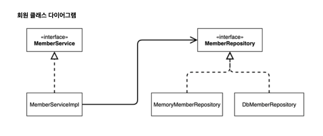
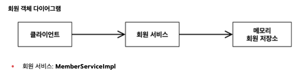
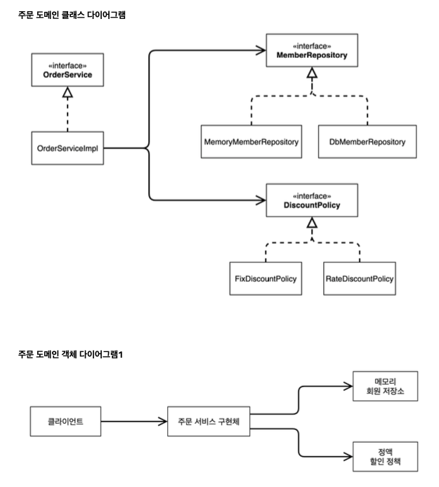

# 요구사항 및 설계

* client
    * 회원을 가입하고 조회
    * vip,일반 등급 존재
    * 자체 DB 구축, 시스템 연동

* 주문 할인
    * 회원은 상품 주문 가능
    * 회원 등급에 따라 정책 적용
    * vip는 1000원 무조건 할인
    * 할인 정책이 바뀔 수 있다.
### client

-> 클래스 다이어그램은 정적인 다이어 그램이다. 이런 식으로 플로우가 생긴다

-> 동적인 객체 다이어 그램이다.

~~~java
 public Member(Long id, String name, Grade grade) {
         this.id = id;
         this.name = name;
         this.grade = grade;
     }
public interface MemberRepository {
     void save(Member member);
     Member findById(Long memberId);
}
 public class MemoryMemberRepository implements MemberRepository {
     private static Map<Long, Member> store = new HashMap<>();}
 public interface MemberService {
     void join(Member member);
     Member findMember(Long memberId);
}
 public class MemberServiceImpl implements MemberService {
     private final MemberRepository memberRepository = new
 MemoryMemberRepository();
     public void join(Member member) {
         memberRepository.save(member);
}
     public Member findMember(Long memberId) {
         return memberRepository.findById(memberId);
}

~~~
1. HashMap은 동시성 이슈가 발생가능 -> ConcurrentHashMap을 사용

2. DIP를 잘 지키고 있지 않는 코드이다
왜? 의존 관계가 인터페이스 뿐만 아니라 구현까지 모두 의존하는 문제점이 있다.

### order

회원을 메모리에서 조회, 다른 할인 정책을 지원해도 주문 서비스를 변경하지 않아도 된다.

~~~java

 public interface DiscountPolicy {
     /**
* @return 할인 대상 금액
      */
     int discount(Member member, int price);
}

public class FixDiscountPolicy implements DiscountPolicy { private int discountFixAmount = 1000; //1000원 할인
     @Override
     public int discount(Member member, int price) {
         if (member.getGrade() == Grade.VIP) {
             return discountFixAmount;
         } else {
             return 0;
} }
}

     public Order(Long memberId, String itemName, int itemPrice, int
 discountPrice) {
         this.memberId = memberId;
         this.itemName = itemName;
         this.itemPrice = itemPrice;
         this.discountPrice = discountPrice;
}
     public int calculatePrice() {
         return itemPrice - discountPrice;
     }
 }
 public interface OrderService {
     Order createOrder(Long memberId, String itemName, int itemPrice);
}

 public class OrderServiceImpl implements OrderService {
     private final MemberRepository memberRepository = new
 MemoryMemberRepository();
     private final DiscountPolicy discountPolicy = new FixDiscountPolicy();
     @Override
     public Order createOrder(Long memberId, String itemName, int itemPrice) {
         Member member = memberRepository.findById(memberId);
         int discountPrice = discountPolicy.discount(member, itemPrice);
         return new Order(memberId, itemName, itemPrice, discountPrice);
}
 }
~~~

flow : 주문 생성 요청이 오면, 회원 정보를 조회 -> 할인 정책 적용 -> 다음 주문 객체 생성해서 반환

**메모리 회원 저장소와, 고정 할인 정책을 구현체로 생성한다.**

~~~java
 @Test
    void createOrder() {
        long memberId = 1L;
        Member member = new Member(memberId, "memberA", Grade.VIP);
        memberService.join(member);
        Order order = orderService.createOrder(memberId, "itemA", 10000);
        Assertions.assertThat(order.getDiscountPrice()).isEqualTo(1000);
    }
~~~
test코드는 JUnit 테스트를 이용해보자. -> 공부 필요