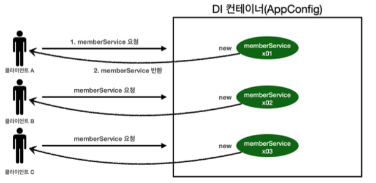
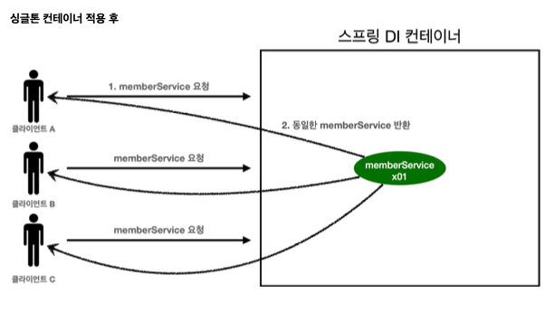

# web application and singleton

* 스프링은 여러 고객이 동시에 요청하기 위한 것들을 처리하기 위해 설계된 프레임 워크다.

~~~java

@Test
@DisplayName("스프링 없는 순수한 DI 컨테이너") void pureContainer() {
AppConfig appConfig = new AppConfig();
//1. 조회: 호출할 때 마다 객체를 생성
MemberService memberService1 = appConfig.memberService();
//2. 조회: 호출할 때 마다 객체를 생성
MemberService memberService2 = appConfig.memberService();
//참조값이 다른 것을 확인
System.out.println("memberService1 = " + memberService1); System.out.println("memberService2 = " + memberService2);
        //memberService1 != memberService2
        assertThat(memberService1).isNotSameAs(memberService2);
    }
~~~
* DI 컨테이너는 AppConfig의 요청을 할 때 마다 객체를 새로 생성한다.
* 메모리 낭비가 매우 심하다 -> 객체를 1개만 생성되고, 공유하도록 설계한다.
❗️싱글톤 패턴

## singleton pattern

* 클래스의 인스턴스가 딱 1개만 생성되는 것을 보장하는 디자인 패턴이다.

~~~java
//1. static 영역에 객체를 딱 1개만 생성해둔다.
private static final SingletonService instance = new SingletonService();
//2. public으로 열어서 객체 인스턴스가 필요하면 이 static 메서드를 통해서만 조회하도록 허용한 다.
     public static SingletonService getInstance() {
         return instance;
}
//3. 생성자를 private으로 선언해서 외부에서 new 키워드를 사용한 객체 생성을 못하게 막는다. 
private SingletonService() {
}
public void logic() { System.out.println("싱글톤 객체 로직 호출");
}
~~~
* private 생성자르 new 키워드를 막아두었다.
* 호출할 때 마다 같은 객체 인스턴스를 반환하는 것을 확인할 수 있다.

**싱글톤 패턴 문제점**
* 구현하는 코드 자체가 많이 들어간다.
* 구체 클래스에 의존한다 -> DIP 위반
* 클라이언트가 구체 클래스에 의존해서 OCP 원칙을 위반할 가능성이 높다.
* 유연성이 떨어진다.
* private로 인해 자식 클래스를 만들기 어렵다.

## singletone container

**싱글톤 컨테이너**
* 스프링 컨테이너는 싱글턴 패턴을 적용하지 않아도 객체 인스턴스를 싱글톤으로 관리

* 스프링 컨테이너 == singleton container

* 스프링 컨테이너의 이러한 기능 덕분에 싱글턴 패턴의 모든 단점을 해겨하면서 객체를 싱글톤으로 유지가능

~~~java
@Test
@DisplayName("스프링 컨테이너와 싱글톤") void springContainer() {
     ApplicationContext ac = new
 AnnotationConfigApplicationContext(AppConfig.class);
//1. 조회: 호출할 때 마다 같은 객체를 반환
     MemberService memberService1 = ac.getBean("memberService",
 MemberService.class);
//2. 조회: 호출할 때 마다 같은 객체를 반환
     MemberService memberService2 = ac.getBean("memberService",
 MemberService.class);
//참조값이 같은 것을 확인
System.out.println("memberService1 = " + memberService1); System.out.println("memberService2 = " + memberService2);
     //memberService1 == memberService2
     assertThat(memberService1).isSameAs(memberService2);
~~~

* 이미 만들어진 객체를 공유

## 주의점

* 싱글톤 방식은 여러 클라이언트가 하나의 같은 객체 인스턴스를 공유하기 때문에 싱글톤 객체는 상태를 stateful하게 설계하면 안된다.

* stateless로 설계해야된다.
    * 클라이언트에 의존적인 필드 x
    * 클라이언트가 값을 변경할 수 있는 필드가 있으면 안된다.

~~~java

private int price; //상태를 유지하는 필드
public void order(String name, int price) { System.out.println("name = " + name + " price = " + price); this.price = price; //여기가 문제!
}
     public int getPrice() {
         return price;
}

//ThreadA: A사용자 10000원 주문 
statefulService1.order("userA", 10000); //ThreadB: B사용자 20000원 주문
statefulService2.order("userB", 20000);
//ThreadA: 사용자A 주문 금액 조회
int price = statefulService1.getPrice();
//ThreadA: 사용자A는 10000원을 기대했지만, 기대와 다르게 20000원 출력 
System.out.println("price = " + price);
~~~
* 스프링 빈은 항상 무상태!!

## @Config와 싱글톤

~~~java

       @Bean
     public MemberService memberService() {
//1번
System.out.println("call AppConfig.memberService"); return new MemberServiceImpl(memberRepository());
}
     @Bean
     public OrderService orderService() {
//1번
System.out.println("call AppConfig.orderService"); return new OrderServiceImpl(
                 memberRepository(),
                 discountPolicy());
}
     @Bean
     public MemberRepository memberRepository() {
//2번? 3번?
System.out.println("call AppConfig.memberRepository"); return new MemoryMemberRepository();
}

~~~
* 위의 코드를 보면 싱글톤이 깨지는 것 같다 2개의 memoryMemberRepo가 생성되기 때문이다 -> 스프링 컨테이너가 해결

* 실제로 출력을 해보면 모두 1번만 호출된다.

#### @Configurate삭제 @Bean만 적용

-> 각기 다른 인스턴스가 생성된다.

**정리**

* @Bean만 사용해도 스프링 빈에는 등록되지만, 싱글톤 보장 x

* @Config항상 사용~~