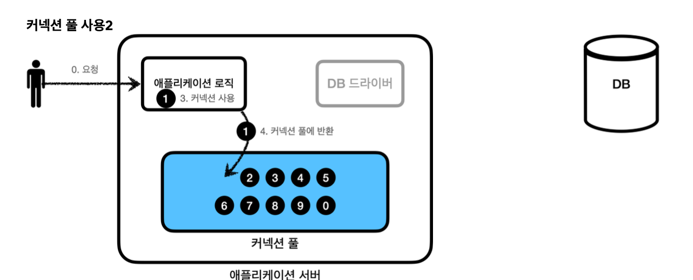

# Connetcion Pool

**과정**
1. 애플리케이션 로직은 db 드라이버를 통해 커넥션 조회

2. Db 드라이버는 Db와 Tcp/ip 커넥션을 연결한다.
3. DB 드라이버는 Tcp/ip 커넥션이 연결되면 Id,Pw와 기타 부가정보를 DB에 전달한다.
4. DB는 Id,Pw를 통해 내부 인증을 완료하고, 내부에 Db 세션을 생성한다.
5. Db는 커넥션 생성이 완료되었다는 응답을 보내준다.
6. DB 드라이버는 커넥션 객체를 생성해 클라이언트에 반환한다.

**문제**

Tcp/ip 커넥션을 새로 생성하기 위한 리소스를 매번 사용해야 되고, 고객이 애플리케이션을 사용할 때, SQL을 실행하는 시간 뿐만 아니라 커넥션을 새로 만드는 시간이 추가되기 때문에 결과적으로 응답 속도에 영향을 준다.

-> 위에서 발생한 문제를 한번에 해결하는 아이디어가 바로 커넥션을 미리 생성해두고 사용하는 커넥션 풀이라는 방법을 사용한다.

애플리케이션을 시작하는 시점에 커넥션 풀은 필요한 만큼 커넥션을 미리 확보해서 풀에 보관 -> 보통 10개

커넥션 풀에 들어있는 커넥션은 tcp/ip로 db와 커넥션이 연결되어 있어 즉시 SQL을 db에 전달할 수 있다.

* 애플리케이션 로직에서 이제는 db 드라이버를 통해 새로운 커넥션을 획득하는 것이 아니다.

* 이미 생성되어 있는 커넥션을 객체 참조로 그냥 가져다 쓰기만 하면 된다.

* 커넥션 풀에 커넥션을 요청하면 커넥션 풀은 자신이 가지고 있는 커넥션 중에 하나를 반환한다.

* 애플리케이션 로직은 커넥션 풀에서 받은 커넥션을 사용해서 SQL을 데이터베이스에 전달하고 그 결과를 받아서 처리한다.

* 커넥션을 모두 사용하고 나면 이제는 종료하는 것이 아니라 커넥션을 풀에 반환한다. -> 주의❗️ 종료하는 것이 아니라 살아있는 상태로 커넥션 풀에 반환

**정리**

* 적절한 커넥션 풀 숫자는 성능 테스트를 통해 정함
* 서버당 최대 커넥션 수를 제한할 수 있다.
* 실무에서는 기본적으로 사용
* hikari를 대부분 사용한다.

## DataSource 이해

커넥션을 얻는 방법은 `DriverManager`를 직접 사용하거나 커넥션 풀을 사용하는 등의 방법이 있다.

**DriverManager를 통해 커넥션 획득**

* DriverManager를 통해서 커넥션을 획득하다가, 커넥션 풀을 사용하는 방법은?

**DriverManager를 통해 커넥션 획득하다가 커넥션 풀로 변경시 문제**

* 예를 들어 어플리케이션 로직에서 DM을 사용해서 커넥션을 획득하다가 HikarCp같은 커넥션 풀을 사용하도록 변경하면 코드도 변경해야 된다.

* 자바에서는 이런 문제를 해결하기 위해 DataSource라는 인터페이스를 제공
* DataSource는 커넥션을 획득하는 방법을 추상화 하는 인터페이스
* 핵심 기능은 커넥션 조회 하나이다.

**정리**

* 대부분의 커넥션 풀은 DataSource 인터페이스를 이미 구현 -> HikariCp 커넥션 풀의 코드를 직접 의존하는 것이 아니라 DataSource 인터페이스에만 의존하도록 로직을 작성하면 된다.

* 커넥션 풀 구현 기술을 변경하고 싶으면 해당 구현체로 갈아끼우면 된다.

* DriverManagerDataSource라는 DataSource를 구현한 클래스를 제공한다.

* 자바는 DataSource를 통해 커넥션을 획듣하는 방법을 추상화했다. -> DriverManagerDataSource를 통해서 dircemanger를 사용하다가 커넥션 풀을 사용하도록 코드를 변경해도 된다.
## DriverManger로 커넥션 얻기

**드라이버 매니저**

~~~java
@Test
      void driverManager() throws SQLException {
          Connection con1 = DriverManager.getConnection(URL, USERNAME,
  PASSWORD);
          Connection con2 = DriverManager.getConnection(URL, USERNAME,
  PASSWORD);
          log.info("connection={}, class={}", con1, con1.getClass());
          log.info("connection={}, class={}", con2, con2.getClass());
      }
~~~

**데이터소스 드라이버 매니저 추가**
~~~java
 @Test
      void dataSourceDriverManager() throws SQLException {
//DriverManagerDataSource - 항상 새로운 커넥션 획득
          DriverManagerDataSource dataSource = new DriverManagerDataSource(URL,
  USERNAME, PASSWORD);
useDataSource(dataSource);
}

  private void useDataSource(DataSource dataSource) throws SQLException {
          Connection con1 = dataSource.getConnection();
          Connection con2 = dataSource.getConnection();
          log.info("connection={}, class={}", con1, con1.getClass());
          log.info("connection={}, class={}", con2, con2.getClass());
}
~~~

**파라미터 차이**

기존 DriverManger를 통해서 커넥션을 획득하는 방법과 DataSource를 통해서 커넥션을 획득하는 방법에는 차이가 있다.

**DriverManager**
~~~java
DriverManager.getConnection(URL, USERNAME, PASSWORD)
  DriverManager.getConnection(URL, USERNAME, PASSWORD)
~~~

* DriverManager는 커넥션을 획들할 때 마다 URL, USERNAME, PASSWORD 같은 파라미터를 계속 전달해야 된다. 반면에 DataSource를 사용하는 방식은 처음 객체를 생성할 때만 필요한 파라미터를 넘겨둔다.

**설정과 사용의 분리**

* **설정** : DataSource를 만들고 필요한 속성들을 사용해서 URL,USERNAME,PASSWORD 같은 부분을 입력하는 것
* **사용** : 설정은 신경쓰지 않고, DataSource의 getConnection()만을 호출해서 사용하면된다.

**설정과 사용의 분리**

* 필요한 데이터를 DataSource가 만들어지는 시점에 미리 넣어두게 되면, DataSource를 사용하는 곳에서는 dataSource.getConnection()만 호풀하면 되므로 URL같은 속성에 의존하지 않고 DataSource만 주입받아서 getConnetction을 호출하면 된다.
* 쉽게 얘기해서 repo는 DataSource만 의존, 속성을 몰라도 됨

## Connection Pool

~~~java
  @Test
  void dataSourceConnectionPool() throws SQLException, InterruptedException {
//커넥션 풀링: HikariProxyConnection(Proxy) -> JdbcConnection(Target)
HikariDataSource dataSource = new HikariDataSource(); dataSource.setJdbcUrl(URL);
dataSource.setUsername(USERNAME); dataSource.setPassword(PASSWORD); dataSource.setMaximumPoolSize(10); dataSource.setPoolName("MyPool");
      useDataSource(dataSource);
Thread.sleep(1000); //커넥션 풀에서 커넥션 생성 시간 대기 
}
~~~

* 커넥션 풀을 사용 -> HikariDataSource는 DataSource 인터페이스를 구현

* 커넥션 풀 최대 사이즈 10 지정 -> MyPool이라고 지정

* 커넥션 풀에서 커넥션을 생성하는 작업은 어플 실행 속도에 영향을 주지 않기 위해 작은 쓰레드에서 작동

## DataSource 적용

~~~java
  public class MemberRepositoryV1 {
      private final DataSource dataSource;
      public MemberRepositoryV1(DataSource dataSource) {
          this.dataSource = dataSource;
}

    private void close(Connection con, Statement stmt, ResultSet rs) {
        JdbcUtils.closeResultSet(rs);
        JdbcUtils.closeStatement(stmt);
        JdbcUtils.closeConnection(con);
}
    private Connection getConnection() throws SQLException {
        Connection con = dataSource.getConnection();
        log.info("get connection={}, class={}", con, con.getClass());
        return con;
} }
~~~

* DataSource 의존관계 주입
    * 외부에서 DataSource를 주입 받아서 사용
    * DataSource는 표준 인터페이스 이기 때문에 DirverManagerDataSource에서 HikariDataSource로 변경되어도 해당 코드를 변경하지 않아도 된다.

**DI**

`DriverManagerDataSource` `HikariDataSource` 로 변경해도 `MemberRepositoryV1` 의 코드는 전혀 변
경하지 않아도 된다. `MemberRepositoryV1` 는 `DataSource` 인터페이스에만 의존하기 때문이다. 이것이 `DataSource` 를 사용하는 장점이다.(DI + OCP)
