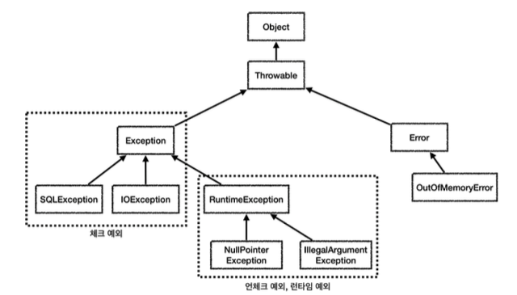

# Exception stage

자바 기본 예외 -> 언체크 or 체크

* Object : 예외도 객체
* Throwable : 최상위 예외
* Error : 메모리 부족이나 시스템 오류와 같이 애플리케이션에서 복구 불가능한 시스템 예외
    * `catch`로 잡으면 안되는데, 앞서 이야기한 `Error`예외도 잡을 수 있기 때문이다.
    * `Error`도 언체크 예외이다.
* `Exception` : 예외
    * 애플리케이션 로직에서 사용할 수 있는 실질적인 최상외 예외
    * `Exception`과 그 하위 예외는 모두 컴파일러가 체크하는 체크 예외이다.
    `RuntimeException`은 예외로 한다.
* `RuntimeException` : 언체크 예외, 런타임 예외
    * 컴파일러가 체크 하지 않는 언체크 예외
    * `RuntimeException`과 그 자식 예외는 모두 언체크 예외 이다.
    * `RuntimeException`의 이름을 따 런타임 예외 = 언체크 예외

**Exception 하위 예외들은 모두 체크 예외인데 RuntimeException은 혼자 언체크 예외이다.**

## 예외 기본 규칙

**예외에 대해서는 2가지 기본 규칙을 기억**

1. 예외는 잡아서 처리하거나 던진다.
2. 예외를 잡거나 던질 때 지정한 예외뿐만 아니라 그 예외의 자식들도 함께 처리된다.
    * 예를 들어서 `Exception`을 `catch`로 잡으면 그 하위 예외들도 모두 잡을 수 있다.
    * 예를 들어서 `Excetpion`을 `throw`로 던지면 그 하위 예외들도 모두 던질 수 있다.

**참고: 예외를 처리하지 못하고 계속 던지면 ?**
* main 쓰레드의 경우 예외 로그를 출력하며 종료
* 여러 사용자의 요청을 처리하기 때문에 하나의 예외 때문에 시스템이 종료되면 안된다.

## 체크 예외 기본 이해

* `Exception`과 그 하위 예외는 모두 컴파일러가 체크하는 체크 예외이다. 단 `RuntimeException`은 예외로 한다.
* 체크 예외는 잡아서 처리하거나, 또는 밖으로 던져야 된다. 그렇지 않으면 컴파일 오류가 발생

~~~java
 @Slf4j
  public class CheckedTest {
      @Test
      void checked_catch() {
          Service service = new Service();
          service.callCatch();
      }
      @Test
      void checked_throw() {
          Service service = new Service();
          assertThatThrownBy(() -> service.callThrow())
                  .isInstanceOf(MyCheckedException.class);
}
/**
* Exception을 상속받은 예외는 체크 예외가 된다. */
      static class MyCheckedException extends Exception {
          public MyCheckedException(String message) {
              super(message);
          }
}
/**
* Checked 예외는
* 예외를 잡아서 처리하거나, 던지거나 둘중 하나를 필수로 선택해야 한다. */
      static class Service {
          Repository repository = new Repository();
/**
* 예외를 잡아서 처리하는 코드 */
          public void callCatch() {
              try {
                  repository.call();
              } catch (MyCheckedException e) {
//예외 처리 로직
log.info("예외 처리, message={}", e.getMessage(), e); }
}
/**
* 체크 예외를 밖으로 던지는 코드
* 체크 예외는 예외를 잡지 않고 밖으로 던지려면 throws 예외를 메서드에 필수로 선언해야한
다.
*/
          public void callThrow() throws MyCheckedException {
              repository.call();
} }
      static class Repository {
          public void call() throws MyCheckedException {
              throw new MyCheckedException("ex");
          }
}
~~~

**Exception을 상속받은 예외는 체크 예외가 된다.**

~~~java
  public MyCheckedException(String message) {
          super(message);
      }
~~~
* `MyCheckException`는 `Exception`을 상속받았다. `Exception`을 상속받으면 체크 예외가 된다.
* 참고로 `RuntimeException`을 상속받으면 언체크 예외가 된다.
* 예외가 제공하는 여러가지 기본 기능이 있는데, 오류 메시지를 보관하는 기능도 있따.

~~~java
@Test
  void checked_catch() {
      Service service = new Service();
      service.callCatch();
  }
~~~
* service.callCathc()에서 예외를 처리했기 때문에 테스트 메서드까지 예외가 올라오지 않는다.

**체크 예외를 잡아서 처리하는 코드**

~~~java
  try {
      repository.call();
} catch (MyCheckedException e) { //예외 처리 로직
}
~~~
* 체크 예외를 잡아서 처리하려면 catch()를 사용해서 예외를 잡으면 된다.
* 여기서는 `MyCheckedException`예외를 잡아서 처리한다.

**catch는 해당 타입과 그 하위 타입을 모두 잡을 수 있다.**

~~~java

  public void callCatch() {
      try {
          repository.call();
      } catch (Exception e) {
//예외 처리 로직 }
}
  }
~~~
* catch에 MyChedckedException의 상위 타입인 Exception을 적어주어도 MyCheckedException을 잡을 수 있다.
* `catch`에 예외를 지정하면 해당 예외와 그 하위 타입 예외를 모두 잡아준다.

~~~java
@Test
void checked_throw() {
    Service service = new Service();
    assertThatThrownBy(() -> service.callThrow())
    .isInstanceOf(MyCheckedException.class);
}
~~~

* `service.callThrow()에서 예외를 처리하지 않고 밖으로 던졌기 때문에 예외가 테스트 메서드까지 올라온다.

**체크 예외를 밖으로 던지는 코드**

~~~java
  public void callThrow() throws MyCheckedException {
      repository.call();
}
~~~
* **체크 예외를 밖으로 던지는 경우 해당 타입 + 하위 타입 모두 던질 수 있다.**

## 언체크 예외 

* `RuntimeException`과 그 하위 예외는 언체크 예외로 분류된다.
* 언체크 예외는 말 그대로 컴파일러가 예외를 체크하지 않는다는 뜻이다.
* 언체크 예외는 체크 예외와 기본적으로 동일하다. 차이가 있다면 예외를 던지는 `throws`를 선언하지 않고, 생략할 수 있다.

**체크 예외 VS 언체크 예외**

* 체크 예외: 예외를 잡아서 처리하지 않으면 항상 `throws` 에 던지는 예외를 선언해야 한다.
* 언체크 예외: 예외를 잡아서 처리하지 않아도 `throws` 를 생략할 수 있다.

**언체크 예외 전체 코드**

~~~java
@Slf4j
public class UncheckedTest {
    @Test
    void unchecked_catch() {
        Service service = new Service();
        service.callCatch();
    }
    @Test
    void unchecked_throw() {
        Service service = new Service();
        assertThatThrownBy(() -> service.callThrow())
                .isInstanceOf(MyUncheckedException.class);
}
/**
* RuntimeException을 상속받은 예외는 언체크 예외가 된다. */
    static class MyUncheckedException extends RuntimeException {
        public MyUncheckedException(String message) {
            super(message);
        }
}
/**
* UnChecked 예외는
* 예외를 잡거나, 던지지 않아도 된다.
* 예외를 잡지 않으면 자동으로 밖으로 던진다. */
    static class Service {
        Repository repository = new Repository();
/**
* 필요한 경우 예외를 잡아서 처리하면 된다. */
        public void callCatch() {   try {
                  repository.call();
} catch (MyUncheckedException e) { //예외 처리 로직
log.info("예외 처리, message={}", e.getMessage(), e); }
}
/**
* 예외를 잡지 않아도 된다. 자연스럽게 상위로 넘어간다.
* 체크 예외와 다르게 throws 예외 선언을 하지 않아도 된다. */
          public void callThrow() {
              repository.call();
} }
      static class Repository {
          public void call() {
              throw new MyUncheckedException("ex");
          }
} }
~~~

**언체크 예외를 잡아서 처리**

~~~java
  try {
      repository.call();
} catch (MyUncheckedException e) { //예외 처리 로직
      log.info("error", e);
  }
~~~

**언체크 예외를 밖으로 던지는 코드 - 생략**

~~~java
public void callThrow() {
      repository.call();
}
~~~

* 언체크 예외는 체크 예외와 다르게 `throws` 예외를 선언하지 않아도 된다.
* 말 그대로 컴파이러가 이런 부분을 체크하지 않는다.

**언체크 예외를 밖으로 던지는 코드 - 선언**

~~~java
public void callThrow() throws MyUncheckedException {
      repository.call();
}
~~~

* 언체크 예외도 `throws`예외를 선언해도 된다.

## **체크 예외 활용**

**기본 원칙은 다음 2가지를 기억하자.**

* 기본적으로 언체크(런타임) 예외를 사용하자.
* 체크 예외는 비즈니스 로직상 의도적으로 던지는 예외에만 사용하자.
    * 이 경우 해당 예외를 잡아서 반드시 처리해야 하는 문제일 때만 체크 예외를 사용해야 한다. 예를 들어서 다 음과 같은 경우가 있다.

**체크 예외의 문제점**

체크 예외는 개발자가 실수로 예외 놓치는 것을 막아주지만, 처리 할 수 없을 때는 예외를 던지도록 선언해야 된다.

* 리포지토리는 db에 접근해서 데이터를 저장하고 관리 `SQLException`체크 예외를 던진다.
* 서비스는 리포지토리와 `NetworkClient` 를 둘다 호출한다.
* 서비스는 `SQLException` 과 `ConnectException` 를 처리할 수 없으므로 둘다 밖으로 던진다.
* 컨트롤러도 두 예외를 처리할 방법이 없다.
* 웹 애플리케이션이라면 서블릿의 오류 페이지나, 또는 스프링 MVC가 제공하는 `ControllerAdvice` 에서 이 런 예외를 공통으로 처리한다.

**2가지 문제**

1. 복구 불가능
    * `SQLException` 을 예를 들면 데이터베이스에 무언가 문제가 있어서 발생하는 예외이다. SQL 문법에 문제가 있을 수 도 있고, 데이터베이스 자체에 뭔가 문제가 발생했을 수도 있다. 데이터베이스 서버가 중간에 다운 되었을 수도 있다. 이 런 문제들은 대부분 복구가 불가능하다. 
2. 의존 관계에 대한 문제
    * 앞서 대부분의 예외는 복구 불가능한 예외라고 했다. 그런데 체크 예외이기 때문에 컨트롤러나 서비스 입장에서는 본인 이처리할수없어도어쩔수없이 `throws` 를통해던지는예외를선언해야한다.

**정리**

* 처리할 수 있는 체크 예외라면 서비스나 컨트롤러에서 처리하겠지만, 지금처럼 데이터베이스나 네트워크 통신처 럼 시스템 레벨에서 올라온 예외들은 대부분 복구가 불가능하다. 그리고 실무에서 발생하는 대부분의 예외들은 이런 시스템 예외들이다.

* 문제는 이런 경우에 체크 예외를 사용하면 아래에서 올라온 복구 불가능한 예외를 서비스, 컨트롤러 같은 각각의 클래스가 모두 알고 있어야 한다. 그래서 불필요한 의존관계 문제가 발생하게 된다.

**throws Exception**

~~~java
void method() throws Exception {..}
~~~
이런 식으로 처리할 수 있지만, 최상위 타입의 예외를 던지면 체크 예외를 다 놓치게 된다. -> 매우 좋지 않은 방법이다

## 언체크 예외 활용

* SQLException을 RunTimeSQlException으로 변환
* ConnectException 대신에 RunTimeException으로 바꿨다.

~~~java
@Slf4j
public class UncheckedAppTest {
    @Test
    void unchecked() {
        Controller controller = new Controller();
        assertThatThrownBy(() -> controller.request())
                .isInstanceOf(Exception.class);
}
    @Test
    void printEx() {
        Controller controller = new Controller();
        try {
            controller.request();
        } catch (Exception e) {
            //e.printStackTrace();
            log.info("ex", e);
        }
    }
    static class Controller {
        Service service = new Service();
        public void request() {
            service.logic();
} }
    static class Service {
        Repository repository = new Repository();
        NetworkClient networkClient = new NetworkClient();
        public void logic() {
            repository.call();
            networkClient.call();
            } }
      static class NetworkClient {
          public void call() {
throw new RuntimeConnectException("연결 실패"); }
}
      static class Repository {
          public void call() {
              try {
                  runSQL();
              } catch (SQLException e) {
                  throw new RuntimeSQLException(e);
} }
          private void runSQL() throws SQLException {
              throw new SQLException("ex");
} }
      static class RuntimeConnectException extends RuntimeException {
          public RuntimeConnectException(String message) {
              super(message);
          }
}
      static class RuntimeSQLException extends RuntimeException {
          public RuntimeSQLException() {
          }
          public RuntimeSQLException(Throwable cause) {
              super(cause);
} }
~~~

**예외 전환**

**런타임 예외 - 대부분 복구 불가능한 예외**
복구 불가능 예외이다 -> 복구 불가능한 예외는 공통으로 처리

**런타임 예외 - 의존 관계에 대한 문제**
런타임 예외는 해당 객체가 처리할 수 없는 예외는 무시

**런타임 예외 throws 생략**

~~~java
class Controller {
      public void request() {
          service.logic();
      }
}
  class Service {
      public void logic() {
          repository.call();
          networkClient.call();
      }
}
~~~

**1. 복구 불가능한 예외**
* 대부분의 예외는 복구가 불가능하다. 일부 복구가 가능한 예외도 있지만 아주 적다.

**2. 의존 관계에 대한 문제**
체크 예외의 또 다른 심각한 문제는 예외에 대한 의존 관계 문제이다.
앞서 대부분의 예외는 복구 불가능한 예외라고 했다. 그런데 체크 예외이기 때문에 컨트롤러나 서비스 입장에서는 본인 이처리할수없어도어쩔수없이 `throws` 를통해던지는예외를선언해야한다.

**체크 예외 throws 선언**

~~~java
class Controller {
      public void request() throws SQLException, ConnectException {
          service.logic();
      }
}
  class Service {
      public void logic() throws SQLException, ConnectException {
          repository.call();
          networkClient.call();
      }
}
~~~

**런타임 예외 구현 기술 변경시 파급 효과**

* 런타임 예외를 사용하면 기술이 변경되어도 컨트롤러, 서비스에서 코드를 변경하지 않아도 된다.

* 구현 기술이 변경되는 경우, 예외를 공통으로 처리하는 곳에서 예외에 따른 다른 처리가 필요할 수도 있지만 한곳만 변경하기 때문에 범위는 최소화

