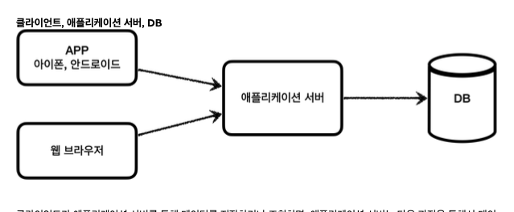
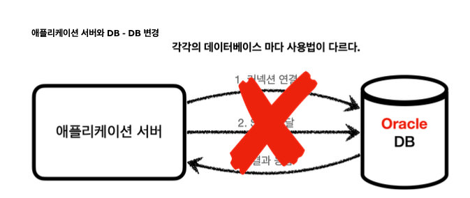
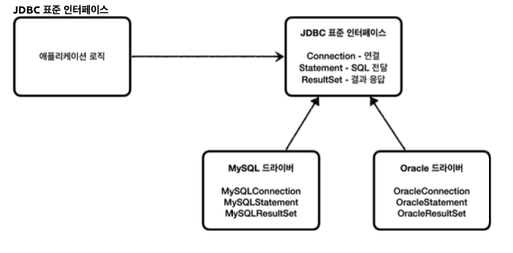
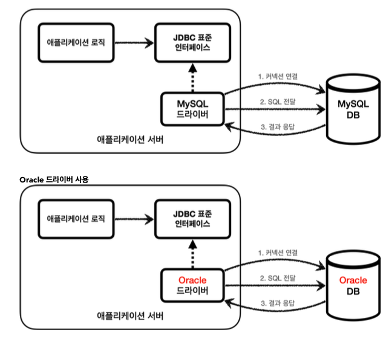
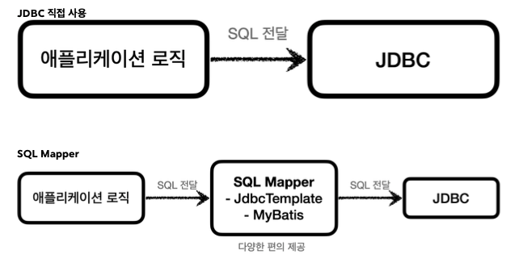
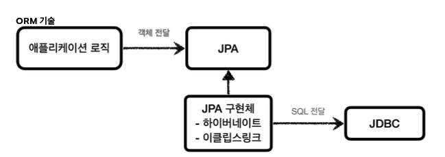
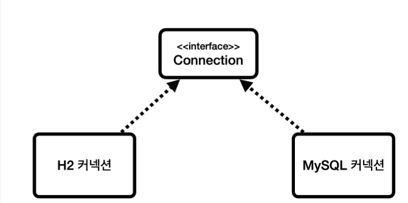
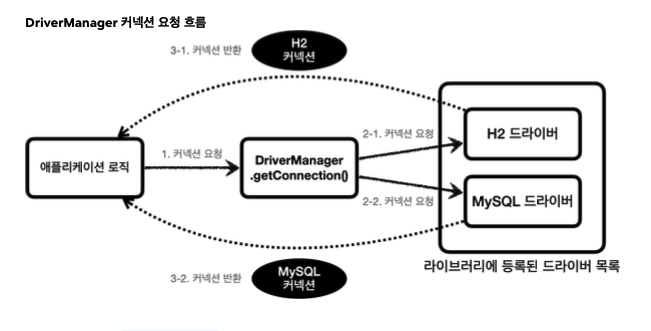

# JDBC

데이터는 대부분 데이터베이스에 보관한다

클라이언트는 서버를 통해 데이터를 저장, 조회 
서버는 다음 과정을 통해서 데베 이용

1. 커넥션 연결 : 주로 TCP/IP를 사용해서 커넥션을 연결
2. SQL 전달 : 서버는 DB가 이해할 수 있는 SQL을 커넥션을 통해서 DB에 전달
3. 결과 응답 : DB는 전달된 SQL을 수행하고 결과를 응답.

but 각각의 데베마다 위 세가지 방법이 모두 다르다.

**2가지의 문제**

1. 데베를 다를 종류의 db로 변경하려면 서버에 개발된 db 사용 코드도 함께 변경
2. 개발자가 각각의 데베 마다 연결, 전달, 응답 받는 방법을 새로 학습

## JDBC 표준 인터페이스

jdbc는 자바에서 데이터베이스에 접속할 수 있도록 하는 자바 API

**대표 3가지 기능**
* java.sql.Connetcion - 연결
* java.sql.Statement - SQL을 담은 내용
* java.sql.ResultSet - SQL 요청 응답

하지만 인터페이스만 있다고해서 기능이 동작하지는 않는다. 이 JDBC 인터페이스를 각각의 DB 벤더에서 자신의 DB에 맞도록 구현해서 라이브러리를 제공했다.

**정리**

1. db는 다른 종류의 db로 변경하면 애플리케이션 서버의 db 사용 코드도 함께 변경해야 되는 문제
    * JDBC 표준 인터페이스에만 의존해서 JDBC 구현 라이브러리만 변경하면 된다.
2. 개발자 각각의 db마다 커넥션 연결, SQL 전달, 그 결과를 응답 받는 방법은 JDBC 표준 인터페이스 사용법만 학습하면 된다.

**하지만 SQL은 각각의 db마다 사용법이 다르다**

## JDBC와 최신 데이터 접근 기술

* SQL Mapper
    * 장점 JDBC를 편리하게 사용하도록 도와줌
        * SQL 응답 결과를 객체로 변환
        * JDBC 반복 줄여줌
    * 단점 개발자가 SQL 작성
    
    * MyBatis

* ORM 기술
    * 객체를 관계형 데이터베이스 테이블과 매핑해주는 기술
    * ORM 기술이 개발자 대신에 SQL을 동적으로 만들어준 후 실행한다.

    * JAP

## db connection

~~~java

  package hello.jdbc.connection;
  public abstract class ConnectionConst {
      public static final String URL = "jdbc:h2:tcp://localhost/~/test";
      public static final String USERNAME = "sa";
      public static final String PASSWORD = "";
}
  public static Connection getConnection() {
          try {
              Connection connection = DriverManager.getConnection(URL, USERNAME,
PASSWORD);
              log.info("get connection={}, class={}", connection,
  connection.getClass());
              return connection;
          } catch (SQLException e) {
              throw new IllegalStateException(e);
          }
}
~~~

db를 연결하려면 JDBC에서 제공하는 driverManger.getConnection을 사용하면 된다.

## JDBC DriverManager 연결 이해

* JDBC는 java.sql.Connetcion 표준 커넥션 인터페이스를 정의
* H2 데이터베이스 드라이버는 JDBC Connection 인터페이스를 구현하여 구현체 제공

1. 커넥션이 필요하면 DriverManager.getConntection을 호출
2. DriverManger는 라이브러리에 등록된 드라이버 목록을 자동 인식.
    * 여기서 각각의 드라이버는 URL 정보를 체크해서 본인이 처리할 수 있는 요청인지 확인

    jdbc:h2로 시작하면 h2 데이터베이스에 접근하기 위한 규칙

    ex) jdbc:h2로 시작했는데 MySQL 드라이버가 먼저 실행되면 본인이 처리 할 수 없다는 결과를 반환

3. 이렇게 찾은 커넥션 구현체가 클라이언트에 반환

## 등록

**Member**
~~~java
 @Data
  public class Member {
      private String memberId;
      private int money;
      public Member() {
      }
      public Member(String memberId, int money) {
          this.memberId = memberId;
          this.money = money;
}

save(Member member){
     String sql = "insert into member(member_id, money) values(?, ?)";
        Connection con = null;
        PreparedStatement pstmt = null;
        try {
            con = getConnection();
            pstmt = con.prepareStatement(sql);
            pstmt.setString(1, member.getMemberId());
            pstmt.setInt(2, member.getMoney());
            pstmt.executeUpdate();
            return member;
        } catch (SQLException e) {
            log.error("db error", e);
            throw e;
        } finally {
            close(con, pstmt, null);
}
}

    private void close(Connection con, Statement stmt, ResultSet rs) {
        if (rs != null) {
            try {
                rs.close();
            } catch (SQLException e) {
                log.info("error", e);
} }
        if (stmt != null) {
            try {
                stmt.close();
            } catch (SQLException e) {
                log.info("error", e);
            }
}
    if (con != null) {
        try {
con.close(); } 
catch (SQLException e) {
    log.info("error", e);
} }
}
private Connection getConnection() {
          return DBConnectionUtil.getConnection();
}
~~~
* sql : 실제 sql 실행문
* con.preparaStatement(sql) : db에 전달할 SQL과 파라미터로 전달할 데이터 준비
    * pstmt.setString(1,member.getMemberId()) : SQL 첫번쨰 ?에 값을 지정 -> 문자 set String
    * pstmt.setInt(2,member.getMnoey()) -> 숫자 setInt이용
* `pstmt.executeUpdate()` : `Statement` 를 통해 준비된 SQL을 커넥션을 통해 실제 데이터베이스에 전달한 다. 참고로 `executeUpdate()` 은 `int` 를 반환하는데 영향받은 DB row 수를 반환한다. 여기서는 하나의 row 를 등록했으므로 1을 반환한다.

**주의**
리소스 정리는 꼭! 해주어야 한다. 따라서 예외가 발생하든, 하지 않든 항상 수행되어야 하므로 `finally` 구문에 주의해서 작성해야한다. 만약 이 부분을 놓치게 되면 커넥션이 끊어지지 않고 계속 유지되는 문제가 발생할 수 있 다. 이런 것을 리소스 누수라고 하는데, 결과적으로 커넥션 부족으로 장애가 발생할 수 있다.

**참고**
`PreparedStatement` 는 `Statement` 의 자식 타입인데, `?` 를 통한 파라미터 바인딩을 가능하게 해준다.
참고로 SQL Injection 공격을 예방하려면 `PreparedStatement` 를 통한 파라미터 바인딩 방식을 사용해야 한다.

**조회**
~~~java
Member findById(String memberId) throws SQLException {
      String sql = "select * from member where member_id = ?";
      Connection con = null;
      PreparedStatement pstmt = null;
      ResultSet rs = null;
      try {
          con = getConnection();
          pstmt = con.prepareStatement(sql);
          pstmt.setString(1, memberId);
          rs = pstmt.executeQuery();
          if (rs.next()) {
              Member member = new Member();
              member.setMemberId(rs.getString("member_id"));
              member.setMoney(rs.getInt("money"));
              return member;
          } else {
              throw new NoSuchElementException("member not found memberId=" +
memberId); }
~~~

* sql : 데이터 조회를 위한 select SQL
* rs = pstmt.executeQuery() 데이터를 변경할 때는 executeUpdate()를 사용하지만, 데이터를 조회할 때는 executeQuery()를 사용한다.

**ResultSet**

* ResultSet은 select 쿼리의 결과가 순서대로 들어간다

## JDBC 개발 - 수정, 삭제

~~~java
 public void update(String memberId, int money) throws SQLException {
      String sql = "update member set money=? where member_id=?";
      Connection con = null;
      PreparedStatement pstmt = null;
      try {
          con = getConnection();
          pstmt = con.prepareStatement(sql);
          pstmt.setInt(1, money);
          pstmt.setString(2, memberId);
          int resultSize = pstmt.executeUpdate();
          log.info("resultSize={}", resultSize);
      } catch (SQLException e) {
          log.error("db error", e);
          throw e;
      } finally {
          close(con, pstmt, null);
} }
~~~
