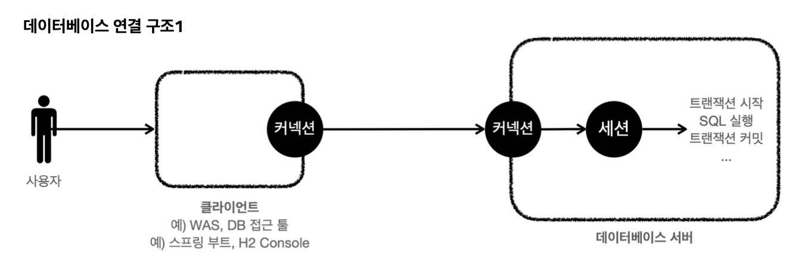
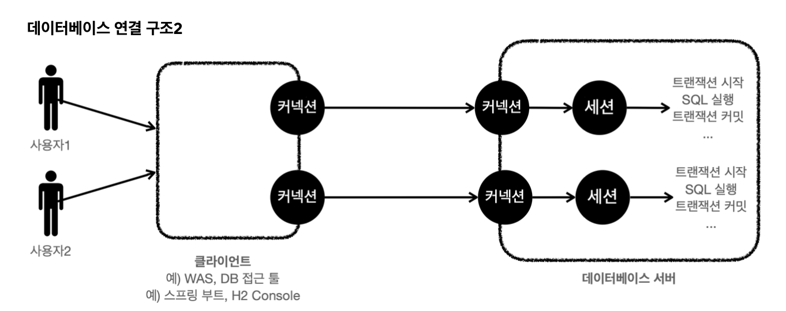
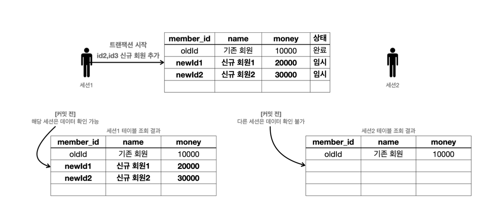
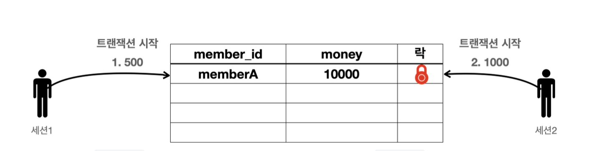
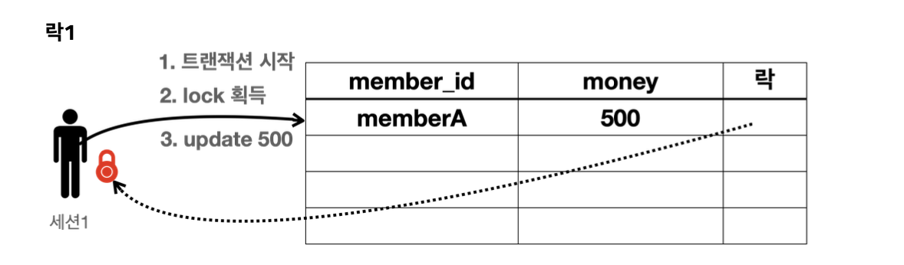
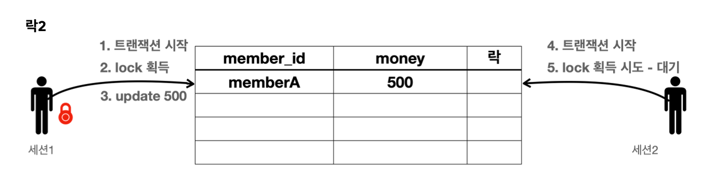
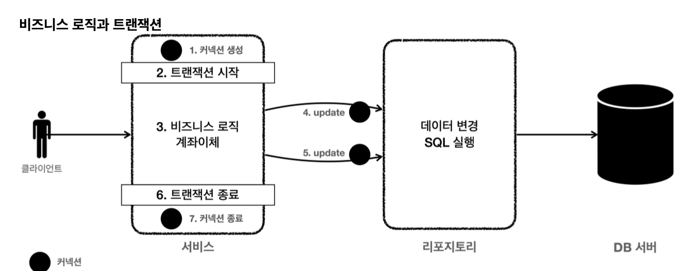
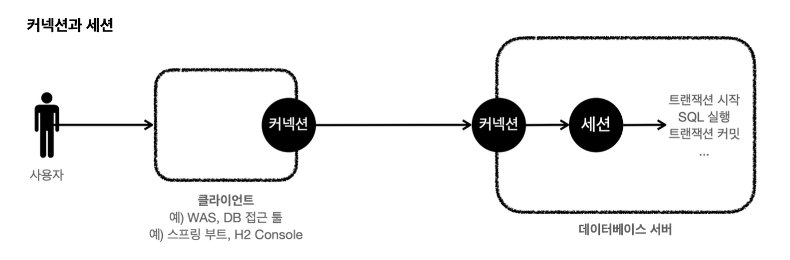

# Transaction

트랜잭션을 지원하기 때문에 db에 저장한다.

Transaction은 거래라는 뜻이다.

db에서 transaction은 하나의 거래를 안전하게 처리하도록 보장해주는 것

모든 작업이 성공하면 `Commit`, 실패하면 `Rollback` 이라 한다.

## Transaction ACID

* atomicity : 트랜잭션 내에서 실행한 작업들은 하나의 작업인 것처럼 모두 성공하거나 모두 실패
* consistency : 모든 트랜잭션은 일관성 있는 db 상태를 유지해야 한다.
* Isolation : 동시에 실행되는 트랜잭션들이 서로에게 영향을 미치지 않도록 격리
* Durability : 트랜잭션을 성공적을 끝내면 그 결과가 항상 기록되어야 된다.

위 4가지 특성을 모두 지키면서 실행하면 동시 처리 성능이 매우 나빠진다.

**트랜잭션 격리 수준**
* Read uncommited
* Read Commitied
* Repeatable Read
* Serializable

## db 연결 구조와 db session

* 사용자는 was나 db 접근 툴 같은 클라이언트를 사용해서 db 서버에 접근 -> 서버에 연결 요청 커넥션 이때 db 서버 내부에 session을 만든다.

* 개발자가 클라이언트를 통해 SQL을 전달하면 현재 커넥션에 연결된 세션이 SQL을 실행

* session은 transaction을 시작 commit or rollback을 통해 트랜잭션을 종료

* 사용자가 커넥션을 닫거나, dba가 세션을 종료시키면 종료

* 커넥션 풀이 10개의 커넥션을 생성하면 세션도 10개 만들어짐

## Transaction

**트랜잭션 사용법**
* 변경 쿼리를 실행하고 결과를 반영하려면 commit 호출, 결과를 반영하고 싶지 않으면 rollback을 호출

* **커밋을 호출하기 전까지 임시로 데이터 저장**

* 세션 1은 트랜잭션을 시작하고 아직 커밋 x
* 새로운 데이터는 임시 상태
* 세션 1은 select 쿼리를 실행해서 본인이 입력한 신규 회원1, 신규 회원2를 조회할 수 있다.
* 세션 2는 조회 하지 못한다.

**Commit 완료 휴**

* 임시에서 완료로 되면서 다른 세션에서도 조회 할 수 있다.

**Rollback**
* 세션 1의 데이터베이스에 반영한 모든 데이터가 처음 상태로 복구된다.

## 락

세션 1이 트랜잭션을 시작하고 데이터를 수정하는 동안 커밋을 수행하지 않았는데, 세션2에서 동시에 같은 데이터를 수정하게 되면 안된다.

원자성이 깨지기 때문에 이런 문제를 방지하기 위해 다른 세션에서 해당 데이터를 수정할 수 없게 막아야 된다.

* 세션 1은 500 세션2는 1000원으로 변경하고 싶다
* db는 이런 문제를 해결하기 위해 락이라는 개념 제공

1. 세션 1은 트랜잭션 시작
2. 세션 1은 500으로 변경 시도, 이때 해당 로우의 락을 먼저 획득해야 된다. 세션 1은 락을 획득
3. 세션 1은 락을 획득해서 update sql을 수행한다.

4. 세션 2는 트랜잭션 시작
5. 세션 2도 변경하고 시도 하지만 락이 없으므로 락이 돌아올 때 까지 대기

6. 세션1이 커밋하면 락 반납
7. 세션 2가 락 획득 
8. update sql 실행

## 락 - 조회

일반적인 조회는 락 x
* db마다 다르지만 락을 획득하고 변경하고 있어도 세션 2에서는 데이터를 조회할 수 있다. 

**조회와 락**
* 조회할 때도 락을 획득하고 싶을 때가 있다. select for update구문 사용

## 트랜잭션 적용

~~~java
public class MemberServiceV1 {
    private final MemberRepositoryV1 memberRepository;
    public void accountTransfer(String fromId, String toId, int money) throws
SQLException {
        Member fromMember = memberRepository.findById(fromId);
        Member toMember = memberRepository.findById(toId);
        memberRepository.update(fromId, fromMember.getMoney() - money);
        validation(toMember);
        memberRepository.update(toId, toMember.getMoney() + money);
}
    private void validation(Member toMember) {
        if (toMember.getMemberId().equals("ex")) {
throw new IllegalStateException("이체중 예외 발생"); }
}
~~~
* fromId의 회원을 조회해서 toId의 회원에게 money만큼의 돈을 계좌이체 하는 로직이다.

~~~java
@Test
@DisplayName("정상 이체")
void accountTransfer() throws SQLException {
//given
        Member memberA = new Member(MEMBER_A, 10000);
        Member memberB = new Member(MEMBER_B, 10000);
        memberRepository.save(memberA);
        memberRepository.save(memberB);
//when
        memberService.accountTransfer(memberA.getMemberId(),
memberB.getMemberId(), 2000);
//then
          Member findMemberA = memberRepository.findById(memberA.getMemberId());
          Member findMemberB = memberRepository.findById(memberB.getMemberId());
          assertThat(findMemberA.getMoney()).isEqualTo(8000);
          assertThat(findMemberB.getMoney()).isEqualTo(12000);
}
@Test
@DisplayName("이체중 예외 발생")
void accountTransferEx() throws SQLException {
//given
          Member memberA = new Member(MEMBER_A, 10000);
          Member memberEx = new Member(MEMBER_EX, 10000);
          memberRepository.save(memberA);
          memberRepository.save(memberEx);
//when
          assertThatThrownBy(() ->
  memberService.accountTransfer(memberA.getMemberId(), memberEx.getMemberId(),
  2000))
                  .isInstanceOf(IllegalStateException.class);
//then
          Member findMemberA = memberRepository.findById(memberA.getMemberId());
          Member findMemberEx =
  memberRepository.findById(memberEx.getMemberId());
//memberA의 돈만 2000원 줄었고, ex의 돈은 10000원 그대로이다. 
assertThat(findMemberA.getMoney()).isEqualTo(8000); 
assertThat(findMemberEx.getMoney()).isEqualTo(10000);
} }
~~~

## 적용2

* 어디서 트랜잭션을 걸어야 될까?
* 트랜잭션은 비즈니스 로직이 있는 서비스 계층에서 시작
* 트랜잭션을 시작하려면 커넥션이 필요
* 애플리케이션에서 db 트랜잭션을 사용하려면 **트랜잭션을 사용하는 동안 같은 커넥션 유지**

같은 커넥션을 유지하려면 파라미터로 전달해서 같은 커넥션이 사용되도록 유지

~~~java
  private final DataSource dataSource;
      public MemberRepositoryV2(DataSource dataSource) {
          this.dataSource = dataSource;
}

    public void update(Connection con, String memberId, int money) throws
SQLException {
        String sql = "update member set money=? where member_id=?";
        PreparedStatement pstmt = null;
        try {
            pstmt = con.prepareStatement(sql);
            pstmt.setInt(1, money);
            pstmt.setString(2, memberId);
            pstmt.executeUpdate();
        } catch (SQLException e) {
            log.error("db error", e);
            throw e;
} finally {
//connection은 여기서 닫지 않는다.     
JdbcUtils.closeStatement(pstmt);
        }
    }
~~~

1. 커넥션 유지가 필요한 두 메서드는 파라미터로 넘어온 커넥션을 사용 -> con = getConnection() 코드가 있으면 안된다.
2. 커넥션 유지가 필요한 두 메서드는 리포지토리에서 커넥션을 닫음 안된다.
* `Connection con = dataSource.getConnection();`
    * 트랜잭션을 시작하려면 커넥션이 필요하다

* `con.setAutoCommit(false); //트랜잭션 시작`
   * 트랜잭션을 시작하려면 자동 커밋 모드를 꺼야한다. 이렇게 하면 커넥션을 통해 세션에`set autocommit false` 가 전달되고, 이후부터는 수동 커밋 모드로 동작한다. 이렇게 자동 커밋 모드를 수동 커밋 모드로 변경하는 것을 트랜잭션을 시작한다고 보통 표현한다.
* `bizLogic(con, fromId, toId, money);`
    * 트랜잭션이 시작된 커넥션을 전달하면서 비즈니스 로직을 수행한다.
    * 이렇게 분리한 이유는 트랜잭션을 관리하는 로직과 실제 비즈니스 로직을 구분하기 위함이다.
    * `memberRepository.update(con..)` : 비즈니스 로직을 보면 리포지토리를 호출할 때 커넥션을 전달 하는 것을 확인할 수 있다.
* `con.commit(); //성공시 커밋`
    * 비즈니스 로직이 정상 수행되면 트랜잭션을 커밋한다.
* `con.rollback(); //실패시 롤백`
    * `catch(Ex){..}` 를 사용해서 비즈니스 로직 수행 도중에 예외가 발생하면 트랜잭션을 롤백한다

* `release(con);`
    * `finally {..}` 를 사용해서 커넥션을 모두 사용하고 나면 안전하게 종료한다. 그런데 커넥션 풀을 사용
    하면 `con.close()` 를 호출 했을 때 커넥션이 종료되는 것이 아니라 풀에 반납된다. 현재 수동 커밋 모드 로 동작하기 때문에 풀에 돌려주기 전에 기본 값인 자동 커밋 모드로 변경하는 것이 안전하다.

**남은 문제**
애플리케이션에서 DB 트랜잭션을 적용하려면 서비스 계층이 매우 지저분해지고, 생각보다 매우 복잡한 코드를 요구한 다. 추가로 커넥션을 유지하도록 코드를 변경하는 것도 쉬운 일은 아니다. 다음 시간에는 스프링을 사용해서 이런 문제 들을 하나씩 해결해보자.
