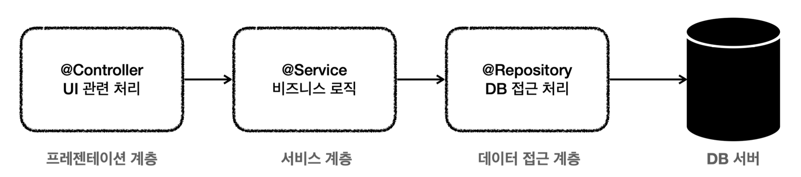
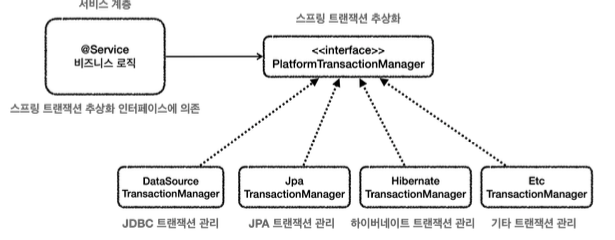
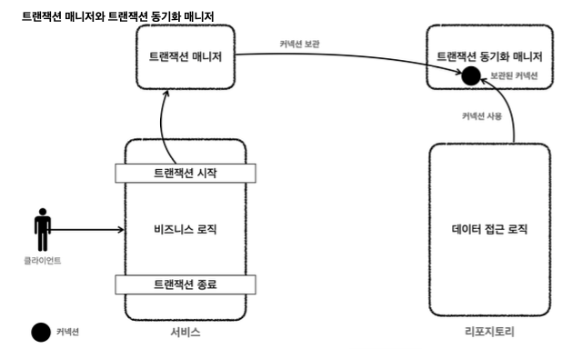
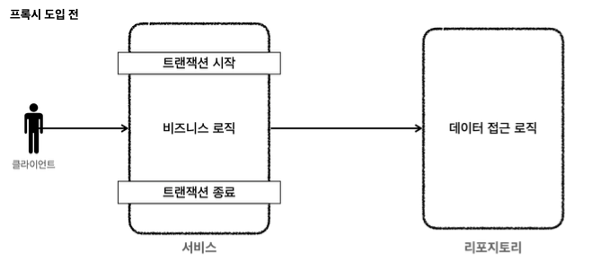
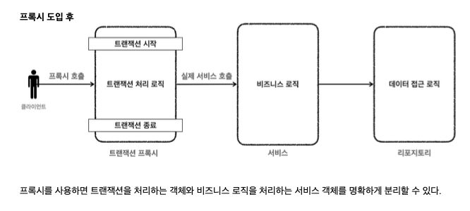
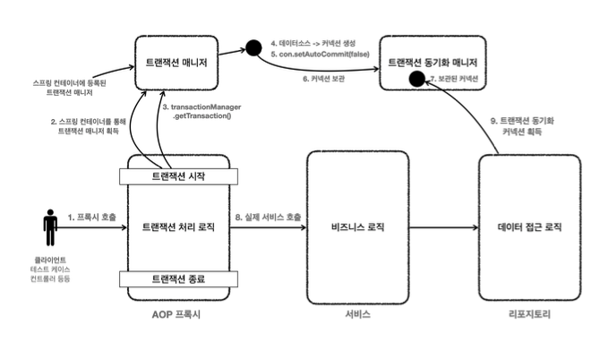

# Spirng Transaction

**문제점**

* pr계층
    * UI 관련
    * 웹 요청 응답
    * 사용자 요청

* 서비스 계층
    * 비즈니스 로직 담당
* 데이터 접근 계층
    * 데이터베이스에 접근하는 코드

**순수한 서비스 계층**

* 비즈니스 계층은 최대한 변경없이 유지되어야 된다.

* 서비스 계층을 특정 기술에 종속적이지 않게 개발해야 된다.
    * 서비스 계층을 최대한 순수하게 유지하기위해 나눔
    * 기술에 종속 = 프레젠테이션 데이터 접근 계층에서 가지고 간다.

~~~java
 public void accountTransfer(String fromId, String toId, int money) throws
SQLException {
        Member fromMember = memberRepository.findById(fromId);
        Member toMember = memberRepository.findById(toId);
        memberRepository.update(fromId, fromMember.getMoney() - money);
        memberRepository.update(toId, toMember.getMoney() + money);
    }
~~~
* MemberServiceV1은 특정 기술에 종속적이지 않고, 순수한 비즈니스 로직만 존재

but
* SQLException -> JDBC에 의존
* V1이라는 구체 클래스에 의존

~~~java
    private final MemberRepositoryV2 memberRepository;
    public void accountTransfer(String fromId, String toId, int money) throws
SQLException {
        Connection con = dataSource.getConnection();
        try {
con.setAutoCommit(false); //트랜잭션 시작 //비즈니스 로직
bizLogic(con, fromId, toId, money); con.commit(); //성공시 커밋
} catch (Exception e) {
con.rollback(); //실패시 롤백
throw new IllegalStateException(e);
        } finally {
            release(con);
} }
~~~
* 트랜잭션은 비즈니스 로직이 있는 서비스 계층에서 시작하는 것이 좋다.
but JDBC 기술에 의존해야 한다는 점이다.

**정리**

* 트랜잭션 문제
* 예외 누수
* jdbc 반복 문제

**transaction 문제**

* JDBC 구현 기술이 서비스 계층에 누수
    * transaction을 적용하기 위해 jdbc 기술이 서비스 계층에 누수
    * 서비스 계층은 순수
* 트랜잭션 동기화 문제
    * 같은 트랜잭션을 유지하기 위해 커넥션을 파라미터로 넘긴다.
* 트랜잭션 적용 반복 문제

**예외 누수**

* 데이터 접근 계층의 JDBC 구현 기술 예외가 서비스 계층으로 전파된다.

## 트랜잭션 추상화

**구현 기술에 따른 트랜잭션 사용법**

* 트랜잭션은 원자적 단위의 비즈니스 로직을 처리
* 구현 기술마다 사용 방법다름

~~~java
//jdbc
try {
con.setAutoCommit(false); //트랜잭션 시작 //비즈니스 로직
bizLogic(con, fromId, toId, money); con.commit(); //성공시 커밋
} catch (Exception e) {
con.rollback(); //실패시 롤백
throw new IllegalStateException(e);
}

//jpa
try {
tx.begin(); //트랜잭션 시작 logic(em); //비즈니스 로직 tx.commit();//트랜잭션 커밋
} catch (Exception e) { tx.rollback(); //트랜잭션 롤백
} finally {
em.close(); //엔티티 매니저 종료
}
emf.close(); //엔티티 매니저 팩토리 종료
~~~

이러한 문제를 해결하면 트랜잭션 기능을 추상화하면 된다.
아주 단순하게 생각하면 인터페이스를 만들어서 사용하면 된다.

**스프링의 트랜잭션 추상화**

**PlatformTransactionManager 인터페이스**
~~~java
 public interface PlatformTransactionManager extends TransactionManager {
      TransactionStatus getTransaction(@Nullable TransactionDefinition
  definition)
throws TransactionException;
  void commit(TransactionStatus status) throws TransactionException;
      void rollback(TransactionStatus status) throws TransactionException;
  }
~~~

* getTransaction() : 트랜잭션 시작
    * getTransaction인 이유는 기존에 이미 진행중인 트랜잭션이 있는 경우 해당 트랜잭션에 참여
* commit() : 트랜잭션을 커밋
* rollback() : 트랜잭션 롤백

## 트랜잭션 동기화

**리소스 동기화**
같은 데이터베이스 커넥션을 유지해야된다. 결국 같은 커넥션 동기화하기 위해 파라미터로 커넥션을 전달했지만 여러 단점들이 많다.

* 스프링은 **트랜잭션 동기화 매니저**를 제공
* 트랜잭션 동기화 매니저는 쓰레드 로컬을 사용

**동작방식**

1. 트랜잭션을 시작하려면 커넥션이 필요하다. 트랜잭션 매니저는 데이터 소스를 통해 커넥션을 만들고 트랜잭션을 시작한다.

2. 트랜잭션 매니저는 트랜잭션이 시작된 커넥션을 트랜잭션 동기화 매니저에 보관한다.

3. 레포는 동기화 매니저에 보관된 커낵션을 꺼내서 사용 따라서 파라미터로 커넥션을 전달 하지 않아도 된다.

4. 트랜잭션이 종료되면 트랜잭션 매니저는 트랜잭션 동기화 매니저에 보관된 커넥션을 통해 트랜잭션을 종료하고 커넥션도 닫는다.

~~~java
 @Slf4j
  public class MemberRepositoryV3 {
    private final DataSource dataSource;
public MemberRepositoryV3(DataSource dataSource) {
    this.dataSource = dataSource;
}
private Connection getConnection() throws SQLException {
//주의! 트랜잭션 동기화를 사용하려면 DataSourceUtils를 사용해야 한다. 
Connection con = DataSourceUtils.getConnection(dataSource);
 log.info("get connection={} class={}", con, con.getClass()); return con;
}
  }
~~~
* 커넥션을 파라미터로 전달하는 부분 모두 제거

**DataSourceUtils.getConnection()**
* getConnection()에서 DataSourceUtils.getConnection()를 사용하도록 변경된 부분을 주의
    * 트랜잭션 동기화 매니저가 관리하는 커넥션이 있으면 해당 커넥션을 반환

**DataSourceUtils.releaseConnection()**

* close()에서 DataSourceUtils.releaseConnection()를 사용하도록 변경된 부분을 특히 주의해야 된다.
* DataSourceUtils.releaseConnection()을 사용하면 커넥션을 바로 닫는 것은 아니다.
    * **트랜잭션을 사용하기 위해 동기화된 커넥션은 커넥션을 닫지 않고 그대로 유지**

**ServiceV3_1**

~~~java
 @RequiredArgsConstructor
  public class MemberServiceV3_1 {
      private final PlatformTransactionManager transactionManager;
      private final MemberRepositoryV3 memberRepository;
      public void accountTransfer(String fromId, String toId, int money) throws
  SQLException { TransactionStatus status = transactionManager.getTransaction(new
DefaultTransactionDefinition());
try {
//비즈니스 로직
            bizLogic(fromId, toId, money);
transactionManager.commit(status); //성공시 커밋 } catch (Exception e) {
transactionManager.rollback(status); //실패시 롤백
            throw new IllegalStateException(e);
        }
}
~~~
* `private final PlatformTransactionManager transactionManager` 
    * 트랜잭션 매니저를 주입 -> DataSourceTransactionManger 구현체 주입
~~~java
@BeforeEach
  void before() {
      DriverManagerDataSource dataSource = new DriverManagerDataSource(URL,
  USERNAME, PASSWORD);
      PlatformTransactionManager transactionManager = new
  DataSourceTransactionManager(dataSource);
      memberRepository = new MemberRepositoryV3(dataSource);
      memberService = new MemberServiceV3_1(transactionManager,
  memberRepository);
  }
~~~

* Test Code에서 `new DataSourceTransactionManager(dataSource)`
    * JDBC 기술을 사용하므로, JDBC용 트랜잭션 매니저를 선택해서 서비스에 주입
    * 트랜잭션 매니저는 데이터 소스를 통해 커넥션을 생성하므로 `DataSource`가 필요하다.

## 트랜잭션 매니저 2

1. 서비스 계층에서 transactionManager.getTransaction()을 호출
2. 트랜잭션을 시작하려면 먼저 db 커넥션 필요, 트랜잭션 매니저는 내부에서 데잍터소스를 용해 커넥션 생성
3. 커낵션 -> 수동모드 -> 실제 db 트랜잭션 시작
4. 커넥션을 동기화 매니저에 보관
5. 동기화 매니저는 쓰레드 로컬에 커넥션 보관
6. 비즈니스 로직 실행 -> 메서드 호출 -> 커넥션을 파라미터로 x
7. 리포지토리 메서드들은 트랜잭션이 시작된 커넥션이 필요 -> DataSourceUtils.getConnection()을 사용해서 동기화 매니저에 보관된 커넥션을 꺼내서 사용
8. 획득한 커넥션을 사용해 sql db에 전달해서 실행
9. 비즈니스 로직이 끝나고 trasaction 종료
10. 트랜잭션을 종료하려면 동기화된 커넥션이 필요 -> 동기화 매니저를 통해 동기화된 커넥션을 획득
11. 획득한 커넥션을 통해 db에 트랜잭션을 커밋 or 롤백
12. 리소스 정리

## AOP

프록시 도입 전에는 기존처럼 서비스의 로직에서 transaction 시작

1. 도입 전 : 서비스에 비즈니스 로직과 트랜잭션 처리 로직이 함께 섞여있다.
2. 도입 후 : 트랜잭션 프록시가 트랜잭션 처리 로직을 모두 가져간다. 트랜잭션을 시작한 후에 실제 서비스를 대신 호출한다.

**스프링이 제공하는 트랜잭션 AOP**

* @Transactional만 붙여주면 된다.

~~~java
    @Transactional
      public void accountTransfer(String fromId, String toId, int money) throws
  SQLException {
          bizLogic(fromId, toId, money);
  }
~~~

* 순수한 비즈니스 로직만 남기고, 트랜잭션 관련 코드는 모두 제거했다.
* 스프링이 제공하는 트랜잭션 AOP를 적용하기 위해 `@Transactional` 애노테이션을 추가했다.

## AOP 정리

**정리**
* 스프링이 제공하는 선언적 트랜잭션 관리 덕분에 트랜잭션 관련 코드를 순수한 비즈니스 로직에서 제거 가능!!
* Transactional만 사용하면 AOP가 자동으로 처리