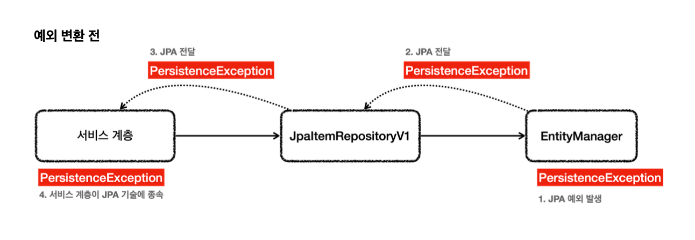
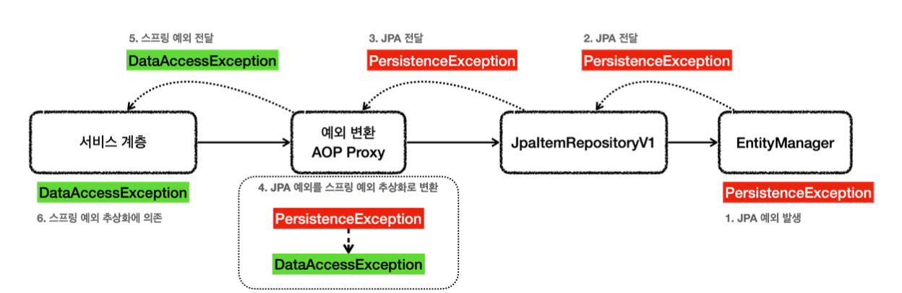

# Jpa

~~~java

 @Data
 @Entity
 public class Item {
     @Id @GeneratedValue(strategy = GenerationType.IDENTITY)
     private Long id;
     @Column(name = "item_name", length = 10)
     private String itemName;
     private Integer price;
     private Integer quantity;
    public Item() {
}
    public Item(String itemName, Integer price, Integer quantity) {
        this.itemName = itemName;
        this.price = price;
        this.quantity = quantity;
} }
~~~
* `@Entity` : JPA가 사용하는 객체라는 뜻이다. 이 에노테이션이 있어야 JPA가 인식할 수 있다. 이렇게`@Entity` 가 붙은 객체를 JPA에서는 엔티티라 한다.

* `@Id` : 테이블의 PK와 해당 필드를 매핑한다.
* @GeneratedValue(strategy = GenerationType.IDENTITY)` : PK 생성 값을 데이터베이스에서 생
성하는 `IDENTITY` 방식을 사용한다. 
* @Column` : 객체의 필드를 테이블의 컬럼과 매핑한다.
    * `name = "item_name"` : 객체는 `itemName` 이지만 테이블의 컬럼은 `item_name` 이므로 이렇게 매핑 했다.
    * length = 10` :JPA의매핑정보로DDL(`create table` )도생성할수있는데,그때컬럼의길이값으 로활용된다.(`varchar 10` )
    * `@Column` 을 생략할 경우 필드의 이름을 테이블 컬럼 이름으로 사용한다. 참고로 지금처럼 스프링 부트와 통합해서 사용하면 필드 이름을 테이블 컬럼 명으로 변경할 때 객체 필드의 카멜 케이스를 테이블 컬럼의 언 더스코어로 자동으로 변환해준다.

**JpaItemRepoV1**

~~~java

@Slf4j
@Repository
@Transactional
public class JpaItemRepositoryV1 implements ItemRepository {
    private final EntityManager em;
    public JpaItemRepositoryV1(EntityManager em) {
        this.em = em;
}
    @Override
    public Item save(Item item) {
        em.persist(item);
        return item;
    }
    @Override
    public void update(Long itemId, ItemUpdateDto updateParam) {
        Item findItem = em.find(Item.class, itemId);
        findItem.setItemName(updateParam.getItemName());
        findItem.setPrice(updateParam.getPrice());
        findItem.setQuantity(updateParam.getQuantity());
}
    @Override
    public Optional<Item> findById(Long id) {
        Item item = em.find(Item.class, id);
        return Optional.ofNullable(item);
    }
    @Override
    public List<Item> findAll(ItemSearchCond cond) {
        String jpql = "select i from Item i";
        Integer maxPrice = cond.getMaxPrice();
        String itemName = cond.getItemName();
        if (StringUtils.hasText(itemName) || maxPrice != null) {
            jpql += " where";
}
        boolean andFlag = false;
        if (StringUtils.hasText(itemName)) {
            jpql += " i.itemName like concat('%',:itemName,'%')";
            andFlag = true;
        }
        if (maxPrice != null) {
            if (andFlag) {
                jpql += " and";
            }
            jpql += " i.price <= :maxPrice";
        }
        log.info("jpql={}", jpql);
        TypedQuery<Item> query = em.createQuery(jpql, Item.class);
        if (StringUtils.hasText(itemName)) {
            query.setParameter("itemName", itemName);
        }
        if (maxPrice != null) {
            query.setParameter("maxPrice", maxPrice);
}
        return query.getResultList();
    }
}
~~~
* private final EntityManager em` :생성자를보면스프링을통해엔티티매니저(`EntityManager`) 라는 것을 주입받은 것을 확인할 수 있다
* `@Transactional` : JPA의 모든 데이터 변경(등록, 수정, 삭제)은 트랜잭션 안에서 이루어져야 한다. 

## 리포지토리

~~~java

 public Item save(Item item) {
     em.persist(item);
     return item;
}
~~~
* em.persist를 사용하면 테이블에 저장이 된다.

**PK**
~~~java
 @Entity
 public class Item {
     @Id @GeneratedValue(strategy = GenerationType.IDENTITY)
     private Long id;
 }
~~~

**update-수정**

~~~java
public void update(Long itemId, ItemUpdateDto updateParam) {
     Item findItem = em.find(Item.class, itemId);
     findItem.setItemName(updateParam.getItemName());
     findItem.setPrice(updateParam.getPrice());
     findItem.setQuantity(updateParam.getQuantity());
}
~~~
* `em.update()` 같은 메서드를 전혀 호출하지 않았다. 그런데 어떻게 UPDATE SQL이 실행되는 것일까? 
* JPA는 트랜잭션이 커밋되는 시점에, 변경된 엔티티 객체가 있는지 확인한다. 특정 엔티티 객체가 변경된 경우에 는 UPDATE SQL을 실행한다.

**findById()**

~~~java
public Optional<Item> findById(Long id) {
     Item item = em.find(Item.class, id);
     return Optional.ofNullable(item);
}
~~~
* Jpa에서 엔티티 객체를 PK 기준으로 조회할 때 find를 사용하고 PK 값을 주면 된다.

**JPQL**

엔티티 객체를 대상으로 하기 때문에 `from` 다음에 `Item` 엔티티 객체 이름이 들어간다. 엔티티 객체와 속성의 대소문 자는 구분해야 한다.
JPQL은 SQL과 문법이 거의 비슷하기 때문에 개발자들이 쉽게 적응할 수 있다.

~~~JPQL
 select i from Item i
 where i.itemName like concat('%',:itemName,'%')
and i.price <= :maxPrice
~~~

**동적 쿼리 문제**
JPA를 사용해도 동적 쿼리 문제가 남는다.

## JPA3

~~~java
 @Override
    public Item save(Item item) {
        em.persist(item);
        return item;
    }
~~~

예외가 발생하면 JPA 예외가 발생하게 된다.

* EntityManager은 순수 JPA기술, 스프링과 관계없음 -> EntityManager는 예외가 발생하면 JPA 관련 예외를 발생시킴

* JPA는 PersisteneException과 그 하위 예외를 발생
    * 추가로 JPA는 IllegalStateException, IllegalArgumentException 발생
* Jpa 예외를 스프링 예외 추상하로 어떻게 변환?

* @Repository에 있다.

**@Repository기능**

* `@Repository`가 붙은 클래스는 컴포넌트 스캔의 대상이 된다.
* `@Repository`가 붙은 클래스는 예외 변환 AOP의 적용 대상이 된다.
    * 스프링과 JPA를 함께 사용하는 경우 스프링은 JPA 예외 변환기를 등록
    * 예외 변환 AOP 프록시는 JPA 관련 예외가 발생하면 JPA 예외 변활기를 통해 발생한 예외를 스프링 데이터 접근 예외로 변환

**예외 변환 후**

