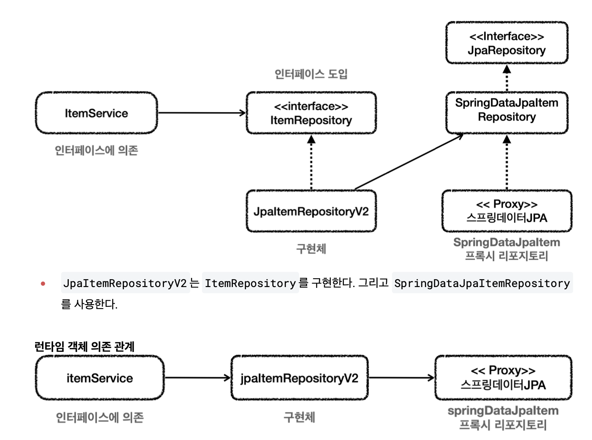

# JpaRepository 사용법

~~~java
 public interface ItemRepository extends JpaRepository<Item, Long> {
 }
~~~

**스프링 데이터 JPA가 구현 클래스를 대신 생성**

## 쿼리 메서드 기능

**순수 JPA 레포**

~~~java
 public List<Member> findByUsernameAndAgeGreaterThan(String username, int age) {
     return em.createQuery("select m from Member m where m.username = :username
 and m.age > :age")
             .setParameter("username", username)
.setParameter("age", age)
 }
~~~

**스프링 데이터 JPA**

~~~java
public interface MemberRepository extends JpaRepository<Member, Long> {
     List<Member> findByUsernameAndAgeGreaterThan(String username, int age);
}
~~~
* 스프링 데이터 JPA는 메스드 이름을 분석해 필요한 JPQ을 만들고 실행해준다.

* 조회: `find...By` ,`read...By` , `query...By` , `get...By`
예: `findHelloBy` 처럼 ...에 식별하기 위한 내용(설명)이 들어가도 된다. 
* COUNT: `count...By` 반환타입 `long`
* EXISTS: `exists...By` 반환타입 `boolean`
삭제: `delete...By` , `remove...By` 반환타입 `long`
* DISTINCT: `findDistinct` , `findMemberDistinctBy` 
* LIMIT: `findFirst3` , `findFirst` , `findTop` , `findTop3`

## 스프링 데이터 JPA 적용 1

~~~java
public interface SpringDataJpaItemRepository extends JpaRepository<Item, Long> {
    List<Item> findByItemNameLike(String itemName);
    List<Item> findByPriceLessThanEqual(Integer price);
//쿼리 메서드 (아래 메서드와 같은 기능 수행)
    List<Item> findByItemNameLikeAndPriceLessThanEqual(String itemName, Integer
price);
//쿼리 직접 실행
    @Query("select i from Item i where i.itemName like :itemName and i.price
<= :price")
    List<Item> findItems(@Param("itemName") String itemName, @Param("price")
Integer price);
}
~~~
* 스프링 데이터가 JPA가 제공하는 JpaRepository 인터페이스를 인터페이스 상속 받으면 기본적인 CRUD 기능을 사용할 수 있다.

~~~java
  @Override
     public Item save(Item item) {
         return repository.save(item);
     }
     @Override
     public void update(Long itemId, ItemUpdateDto updateParam) {
         Item findItem = repository.findById(itemId).orElseThrow();
         findItem.setItemName(updateParam.getItemName());
         findItem.setPrice(updateParam.getPrice());
         findItem.setQuantity(updateParam.getQuantity());
}
     @Override
     public Optional<Item> findById(Long id) {return repository.findById(id);
     }
     @Override
     public List<Item> findAll(ItemSearchCond cond) {
         String itemName = cond.getItemName();
         Integer maxPrice = cond.getMaxPrice();
         if (StringUtils.hasText(itemName) && maxPrice != null) {
 //return repository.findByItemNameLikeAndPriceLessThanEqual("%" + itemName +
 "%", maxPrice);
             return repository.findItems("%" + itemName + "%", maxPrice);
         } else if (StringUtils.hasText(itemName)) {
             return repository.findByItemNameLike("%" + itemName + "%");
         } else if (maxPrice != null) {
             return repository.findByPriceLessThanEqual(maxPrice);
         } else {
             return repository.findAll();
         }
} }
~~~
**의존관계와 구조**
* `ItemService` 는 `ItemRepository` 에 의존하기 때문에 `ItemService` 에서 `SpringDataJpaItemRepository` 를 그대로 사용할 수 없다.

* 물론 `ItemService` 가 `SpringDataJpaItemRepository` 를 직접 사용하도록 코드를 고치면 되겠지만, 우 리는 `ItemService` 코드의 변경없이 `ItemService` 가 `ItemRepository` 에 대한 의존을 유지하면서 DI를 통해 구현 기술을 변경하고 싶다.

* JpaItemRepV2는 ItemRepository를 구현
SpringDataJapItemRepo를 사용

**save()** 
`repository.save(item)`
스프링 데이터 JPA가 제공하는 `save()` 를 호출한다.

**update()**
스프링 데이터 JPA가 제공하는 `findById()` 메서드를 사용해서 엔티티를 찾는다.
그리고 데이터를 수정한다.
이후 트랜잭션이 커밋될 때 변경 내용이 데이터베이스에 반영된다. (JPA가 제공하는 기능이다.)

**findById()** `repository.findById(itemId)`
스프링 데이터 JPA가 제공하는 `findById()` 메서드를 사용해서 엔티티를 찾는다.

