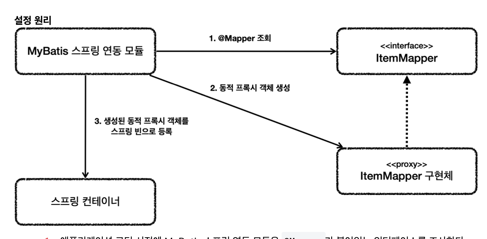

# MyBatis

JdbcTemplate과 비교해서 더 편한 점 : XML에 편하게 작성 + 동적 쿼리를 편리하게 작성할 수 있다는 점

**JdbcTemplate**
~~~java
 String sql = "update item " +
         "set item_name=:itemName, price=:price, quantity=:quantity " +
         "where id=:id";
~~~

**MyBatis**
~~~xml
<update id="update">
     update item
     set item_name=#{itemName},
         price=#{price},
         quantity=#{quantity}
     where id = #{id}
</update>
~~~

**동적 쿼리 비교**

~~~java
String sql = "select id, item_name, price, quantity from item"; //동적 쿼리
if (StringUtils.hasText(itemName) || maxPrice != null) {
     sql += " where";
 }
 boolean andFlag = false;
 if (StringUtils.hasText(itemName)) {
     sql += " item_name like concat('%',:itemName,'%')";
     andFlag = true;
 }
 if (maxPrice != null) {
     if (andFlag) {
         sql += " and";
     }
     sql += " price <= :maxPrice";
 }
 log.info("sql={}", sql);
 return template.query(sql, param, itemRowMapper());
~~~
-> JdbcTemplate 동적 쿼리

**MyBatis**

~~~xml

 <select id="findAll" resultType="Item">
     select id, item_name, price, quantity
     from item
     <where>
         <if test="itemName != null and itemName != ''">
             and item_name like concat('%',#{itemName},'%')
         </if>
         <if test="maxPrice != null">
             and price &lt;= #{maxPrice}
         </if>
     </where>
 </select>
~~~

장단점 : Jdbc는 스프링에 내장 but MyBatis는 약간의 설정 필요

**정리**
프로젝트에서 동적 쿼리와 복잡한 쿼리가 많으면 : myBatis

단순 쿼리들이 많으면 Jdbctemplate 선택

## MyBatis 적용

~~~java
 @Mapper
 public interface ItemMapper {
void save(Item item);
void update(@Param("id") Long id, @Param("updateParam") ItemUpdateDto updateParam);
Optional<Item> findById(Long id);
List<Item> findAll(ItemSearchCond itemSearch);
}
~~~
* 마이바티스 매핑 XML을 호출해주는 매퍼 인스턴스다.

~~~xml
<mapper namespace="hello.itemservice.repository.mybatis.ItemMapper">
     <insert id="save" useGeneratedKeys="true" keyProperty="id">
         insert into item (item_name, price, quantity)
         values (#{itemName}, #{price}, #{quantity})
~~~
* 경로와 파일 이름에 주의하자
* namespace : 앞서 만든 매퍼 인터페이스 지정

~~~xml
void save(Item item); 
 <insert id="save" useGeneratedKeys="true" keyProperty="id">
     insert into item (item_name, price, quantity)
     values (#{itemName}, #{price}, #{quantity})
</insert>
~~~
* insert Sql은 <insert>를 사용
* id에는 매퍼 인터페이스에 설정한 메서드 이름 지정
* 파라미터는 #{} 문법을 사용
* #{} 문법을 사용하면 PreparedStatement사용

**update**
~~~xml
void update(@Param("id") Long id, @Param("updateParam") ItemUpdateDto
 updateParam);
 <update id="update">
     update item
     set item_name=#{updateParam.itemName},
         price=#{updateParam.price},
         quantity=#{updateParam.quantity}
     where id = #{id}
 </update>
~~~
* Update Sql은 <update>를 사용한다.
* 여기서는 파라미터가 Long id, ItemUpdateDto로 2개이다.
* 1개만 있으면 @Param을 지정하지 않아도 되지만, 파라미터가 2개 이상이면 @Param으로 지정해야 된다.

**select**
~~~xml
Optional<Item> findById(Long id);
 <select id="findById" resultType="Item">
     select id, item_name, price, quantity
     from item
     where id = #{id}
</select>
~~~
* Select sql은 select를 사용하면 된다.
* resultType은 반환 타입을 명시하면 된다.
* 자바 코드에서 반환 객체가 하나이면 Item, Optional<Item>과 같이 사용하면 되고, 반환 객체가 하나 이상이면 컬렉션을 사용하면 된다.

**FindAll**

~~~xml
List<Item> findAll(ItemSearchCond itemSearch);
 <select id="findAll" resultType="Item">
     select id, item_name, price, quantity
     from item
     <where>
         <if test="itemName != null and itemName != ''">
             and item_name like concat('%',#{itemName},'%')
         </if>
         <if test="maxPrice != null">
             and price &lt;= #{maxPrice}
         </if>
     </where>
 </select>
~~~
* Mybatis는 <where>, <if> 같은 동적 쿼리 문법을 통해 통적 쿼리 지원
* <if>는 해당 조건이 만족하면 구문 추가
* <where>은 적절하게 where문장을 만들어준다

## MyBatis 2

~~~java
private final ItemMapper itemMapper;

@Override
public Item save(Item item) {
        itemMapper.save(item);
        return item;
}
    @Override
    public void update(Long itemId, ItemUpdateDto updateParam) {
        itemMapper.update(itemId, updateParam);
    }
    @Override
    public Optional<Item> findById(Long id) {
        return itemMapper.findById(id);
    }
    @Override
    public List<Item> findAll(ItemSearchCond cond) {
        return itemMapper.findAll(cond);
    }
~~~
* ItemRepo를 구현해서 MyBatisRepo로 만들고
* MyBatisRepo는 단순히 ItemMapper에 기능 위임

* application 로딩 시점에 MyBatis 스프링 연동 모듈은 @Mapper가 붙어있는 인터페이스 조사
2. 해당 인터페이스가 발견되면 동적 프록시 기술을 사용해서 ItemMapper 인터페이스의 구현체를 만든다.
3. 생성된 구현체를 스프링 빈으로 등록

**정리**

* 매퍼 구현체 덕분에 마이바티스를 스프링에 편리하게 통합해서 사용할 수 있다.
* 매퍼 구현체를 사용하면 스프링 예외 추상화도 함께 적용된다.
* 마이바티스 스프링 연동 모듈이 많은 부분을 자동으로 설정해주는데, 데이터베이스 커넥션, 트랜잭션과 관련된 기능도 마이바티스와 함께 연동하고, 동기화해준다.

## 동적쿼리

~~~xml
<select id="findActiveBlogWithTitleLike"
      resultType="Blog">
   SELECT * FROM BLOG
   WHERE state = ‘ACTIVE’
   <if test="title != null">
     AND title like #{title}
   </if>
</select>
~~~
* 해당 조건에 따라 값을 추가할지 말지 판단.
* 내부의 문법은 OGNL을 사용한다.
