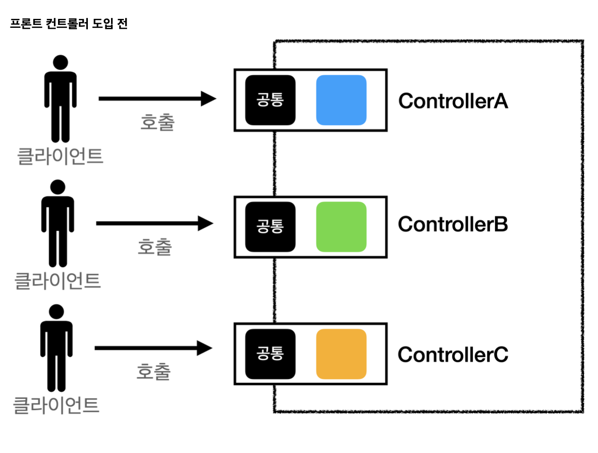
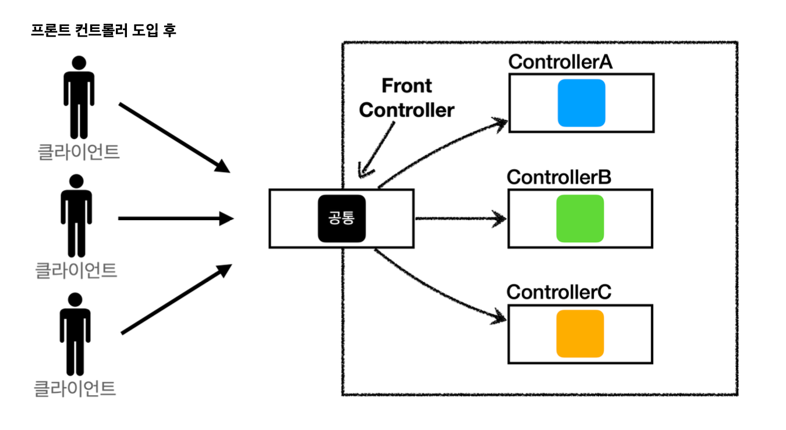
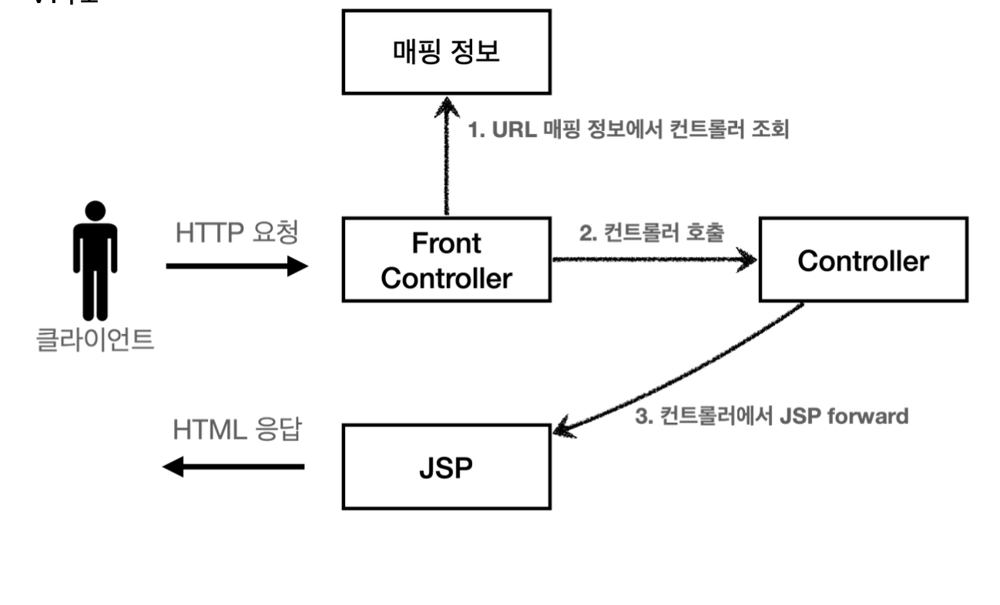
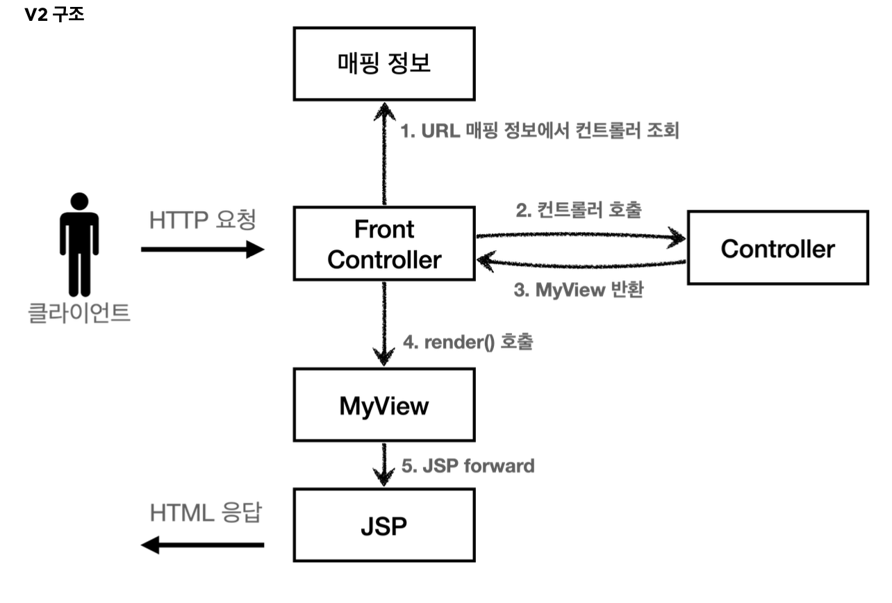
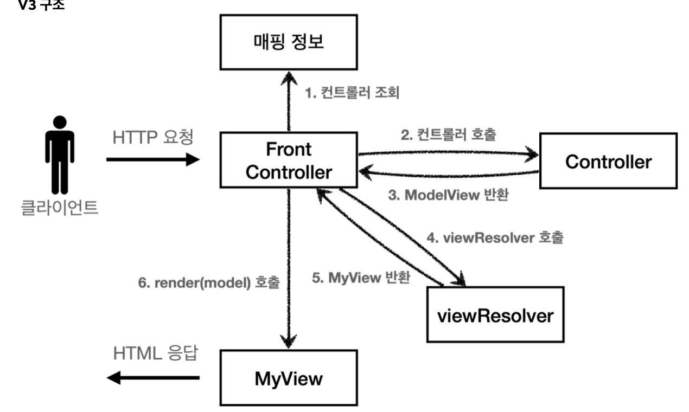
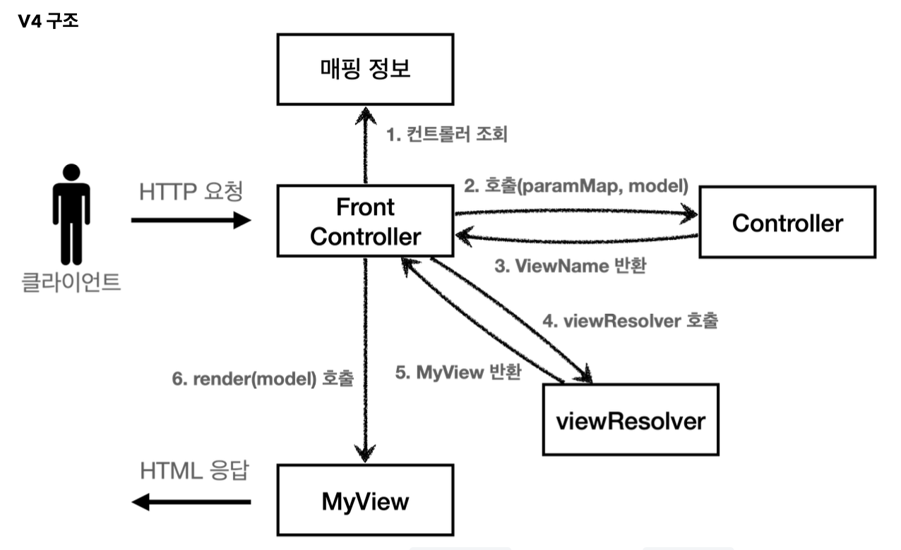
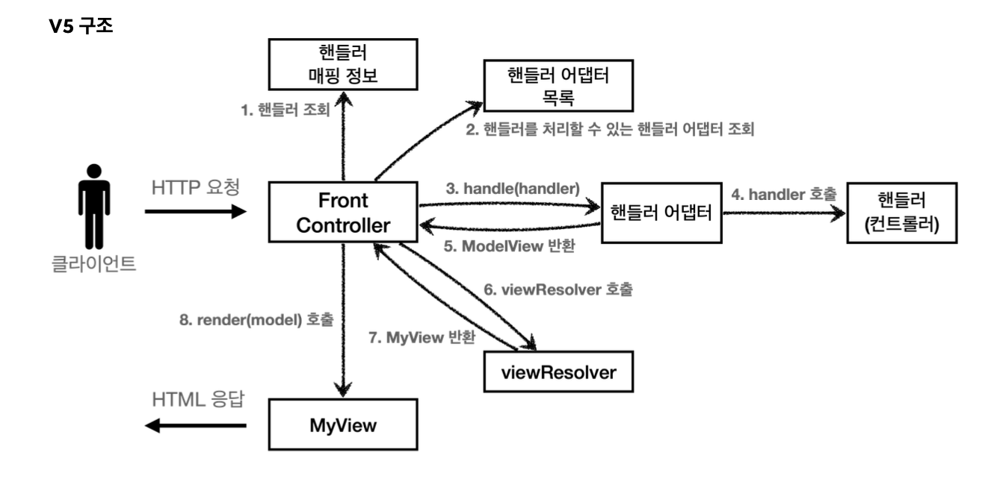

# introduce front controller

**Before**


**After**


**front controller 특징**

* 프론트 컨트롤러 서블릿 하나로 클라이언트의 요청 받음
* 프론트 컨트롤러가 요청에 맞는 컨트롤러를 찾아 호출
* 공통 처리 가능

웹 MVC의 핵심은 **❗️Front Countroller**이다

## V1의 구조 



서블릿과 비슷한 모양의 컨트롤러 인터페이스 도입

~~~java 

 public interface ControllerV1 {
     void process(HttpServletRequest request, HttpServletResponse response)
 throws ServletException, IOException;
 }


 public class MemberFormControllerV1 implements ControllerV1 {
@Override
     public void process(HttpServletRequest request, HttpServletResponse
 response) throws ServletException, IOException {
         String viewPath = "/WEB-INF/views/new-form.jsp";
         RequestDispatcher dispatcher = request.getRequestDispatcher(viewPath);
         dispatcher.forward(request, response);
}
 }

~~~
(상세코드는 project)

**FrontControllerV1**

~~~java
  @WebServlet(name = "frontControllerServletV1", urlPatterns = "/front-controller/
 v1/*")
 public class FrontControllerServletV1 extends HttpServlet {
     private Map<String, ControllerV1> controllerMap = new HashMap<>();
     public FrontControllerServletV1() {
         controllerMap.put("/front-controller/v1/members/new-form", new
 MemberFormControllerV1());
         controllerMap.put("/front-controller/v1/members/save", new
 MemberSaveControllerV1());
         controllerMap.put("/front-controller/v1/members", new
 MemberListControllerV1());
     }
@Override
     protected void service(HttpServletRequest request, HttpServletResponse
 response)
             throws ServletException, IOException {
         System.out.println("FrontControllerServletV1.service");
         String requestURI = request.getRequestURI();
          ControllerV1 controller = controllerMap.get(requestURI);
         if (controller == null) {
             response.setStatus(HttpServletResponse.SC_NOT_FOUND);
return; }
         controller.process(request, response);
     }
}
~~~

**코드 분석**

1. urlPartterns
    * front-controller/v1를 포함한 하위 모든 요청은 이 서블릿에서 받아들여진다.

2. controllerMap
    * key : 매핑 Url
    * value : 호출된 컨트롤러

3. service()
    * 먼저 requestURI를 조회 후 호출할 컨트롤러를 Map에서 찾고 없으면 404반환
    * 컨트롤러를 찾으면 controller.process를 통해 해당 컨트롤러 실행

4. JSP
    * 이전에 사용했던 것 그대로 사용

## View의 분리 -v2

~~~java

 String viewPath = "/WEB-INF/views/new-form.jsp";
 RequestDispatcher dispatcher = request.getRequestDispatcher(viewPath);
dispatcher.forward(request, response); 
~~~

모든 컨트롤러에서 뷰로 이동하는 부분이 중복!

**v2의 구조**



**MyView**

뷰 객체를 분리할 것이다.

~~~java
public class MyView {
     private String viewPath;
     public MyView(String viewPath) {
         this.viewPath = viewPath;
}
     public void render(HttpServletRequest request, HttpServletResponse response)
 throws ServletException, IOException {
         RequestDispatcher dispatcher = request.getRequestDispatcher(viewPath);
         dispatcher.forward(request, response);
     }
}
~~~

**컨트롤러가 뷰를 반환하는 특징이 있다.**

**ControllerV2**
~~~java

 public interface ControllerV2 {

MyView process(HttpServletRequest request, HttpServletResponse response)
 throws ServletException, IOException;
}
~~~

**회원 등록 폼**

~~~java
@Override
     public MyView process(HttpServletRequest request, HttpServletResponse
 response) throws ServletException, IOException {
         return new MyView("/WEB-INF/views/new-form.jsp");
     }
~~~
이제 각 컨트롤러는 복잡한 dispatcher.forward()를 생성 호출하지 않아도 된다.
My View 객체를 생성하고 거기에 뷰 이름만 넣으면 된다.

**프론트 컨트롤러 V2**

~~~java
@WebServlet(name = "frontControllerServletV2", urlPatterns = "/front-controller/
 v2/*")
 public class FrontControllerServletV2 extends HttpServlet {
     private Map<String, ControllerV2> controllerMap = new HashMap<>();
     public FrontControllerServletV2() {
         controllerMap.put("/front-controller/v2/members/new-form", new
 MemberFormControllerV2());
         controllerMap.put("/front-controller/v2/members/save", new
 MemberSaveControllerV2());
         controllerMap.put("/front-controller/v2/members", new
 MemberListControllerV2());
     }
@Override
     protected void service(HttpServletRequest request, HttpServletResponse
 response)
 throws ServletException, IOException {
         String requestURI = request.getRequestURI();
         ControllerV2 controller = controllerMap.get(requestURI);
         if (controller == null) {
             response.setStatus(HttpServletResponse.SC_NOT_FOUND);
return; }
         MyView view = controller.process(request, response);
         view.render(request, response);
     }
}
~~~
ControllerV2의 반환 타입이 MyView이므로 프론트 컨트롤러는 컨트롤러의 호출 결과로 MyView를 반환 받는다.
view.render()를 호출하면 forward 로직을 수행해서 JSP가 실행된다.

~~~java
MyView.render()
 public void render(HttpServletRequest request, HttpServletResponse response)
 throws ServletException, IOException {
     RequestDispatcher dispatcher = request.getRequestDispatcher(viewPath);
     dispatcher.forward(request, response);
 }
~~~
프론트 컨트롤러의 도입으로 MyView 객체의 render()를 호출하는 부분을 모두 일관되게 처리할 수 있다.

## Model 추가 - v3

**서블릿 종속성 제거**
컨트롤러 입장에서 HttpServletRequest, Response가 꼭 필요할까?

요청 파라미터 정보는 자바의 Map으로 대신 넘기도록 하고 구조에서는 컨트롤러가 서블릿 기술을 몰라도 된다.

request 객체를 Model로 사용하는 대신에 별도의 Model 객체를 만들어서 반환하면 된다.

**뷰 이름 중복 제거**

뷰 이름에 중복이 있는 것을 확인할 수 있다.
컨트롤러는 **뷰의 논리 이름**을 반환하고, 실제 물리 위치의 이름은 프론트 컨트롤러에서 처리하도록 단순화 한다.

**V3의 구조**



지금까지 컨트롤러에서 서블릿에 종속적인 HttpServletRequest를 사용 + Model에서도 request.setAttribute를 통해 데이터 저장하고 뷰에 전달 -> Model을 직접 만들고, view 이름까지 전달하는 객체를 만들어 보자.

**ModelView**
~~~java
@Getter @Setter
 public class ModelView {
     private String viewName;
     private Map<String, Object> model = new HashMap<>();
     public ModelView(String viewName) {
         this.viewName = viewName;
}
 }
~~~
뷰의 이름과 뷰를 렌더링할 때 필요한 model 객체를 가지고 있다. model은 단순히 map으로 되어 있고, 컨트롤러에서 뷰에 필요한 데이터를 key,value로 넣어주면 된다.

**ControllerV3**

~~~java
public interface ControllerV3 {
     ModelView process(Map<String, String> paramMap);
 }
 ~~~
서블릿 기술을 전혀 사용하지 않는다 -> 구현이 단순해진다.
HttpServletRequest가 제공하는 파라미터는 프론트 컨트롤러가 paramMap에 담아서 호출
응답 결과로 뷰 이름과 뷰에 전달할 Model 데이터를 포함하는 ModleView 객체를 반환

**회원 등록 폼**
~~~java
     @Override
     public ModelView process(Map<String, String> paramMap) {
         return new ModelView("new-form");
     }
~~~

**FrontControllerV3**

~~~java
 public FrontControllerServletV3() {
        controllerMap.put("/front-controller/v3/members/new-form", new
MemberFormControllerV3());
        controllerMap.put("/front-controller/v3/members/save", new
MemberSaveControllerV3());
        controllerMap.put("/front-controller/v3/members", new
MemberListControllerV3());
    }
@Override
    protected void service(HttpServletRequest request, HttpServletResponse
response)
            throws ServletException, IOException {
        String requestURI = request.getRequestURI();
        ControllerV3 controller = controllerMap.get(requestURI);
        if (controller == null) {
            response.setStatus(HttpServletResponse.SC_NOT_FOUND);
return; }
        Map<String, String> paramMap = createParamMap(request);
        ModelView mv = controller.process(paramMap);
        String viewName = mv.getViewName();
        MyView view = viewResolver(viewName);
        view.render(mv.getModel(), request, response);
    }
    private Map<String, String> createParamMap(HttpServletRequest request) {
        Map<String, String> paramMap = new HashMap<>();
        request.getParameterNames().asIterator()
                .forEachRemaining(paramName -> paramMap.put(paramName,
request.getParameter(paramName)));
        return paramMap;
}
private MyView viewResolver(String viewName) {
         return new MyView("/WEB-INF/views/" + viewName + ".jsp");
}
~~~
view.render(my.getModle()) -> 오류 발생

* createParamMap()
    * HttpServletRequest에서 파라미터 정보를 꺼내 Map으로 변환, 컨트롤러에 전달하면서 호출

**view Resolver**

* Myview view = viewResolver(viewName)
    * 컨트롤러가 반환한 논리 뷰 이름을 실제 물리 뷰 경로로 변경 -> 실제 물리 경로가 있는 MyView객체를 반환
    * 논리 뷰 이름 : members
    * 물리 뷰 이름 : `/WEB-INF/views/members.jsp`

* `view.render(mv.getModel(), request, response)`
    * 뷰 객체를 통해서 HTML 화면을 렌더링 한다.
    * 뷰 객체의 `render()` 는 모델 정보도 함께 받는다.
    * JSP는 `request.getAttribute()` 로 데이터를 조회하기 때문에, 모델의 데이터를 꺼내서`request.setAttribute()` 로 담아둔다. 
    * JSP로 포워드 해서 JSP를 렌더링 한다.

**My View**
~~~java
 public MyView(String viewPath) {
         this.viewPath = viewPath;
}
     public void render(HttpServletRequest request, HttpServletResponse response)
 throws ServletException, IOException {
         RequestDispatcher dispatcher = request.getRequestDispatcher(viewPath);
         dispatcher.forward(request, response);
     }
     public void render(Map<String, Object> model, HttpServletRequest request,
 HttpServletResponse response) throws ServletException, IOException {
         modelToRequestAttribute(model, request);
         RequestDispatcher dispatcher = request.getRequestDispatcher(viewPath);
         dispatcher.forward(request, response);
}
     private void modelToRequestAttribute(Map<String, Object> model,
 HttpServletRequest request) {
         model.forEach((key, value) -> request.setAttribute(key, value));
     }
~~~
* myview에서 입력 받은 request들을 setAttribute로 설정해주고 -> render에서 Dispatch를 해준다.

## V4



V3와 같지만 컨트롤러가 ModelView를 반환하지 않고, ViewName만 반환

~~~java
ControllerV4{
String process(Map<String, String> paramMap, Map<String, Object> model);
}
~~~

~~~java
//회원 등록
     public String process(Map<String, String> paramMap, Map<String, Object>
 model) {
         return "new-form";
     }
//회원 저장
 String username = paramMap.get("username");
         int age = Integer.parseInt(paramMap.get("age"));
         Member member = new Member(username, age);
         memberRepository.save(member);
         model.put("member", member);
         return "save-result";
~~~
모델이 파라미터로 전달되기 때문에, 직접 생성하지 않아도 된다.

**FrontControllerV4**

~~~java
Map<String, String> paramMap = createParamMap(request); Map<String, Object> model = new HashMap<>(); //추가
         String viewName = controller.process(paramMap, model);
         MyView view = viewResolver(viewName);
         view.render(model, request, response);
     }
     private Map<String, String> createParamMap(HttpServletRequest request) {
         Map<String, String> paramMap = new HashMap<>();
         request.getParameterNames().asIterator()
                 .forEachRemaining(paramName -> paramMap.put(paramName,
 request.getParameter(paramName)));
         return paramMap;
     }
     private MyView viewResolver(String viewName) {
         return new MyView("/WEB-INF/views/" + viewName + ".jsp");}

~~~
**모델 객체 전달**

`Map<String, Object> model = new HashMap<>();`
    : 모델 객체를 프론트 컨트롤러에서 생성해서 넘겨준다. 컨트롤러에서 모델 객체에 값을 담으면 여기에 그대로 담겨있게 된다.

## V5 -adapter pattern

어떤 개발자는 ControllerV3 어떤 개발자는 ControllerV4로 개발하고 싶다 어떻게 해야 될까?

**adapter Pattern**



* 핸들러 어댑터 : 중간에 어댑터 역할, 중간에서 어댑터 역할을 해주는 덕분에 다양한 종류의 컨트롤러를 호출할 수 있다.
* 핸들러 : 컨트롤러의 이름을 더 넓은 범위인 핸들러로 변경 -> 해당하는 종류의 어댑터만 있으면 다 처리가 가능


**MyHandlerAdapter**

~~~java
boolean supports(Object handler);
  ModelView handle(HttpServletRequest request, HttpServletResponse response,Object handler) throws ServletException, IOException;
~~~

* boolean support
    * handler 컨트롤러를 말한다.
    * 어댑터가 해당 컨트롤러를 처리할 수 있는지 판단

* ModelView handler
    * 어댑터는 실제 컨트롤러가 호출, 그 결과로 ModelView 반환
    * 실제 컨트롤러가 ModleView를 반환 못하면 어댑터가 ModelVeiw를 직접 생성해서라도 반환


**ControllerV3HandlerAdapter**

~~~java

 public class ControllerV3HandlerAdapter implements MyHandlerAdapter {
     @Override
     public boolean supports(Object handler) {
         return (handler instanceof ControllerV3);
     }
@Override
     public ModelView handle(HttpServletRequest request, HttpServletResponse
 response, Object handler) {
    ControllerV3 controller = (ControllerV3) handler;
         Map<String, String> paramMap = createParamMap(request);
         ModelView mv = controller.process(paramMap);
return mv; }
     private Map<String, String> createParamMap(HttpServletRequest request) {
         Map<String, String> paramMap = new HashMap<>();
         request.getParameterNames().asIterator()
                 .forEachRemaining(paramName -> paramMap.put(paramName,
 request.getParameter(paramName)));
         return paramMap;
     }
}
~~~

~~~java
public boolean supports(Object handler) {
     return (handler instanceof ControllerV3);
}
~~~
ControllerV3를 처리할 수 있는 어댑터

~~~java
public boolean supports(Object handler) {
     return (handler instanceof ControllerV3);
}
~~~
handler를 컨트롤러 V3로 변환한 다음에 V3 형식에 맞도록 호출한다.
`supports()` 를 통해 `ControllerV3` 만 지원하기 때문에 타입 변환은 걱정없이 실행해도 된다.
ControllerV3는 ModelView를 반환하므로 그대로 ModelView를 반환하면 된다.


**FrontControllerServlet5**

~~~java
@Override
     protected void service(HttpServletRequest request, HttpServletResponse
 response)
             throws ServletException, IOException {
         Object handler = getHandler(request);
         if (handler == null) {
             response.setStatus(HttpServletResponse.SC_NOT_FOUND);
return; }
         MyHandlerAdapter adapter = getHandlerAdapter(handler);
         ModelView mv = adapter.handle(request, response, handler);
         MyView view = viewResolver(mv.getViewName());
         view.render(mv.getModel(), request, response);
     }
     private Object getHandler(HttpServletRequest request) {
         String requestURI = request.getRequestURI();
         return handlerMappingMap.get(requestURI);
}
     private MyHandlerAdapter getHandlerAdapter(Object handler) {
         for (MyHandlerAdapter adapter : handlerAdapters) {
             if (adapter.supports(handler)) {
                 return adapter;
} }
throw new IllegalArgumentException("handler adapter를 찾을 수 없습니다. handler=" + handler);
}
     private MyView viewResolver(String viewName) {
         return new MyView("/WEB-INF/views/" + viewName + ".jsp");
}
~~~
컨트롤러 -> 핸들러
이전에는 컨트롤러를 직접 매핑 -> 컨트롤러 뿐만 아니라 어댑터가 지원하기만 하면 어떤 것이라도 URL 매핑해서 사용가능

~~~java
public FrontControllerServletV5() { initHandlerMappingMap(); //핸들러 매핑 초기화 
initHandlerAdapters(); //어댑터 초기화
}
~~~

**매핑 정보**

`private final Map<String, Object> handlerMappingMap = new HashMap<>();`

매핑 정보의 값이 v3,v4와 같은 인터페이스에 아무 값이나 받을 수 있는 Object로 변경

**핸들러 매핑**

~~~java
Object handler = getHandler(request)`
```java
 private Object getHandler(HttpServletRequest request) {
     String requestURI = request.getRequestURI();
     return handlerMappingMap.get(requestURI);
}
~~~
핸들러 매핑 정보인 handlerMappingMap에서 URL에서 매핑된 핸들러 객체를 찾아서 반환

