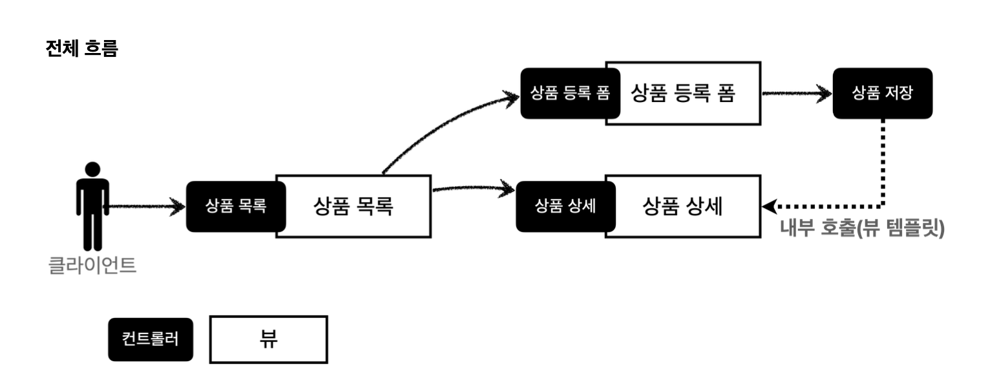
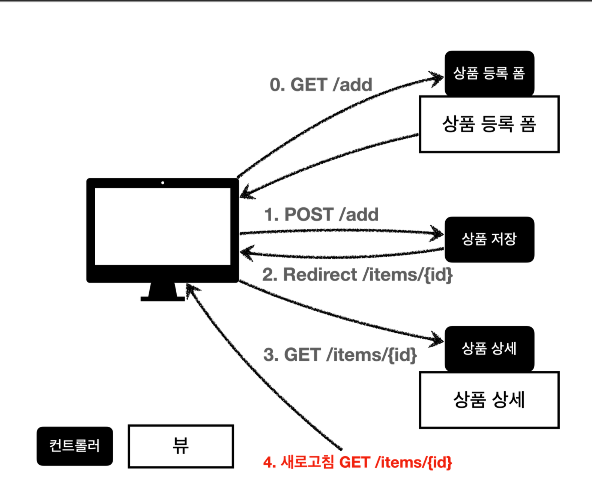

# 요구사항

**상품 도메인**
* 상품 ID
* 상품명
* 가격
* 수량

**상품 관리 기능**
* 상품 목록
* 상품 상세
* 상품 등록
* 상품 수정

**item- 상품객체**

~~~java
@Data
 public class Item {
     private Long id;
     private String itemName;
     private Integer price;
     private Integer quantity;
     public Item() {
     }
     public Item(String itemName, Integer price, Integer quantity) {
         this.itemName = itemName;
         this.price = price;
         this.quantity = quantity;}
 }
~~~
* 실제로는 data 보드는 @Getter @Setter을 많이 쓴다.


**ItemRepo - 상품 저장소**

~~~java

 @Repository
 public class ItemRepository {
private static final Map<Long, Item> store = new HashMap<>(); //static 사용 private static long sequence = 0L; //static 사용
     public Item save(Item item) {
         item.setId(++sequence);
         store.put(item.getId(), item);
         return item;
}
     public Item findById(Long id) {
         return store.get(id);
}
     public List<Item> findAll() {
         return new ArrayList<>(store.values());
}
     public void update(Long itemId, Item updateParam) {
         Item findItem = findById(itemId);
         findItem.setItemName(updateParam.getItemName());
         findItem.setPrice(updateParam.getPrice());
         findItem.setQuantity(updateParam.getQuantity());
}
     public void clearStore() {
         store.clear();
}
~~~

## 상품 목록 - 타임리프

~~~java

 @Controller
 @RequestMapping("/basic/items")
 @RequiredArgsConstructor
  public class BasicItemController {
     private final ItemRepository itemRepository;
     @GetMapping
     public String items(Model model) {
         List<Item> items = itemRepository.findAll();
         model.addAttribute("items", items);
         return "basic/items";
}
~~~

컨트롤러 로직은 itemRepo에서 모든 상품 조회후 모델에 담는다. -> 뷰 템플릿 호출

~~~java
@RequiredArgsConstructor

 public BasicItemController(ItemRepository itemRepository) {
   this.itemRepository = itemRepository;
}
~~~

* 생성자가 1개만 존재하면 해당 생성자에 @Autowired로 의존관계를 주입
* final keyword를 빼면 안된다.


### thymeleaf

`<html xmlns:th="http://www.thymeleaf.org">`
-> 간단하게 타임리프 선언

**속성 변경 - th:href**
* `th:href="@{/css/bootstrap.min.css}"`

**반복 출력 - th:each**
* `<tr th:each="item : ${items}">`

**URL 링크 간단히**
* `th:href="@{|/basic/items/${item.id}|}`

## 상품상세

~~~java

```java
 @GetMapping("/{itemId}")
 public String item(@PathVariable Long itemId, Model model) {
     Item item = itemRepository.findById(itemId);
     model.addAttribute("item", item);
     return "basic/item";
}
~~~
`PathVariable` 로 넘어온 상품ID로 상품을 조회하고, 모델에 담아둔다. 그리고 뷰 템플릿을 호출한다.

## 상품 등록 처리 - @ModelAttribute

~~~java

/**
* @ModelAttribute("item") Item item
* model.addAttribute("item", item); 자동 추가 */
 @PostMapping("/add")
 public String addItemV2(@ModelAttribute("item") Item item, Model model) {
itemRepository.save(item);
 }
~~~

**@ModelAttribute - 요청 파라미터 처리**
* @ModelAttribute는 Item 객체를 생성, 요청 파라미터의 값을 프로퍼티 접근법으로 입력

**@ModelAttribute - Model 추가**

* 모델에 @ModelAttribute로 지정한 객체를 자동을 넣어준다. model.addAtriubte("item",item)가 주석처리 되어 있어도 잘 동작한다.


## 상품 수정

~~~java
 @GetMapping("/{itemId}/edit")
 public String editForm(@PathVariable Long itemId, Model model) {
     Item item = itemRepository.findById(itemId);
     model.addAttribute("item", item);
     return "basic/editForm";
}

 @PostMapping("/{itemId}/edit")
 public String edit(@PathVariable Long itemId, @ModelAttribute Item item) {
     itemRepository.update(itemId, item);
     return "redirect:/basic/items/{itemId}";
 }
 ~~~

 **리다이렉트**
 상품 수정은 마지막에 뷰 템플릿을 호출하는 대신 상품 상세 하면으로 이동

 ### PRG/POST/GET

 
 전체 흐름이다
 -> 새로 고침을 누르면 상품이 계속해서 중복 등록이 된다.

Before

* 웹 브라우저의 새로고침은 마지막에 서버에 전송한 데이터를 다시 전송

* 상품 등록 폼에서 데이터를 입력하고 저장 -> POST /add + 상품데이터를 서버로 전송

* 이 상태에서 새로 고침을 또 선택하면 마지막에 전송한 POST /add + 상품 데이터를 서버로 다시 전송

After


* 웹 브라우저의 새로 고침은 마지막에 서버에 전송한 데이터를 다시 전송

* 상품 상세 화면으로 리다이렉트를 호출하면 된다.

* 마지막에 호출한 내용이 상품 상세 화면인 GET /items/{id}가 된다.

### RedirectAttribute

~~~java
@PostMapping("/add")
 public String addItemV6(Item item, RedirectAttributes redirectAttributes) {
     Item savedItem = itemRepository.save(item);
     redirectAttributes.addAttribute("itemId", savedItem.getId());
     redirectAttributes.addAttribute("status", true);
     return "redirect:/basic/items/{itemId}";
}
~~~
**RedirectAttribute**
URL incoding + pathVariable, 쿼리 파라미터까지 처리해준다

* redirect:/basic/items/{itemdId}

