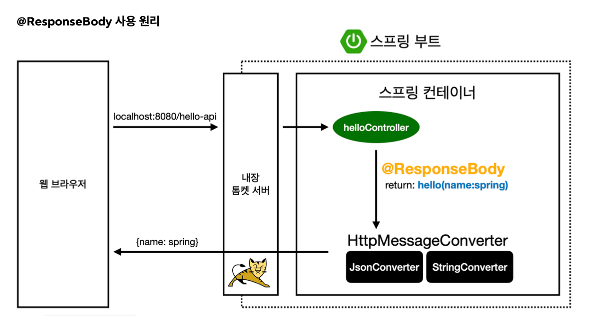
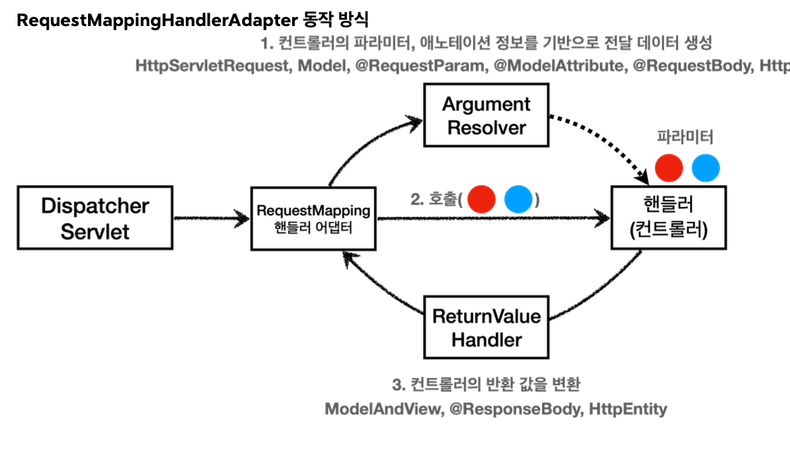
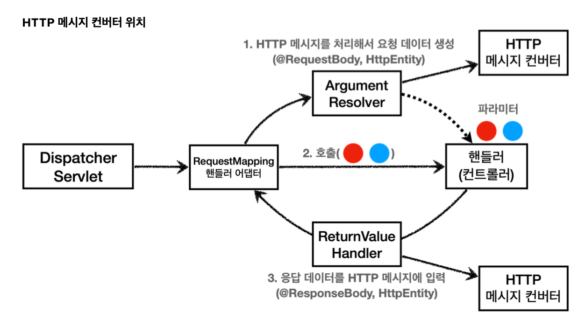

# HTTP Message Convert
뷰 템플릿으로 HTML을 생성해서 응답하는 것이 아니라, HTTP API처럼 JSON 데이터를 HTTP 메시지 바디에서 직접 읽거나 쓰는 경우 HTTP 메시지 컨버터를 사용

* @ResponseBody
    * viewResolver` 대신에 `HttpMessageConverter` 가 동작
    * 기본 문자처리: `StringHttpMessageConverter`
    * 기본 객체처리: `MappingJackson2HttpMessageConverter`

~~~java
 HttpMessageConverter<T> {
     boolean canRead(Class<?> clazz, @Nullable MediaType mediaType);
     boolean canWrite(Class<?> clazz, @Nullable MediaType mediaType);
 }
~~~

* canRead(), canWriter() : 메시지 컨버터가 해당 클래서, 미디어타입을 지원하는지 체크
* read(), wirte(): 메시지 컨버터를 통해서 메시지를 읽고 쓰는 기능

**HTTP 요청 데이터 읽기**

* HTTP 요청 -> 컨트롤러에서 @RequestBody, HttpEntity 파라미터를 호출
* 메시지 컨버터가 메시지를 읽을 수 있는지 확인하기 위해 canRead()를 호출
    * 대상 클래스 타입 지원?
    * HTTP 요청의 Content-type 미디어 타입을 지원?
* canRead() 조건을 만족하면 read()를 호출해서 객체 생성, 반한

**HTTP 응답 데이터 생성**

* 컨트롤러에서 @ResponseBody, HttpEntity로 값이 반환
* 메시지 컨버터가 메시지를 쓸 수 있는지 확인하기 위해 canWrite()호출
    * 대상 클래스 타입을 지원하는가.(더 정확히는 `@RequestMapping` 의 `produces` )
    * HTTP 요청의 Accept 미디어 타입을 지원하는가
* `canWrite()` 조건을 만족하면 `write()` 를 호출해서 HTTP 응답 메시지 바디에 데이터를 생성한다.

결구 핸들러 어댑터에 위치해 있다.

**ArgumentResolver**
애노테이션 기반의 컨트롤러는 매우 다양한 파라미터를 사용
Httpservlet, 모델 Http 메시지를 처리하는 부분까지 매우 큰 유연함을 보여준다.

애노테이션 기반 컨트롤러를 처리하는 `RequestMappingHandlerAdapter` 는 바로 이 `ArgumentResolver` 를 호출해서 컨트롤러(핸들러)가 필요로 하는 다양한 파라미터의 값(객체)을 생성한다.

~~~java

 boolean supportsParameter(MethodParameter parameter);
@Nullable
     Object resolveArgument(MethodParameter parameter, @Nullable
 ModelAndViewContainer mavContainer,
             NativeWebRequest webRequest, @Nullable WebDataBinderFactory
 binderFactory) throws Exception;
~~~

**동작 방식**

`ArgumentResolver` 의 `supportsParameter()` 를 호출해서 해당 파라미터를 지원하는지 체크하고, 지원하면 `resolveArgument()` 를 호출해서 실제 객체를 생성한다. 그리고 이렇게 생성된 객체가 컨트롤러 호출시 넘어가는
것이다.

**ReturnValueHandler**

`HandlerMethodReturnValueHandler` 를 줄여서 `ReturnValueHandler` 라 부른다. `ArgumentResolver` 와 비슷한데, 이것은 응답 값을 변환하고 처리한다.

컨트롤러에서 String으로 뷰 이름을 반환해도, 동작하는 이유가 바로 ReturnValueHandler 덕분이다. 

## HTTP 메시지 컨버터

**요청의 경우** `@RequestBody` 를 처리하는 `ArgumentResolver` 가 있고, `HttpEntity` 를 처리하는 `ArgumentResolver` 가 있다. 이 `ArgumentResolver` 들이 HTTP 메시지 컨버터를 사용해서 필요한 객체를 생성
하는 것이다.

**응답의 경우** `@ResponseBody` 와 `HttpEntity` 를 처리하는 `ReturnValueHandler` 가 있다. 그리고 여기에서
HTTP 메시지 컨버터를 호출해서 응답 결과를 만든다.