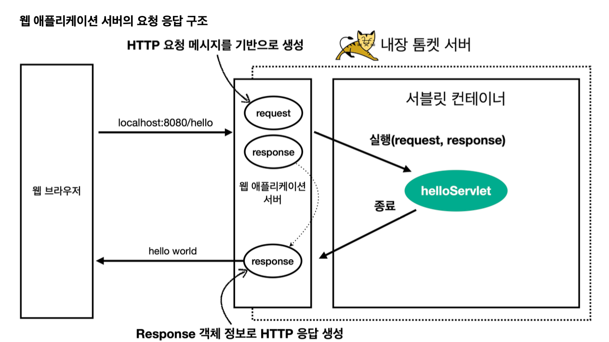
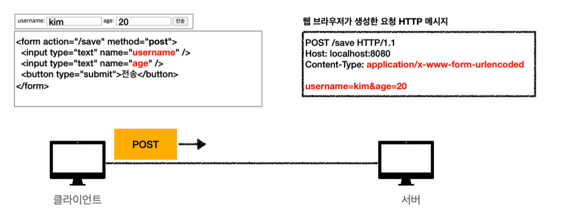

# Servlet

서블릿 등록하고 사용하기!

스프링부트는 @ServletCommponentScan을 지원

~~~java
@ServletComponentScan //서블릿 자동 등록 @SpringBootApplication
public class ServletApplication 
~~~

서블릿 등록

~~~java
 @WebServlet(name = "helloServlet", urlPatterns = "/hello")
 public class HelloServlet extends HttpServlet {
@Override
     protected void service(HttpServletRequest request, HttpServletResponse
 response)
             throws ServletException, IOException {
         System.out.println("HelloServlet.service");
         System.out.println("request = " + request);
         System.out.println("response = " + response);
         String username = request.getParameter("username");
         System.out.println("username = " + username);
         response.setContentType("text/plain");
         response.setCharacterEncoding("utf-8");
         response.getWriter().write("hello " + username);
}
 }
~~~

* @WebServlet : 서블릿 annotation
* name : 서블릿 name
* urlPatterns: URL 매핑

**서블릿 컨테이너 동작 방식**

스프링 부트 -> 내장 톰켓 -> 서블릿 컨테이너

웹 브라우저 접속 -> 애플리케이션 서버에 request response생성 -> 실행 -> 종료 -> response -> 웹 브라우저에 전송

## HttpServletRequest

HTTP 요청 메시지를 개발자가 직접 파싱하면 매우 불편하다. 서블릿이 개발자를 대신해서 HTTP 요청 메시지를 파싱한다. 그 결과를 HttpServletRequest 객체에 담아 제공한다.

Request를 사용하면 HTTP 요청 메시지를 편리하게 조회할 수 있다.

**HTTP 요청 메시지**
~~~
 POST /save HTTP/1.1
 Host: localhost:8080
 Content-Type: application/x-www-form-urlencoded
 username=kim&age=20
~~~

**임시 저장소 기능**
* 해당 HTTP 요청이 시작부터 끝날 때 까지 유지되는 임시 저장소 기능
    * 저장: `request.setAttribute(name, value)` 
    * 조회: `request.getAttribute(name)`

### Request 사용법

~~~java
 @WebServlet(name = "requestHeaderServlet", urlPatterns = "/request-header")
 public class RequestHeaderServlet extends HttpServlet {
@Override
     protected void service(HttpServletRequest request, HttpServletResponse
 response)
             throws ServletException, IOException {
         printStartLine(request);
         printHeaders(request);
         printHeaderUtils(request);
         printEtc(request);
         response.getWriter().write("ok");
     }
~~~
- 나머지 함수들은 생략

### HTTP 요청 데이터

1. Get - 쿼리파라미터
    * /username=hello&age=20
    * 메시지 바디없이, url의 쿼리 파라미터에 데이터를 포함해서 전달
2. Post - html form
    * conent type: application/x-www-form-unlencoded
    * 메시지 바디형식으로 전달
3. HTTP message body에 데이터를 직접 담아서 요청
    * HTTP API에서 주로 사용 Json, xml, txt
    * 주로 Json 사용

#### Post (전송 - 저장)

#### Get

쿼리 마라미터를 사용해서 데이터 전달

http://localhost:8080/request-param?username=hello&age=20

~~~java

        request.getParameterNames().asIterator()
                .forEachRemaining(paramName -> System.out.println(paramName +
"=" + request.getParameter(paramName))); System.out.println("[전체 파라미터 조회] - end"); System.out.println();
System.out.println("[단일 파라미터 조회]");
String username = request.getParameter("username"); System.out.println("request.getParameter(username) = " + username);
        String age = request.getParameter("age");
        System.out.println("request.getParameter(age) = " + age);
        System.out.println();
System.out.println("[이름이 같은 복수 파라미터 조회]"); System.out.println("request.getParameterValues(username)"); String[] usernames = request.getParameterValues("username"); for (String name : usernames) {
System.out.println("username=" + name);
}
         response.getWriter().write("ok");
     }
~~~

중복일 때는 request. getParmeterValues()의 첫번째 값을 반환

#### HTTP 요청 데이터 - Post html form

주로 회원 가입, 상품 주문

~~~html
 <!DOCTYPE html>
 <html>
 <head>
     <meta charset="UTF-8">
     <title>Title</title>
 </head>
 <body>
 <form action="/request-param" method="post">
username: <input type="text" name="username" /> age: <input type="text" name="age" /> <button type="submit">전송</button>
</form>
</body>
</html>
~~~

❗️**POST HTML Form 형식**으로 데이터를 전달하면 HTTP 메시지 바디에 해당 데이터를 포함해서 보내기 때문에 바디에 포함된 데이터가 어떤 형식인지 content-type을 꼭 지정해야 한다. 이렇게 폼으로 데이터를 전송하는 형 식을 `application/x-www-form-urlencoded` 라 한다.

#### API 메시지 바디 - 단순 텍스트
HTTP message body에 데이터 직접 담아서 요청
 * API에서 주로 사용
 * 데이터 형식은 주로 JSON

~~~java

@Override
     protected void service(HttpServletRequest request, HttpServletResponse
 response)
             throws ServletException, IOException {
         ServletInputStream inputStream = request.getInputStream();
         String messageBody = StreamUtils.copyToString(inputStream,StandardCharsets.UTF_8);
    System.out.println("messageBody = " + messageBody);
    response.getWriter().write("ok");
}
~~~

* content-type: text/plain
* message body: `hello`
* 결과: `messageBody = hello`

#### JSON 방식

* content-type: **application/json**
* message body: `{"username": "hello", "age": 20}`
* 결과: `messageBody = {"username": "hello", "age": 20}`

~~~java
  protected void service(HttpServletRequest request, HttpServletResponse
response)
            throws ServletException, IOException {
        ServletInputStream inputStream = request.getInputStream();
        String messageBody = StreamUtils.copyToString(inputStream,
StandardCharsets.UTF_8);
        System.out.println("messageBody = " + messageBody);
        HelloData helloData = objectMapper.readValue(messageBody,
HelloData.class);
System.out.println("helloData.username = " + helloData.getUsername())
System.out.println("helloData.age = " + helloData.getAge());
         response.getWriter().write("ok");
            }
~~~

❗️ JSON 결과를 파싱해서 사용할 수 있는 자바 객체로 변환하려면 Jackson, Gson 같은 JSON 변환 라이브러리 를 추가해서 사용해야 한다. 스프링 부트로 Spring MVC를 선택하면 기본으로 Jackson 라이브러리
( `ObjectMapper` )를 함께 제공한다.

#### HTTP 응답 - JSON HTML

~~~java
HTML 방법
@Override
     protected void service(HttpServletRequest request, HttpServletResponse
 response)
             throws ServletException, IOException {
         //Content-Type: text/html;charset=utf-8
         response.setContentType("text/html");
         response.setCharacterEncoding("utf-8");
PrintWriter writer = response.getWriter();
writer.println("<html>"); writer.println("<body>"); writer.println(" 
안녕?
"); writer.println("</body>"); writer.println("</html>");
             }
~~~

~~~java
API JSON

@Override
     protected void service(HttpServletRequest request, HttpServletResponse
 response)
             throws ServletException, IOException {
         //Content-Type: application/json
         response.setHeader("content-type", "application/json");
         response.setCharacterEncoding("utf-8");
         HelloData data = new HelloData();
         data.setUsername("kim");
         data.setAge(20);
         //{"username":"kim","age":20}
         String result = objectMapper.writeValueAsString(data);
         response.getWriter().write(result);
}
~~~

