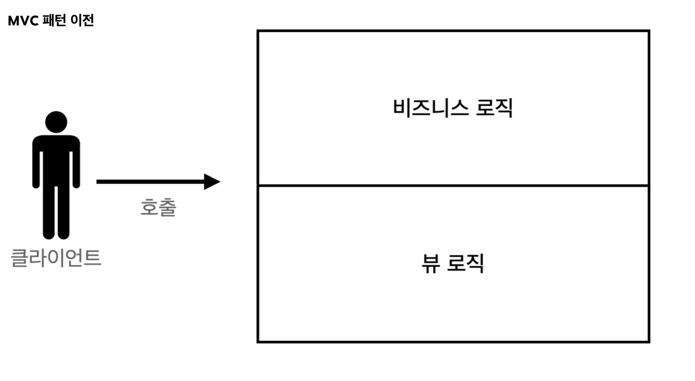
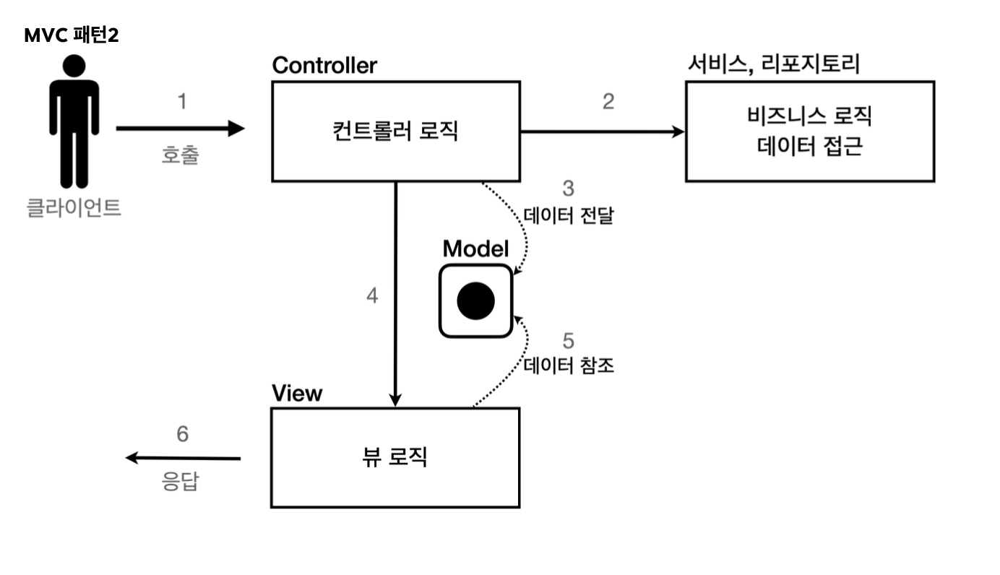

# web app

회원 정보

name, age

**요구사항**
* 회원저장
* 회원 목록 조회

~~~java
class Member {
     private Long id;
     private String username;
     private int age;}
 private static final MemberRepository instance = new MemberRepository();
     public static MemberRepository getInstance() {
         return instance;
}
private MemberRepository() {
     }
~~~
(상세 코드는 자바 Project)

회원 저장소에서는 싱글톤 패턴을 적용 ->스프링을 사용하려면 스프링 빈으로 등록 but 지금은 servlet으로만
-> 싱글톤 패턴은 객체를 단 하나만 생성해야 되기 때문에 private로 막는다.


## servlet 

~~~java

     protected void service(HttpServletRequest request, HttpServletResponse
 response)
             throws ServletException, IOException {
         response.setContentType("text/html");
         response.setCharacterEncoding("utf-8");
         PrintWriter w = response.getWriter();
         w.write("<!DOCTYPE html>\n" +
} }
"<html>\n" +
"<head>\n" +
"    <meta charset=\"UTF-8\">\n" +
"    <title>Title</title>\n" +
"</head>\n" +
"<body>\n" +
"<form action=\"/servlet/members/save\" method=\"post\">\n" +
"    username: <input type=\"text\" name=\"username\" />\n" +
"    age:      <input type=\"text\" name=\"age\" />\n" +
" <button type=\"submit\">전송</button>\n" + "</form>\n" +
"</body>\n" +
"</html>\n");
}
~~~
단순하게 회원 정보를 입력 -> HTML로 만들어서 응답
~~~java
memberRepository.save(member);
response.setContentType("text/html");
response.setCharacterEncoding("utf-8");
PrintWriter w = response.getWriter();
w.write("<html>\n" +
"<head>\n" +
" <meta charset=\"UTF-8\">\n" + "</head>\n" +
"<body>\n" +
"성공\n" +
"<ul>\n" +
~~~
(상세 코드는 자바 project)

1. 파라미터 조회해서 Member 객체 만듬
2. Member 객체를 Repo를 통해 저장
3. Member 객체를 사용해 HTML을 동적으로 만들어 응답

**MemberLIstservlet**

(상세코드는 자바 project)
~~~java
protected void service(HttpServletRequest request, HttpServletResponse
response)
response.setContentType("text/html");
response.setCharacterEncoding("utf-8");
List<Member> members = memberRepository.findAll();

~~~
1. findAll()을 통해 모든 회원 조회
2. 회원 목록 HTML을 for 루프를 통해 회원 수 만큼 동적으로 생성

**정리**

자바 코드 -> HTML이 매우 비효율적이다
HTML에 자바코드를 사용하는 템플릿 엔진이 나온 이유이다.(동적으로 변경 가능) 종류로는 thymeleaf, jsp등이 있다.

## JSP


**회원 저장 JSP**
~~~java
<%@ page import="hello.servlet.domain.member.MemberRepository" %>
 <%@ page import="hello.servlet.domain.member.Member" %>
 <%@ page contentType="text/html;charset=UTF-8" language="java" %>
 <%
//
request, response 사용 가능
MemberRepository memberRepository = MemberRepository.getInstance();
System.out.println("save.jsp");
String username = request.getParameter("username");
int age = Integer.parseInt(request.getParameter("age"));
Member member = new Member(username, age);
System.out.println("member = " + member);
memberRepository.save(member);
%>
<html>
<head>
    <meta charset="UTF-8">
</head>
<body> 성공
~~~
(상세 코드는 프로젝트)

servlet과 다른 점은 HTML을 중심으로 하고 자바 코드를 부분부분 입력했다.

**회원 목록 JSP**

~~~java
<%
     MemberRepository memberRepository = MemberRepository.getInstance();
     List<Member> members = memberRepository.findAll();
 %>
 <html>
 <head>
     <meta charset="UTF-8">
     <title>Title</title>
 </head>
<body>
<a href="/index.html">메인</a> <table>
~~~
(상세 코드는 project)

### servlet and jsp의 한계

서블릿 : view화면을 위한 HTML을 만드는 작업이 자바 코드에 섞여서 복잡했다.

jsp : view를 생성하는 HTML 작업을 깔끔하게 가져가고, 동적으로 변경이 필요한 부분에만 자바 코드적용

이러한 문제들을 해결하기 위해 mvc 등장

## MVC

하나의 서블릿이나 jsp만으로 비즈니스 로직과 뷰 렌더링을 모두 처리하게 되면 너무 많은 역할 + 유지보수가 어렵다.

**변경의 라이프 사이클**

변경의 라이프 사이클이 다르다
UI를 일부 수정하는 일과 비즈니스 로직을 수정하는 일은 각각 다르게 발생할 경우가 높아 서로 영향을 주지 않아야 된다.


**model view controller**

servlet, JSP가 처리하던 것을 controller와 viw라는 영역으로 서로 나뉜 것이다.

**controller** : HTTP 요청을 받아 파라미터 검증, 비즈니스 로직 실행, 뷰에 전달할 결과 데이터를 조회해 model에 담는다.

**model** : 뷰에 출력할 데이터를 담아두고 뷰가 필요한 데이터는 model이 담아서 전달해주는 덕분에 view는 비즈니스 로직이나 데이터 접근을 몰라도 되고 화면 렌더링만 해주면 된다.

**View** : 모델에 담겨있는 데이터를 사용해 화면에 보여주는 것


*before*


*after*



**회원 등록 폼 - controller**

~~~java
protected void service(HttpServletRequest request, HttpServletResponse
 response)
             throws ServletException, IOException {
         String viewPath = "/WEB-INF/views/new-form.jsp";
         RequestDispatcher dispatcher = request.getRequestDispatcher(viewPath);
         dispatcher.forward(request, response);
             }
~~~

dispatcher.forward : 다른 서블릿이나 jsp로 이동가능

`/WEB_INF` : jsp가 이 경로안에 있으면 외부에서 직접 jsp를 호출하는게 불가 -> 꼭❗️ 컨트롤러를 통해서 호출

redirect vs foward

redirect : 쉽게 말해 클라이언트가 다시 경로를 요청 + 클라이언트 인지o
(refresh 같은 느낌?)

foward : 서버 내부에서 일어나는 호출+ 클라이언트 인지 x


**회원 등록 폼 - 뷰**
~~~html
<html>
 <head>
     <meta charset="UTF-8">
     <title>Title</title>
 </head>
<body>
<!-- 상대경로 사용, [현재 URL이 속한 계층 경로 + /save] --> <form action="save" method="post">
username: <input type="text" name="username" /> age: <input type="text" name="age" /> <button type="submit">전송</button>
 </form>
 </body>
</html>
~~~

**회원 저장 - 컨트롤러**

~~~java
  protected void service(HttpServletRequest request, HttpServletResponse
 response)
             throws ServletException, IOException {
         String username = request.getParameter("username");
         int age = Integer.parseInt(request.getParameter("age"));
         Member member = new Member(username, age);
         System.out.println("member = " + member);
         memberRepository.save(member);
//Model에 데이터를 보관한다.
request.setAttribute("member", member);
}
~~~
(상세코드는 project)

❗️ **request가 제공하는 setAtributes()를 사용하면 request객체에 데이터를 보관해서 뷰에 전달할 수 있다.**

❗️ **`view`는 getAtributes()를 사용하면 된다.**

**회원 저장 - 뷰**

~~~html
ain/webapp/WEB-INF/views/save-result.jsp`
```html
 <%@ page contentType="text/html;charset=UTF-8" language="java" %>
 <html>
 <head>
     <meta charset="UTF-8">
 </head>
<body> 성공 <ul>
     <li>id=${member.id}</li>
     <li>username=${member.username}</li>
     <li>age=${member.age}</li>
</ul>
<a href="/index.html">메인</a>
~~~

**목록조회 -컨트롤러**

~~~java
   System.out.println("MvcMemberListServlet.service");
         List<Member> members = memberRepository.findAll();
         request.setAttribute("members", members)
~~~

**목록 조회 - 뷰**

~~~html
<html>
 <head>
     <meta charset="UTF-8">
     <title>Title</title>
 </head>
<body>
<a href="/index.html">메인</a> <table>
     <thead>
     <th>id</th>
     <th>username</th>
     <th>age</th>
     </thead>
     <tbody>
     <c:forEach var="item" items="${members}">
         <tr>
             <td>${item.id}</td>
             <td>${item.username}</td>
             <td>${item.age}</td>
         </tr>
     </c:forEach>
     </tbody>
 </table>
 ~~~
 

 ### 한계

 컨트롤러에 중복되는 코드들이 많다!!

 1. 포워드 중복
 ~~~java
  RequestDispatcher dispatcher = request.getRequestDispatcher(viewPath);
dispatcher.forward(request, response);
~~~

2. 사용하지 않는 코드
    * response는 전혀 사용하지 않는다.
    * test case 작성도 어렵다

3. 공통 처리가 어렵다
    * 메서드로 뽑을 수 있만, 메서드 호출 + 호출 하지 않으면 문제


**정리**

컨트롤러 호출 전에 먼저 공통 기능을 처리해야된다.

이러한 역할을 하는 **front controller** 패턴을 도입하면 된다!!