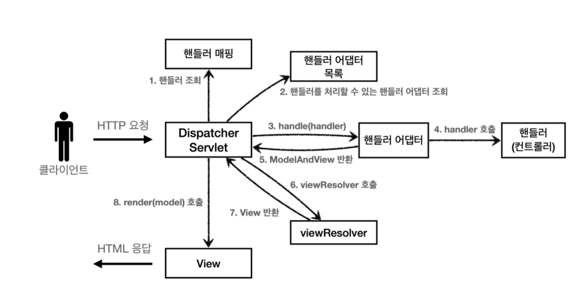

# entire structure

**DispatcherServlet**

* dispatcherservlet도 부모 클래스에서 HttpServlet을 상속 받아서 사용하고, 서블릿으로 동작.
    * Dispathcer -> FrameWork -> HttpServlet -> HttpServlet

**요청 흐름**
* HttpSevler이 제공하는 `service()`가 호출한다.
* `DispatcherServlet`의 부모인 `FrameworkServlet`에서 `service()`를 오버라이드
* `FrameworkServlet.service()`를 시작으로 `DispathcerServlet.doDispathc()`가 호출된다.

~~~java

 protected void doDispatch(HttpServletRequest request, HttpServletResponse
 response) throws Exception {
     HttpServletRequest processedRequest = request;
     HandlerExecutionChain mappedHandler = null;
     ModelAndView mv = null;
// 1. 핸들러 조회
mappedHandler = getHandler(processedRequest); if (mappedHandler == null) {
         noHandlerFound(processedRequest, response);
return; }
// 2. 핸들러 어댑터 조회 - 핸들러를 처리할 수 있는 어댑터
HandlerAdapter ha = getHandlerAdapter(mappedHandler.getHandler());
// 3. 핸들러 어댑터 실행 -> 4. 핸들러 어댑터를 통해 핸들러 실행 -> 5. ModelAndView 반환 
 mv = ha.handle(processedRequest, response, mappedHandler.getHandler());
     processDispatchResult(processedRequest, response, mappedHandler, mv,
 dispatchException);
}
~~~

**동작 순서**

1. **핸들러 조회** : 핸들러 매핑을 통해 요청 URL에 매핑된 핸들러를 조회
2. **핸들러 어댑터 조회** : 핸들러를 실행할 수 있는 핸들러 어댑터를 조회한다.
3. **핸들러 어댑터 실행** : 핸들러 어댑터를 실행한다.
4. **핸들러 실행** : 핸들러 어댑터가 실제 핸들러를 실행한다
5. **ModelAndView 반환** : 핸들러 어댑터는 핸ㄷ를러가 반환하는 정보를 ModelAndVIew로 변환해서 반환
6. **viewResolver 호출** : 뷰 리졸버를 찾고 실행
7. **View 반환**
8. **뷰 렌더링**

**인터페이스**
* 스프링 mvc는 `DispatcherServlet` 코드의 변경 없이, 원하는 기능을 변경하거나 확장할 수 있다.
* 이 인터페이스들만 구현해서 `DispatcherServlet`에 등록하면 나만의 컨트롤러를 만들 수 있다.

**정리**

mvc코드는 분량도 매우 많고, 내부 구조 파악도 힘들다. 나만의 컨트롤러 없이 충분히 요구사항에 맞추어 기능이 만들어져 있다.

## 스프릉 MVC 시작

**@RequestMapping**

스프링 애노테이션을 활용한 매우 유용하고, 실용적인 컨트롤러

* RequestMappingHandlerMapping
* RequestMappingAdapter

우선순위가 높은 핸들러 매핑과 핸들러 어댑터는 위에 두가지이다.
-> 실무에서는 99.9%이 방식의 컨트롤러를 사용한다.

~~~java
 @Controller
 public class SpringMemberFormControllerV1 {
    @RequestMapping("/springmvc/v1/members/new-form")
    public ModelAndView process() {
        return new ModelAndView("new-form");
    }
 }
~~~
* @Controller:
    * 스프링이 자동으로 스프링 빈으로 등록
    * 스프링 mvc에서 애노테이션 기반 컨트롤러로 인식
* @RequestMapping : 요청 정보를 매핑, 애노테이션을 기반으로 동작하기 때문에, 
                    메서드의 이름은 임의로 지으면 된다.

* ModelAndView : 모델과 뷰 정보를 담아서 반환

~~~java
* @RequestParam 사용
* @RequestMapping -> @GetMapping, @PostMapping */
 @Controller
 @RequestMapping("/springmvc/v3/members")
 public class SpringMemberControllerV3 {
     private MemberRepository memberRepository = MemberRepository.getInstance();
     @GetMapping("/new-form")
     public String newForm() {
         return "new-form";
     }
     @PostMapping("/save")
     public String save(
             @RequestParam("username") String username,
             @RequestParam("age") int age,
             Model model) {
         Member member = new Member(username, age);
         memberRepository.save(member);
         model.addAttribute("member", member);
         return "save-result";
     }
     @GetMapping
     public String members(Model model) {
         List<Member> members = memberRepository.findAll();
         model.addAttribute("members", members);
         return "members";
} }
~~~
실무에서는 이런식으로 사용한다.
