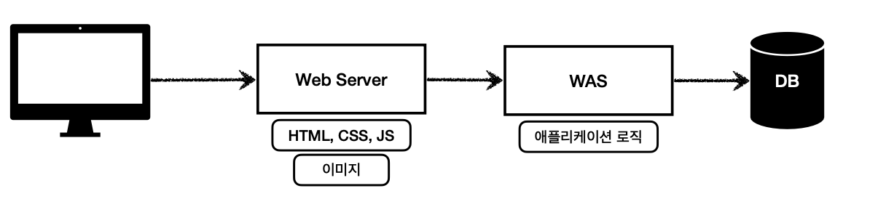
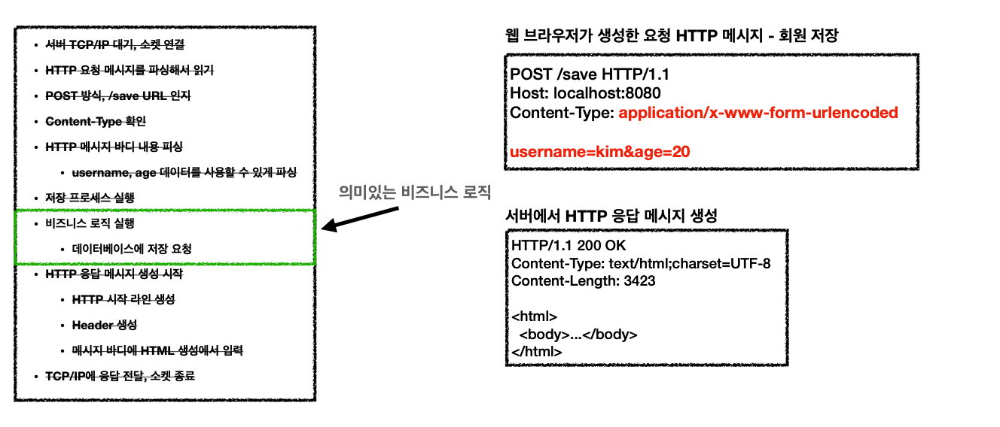
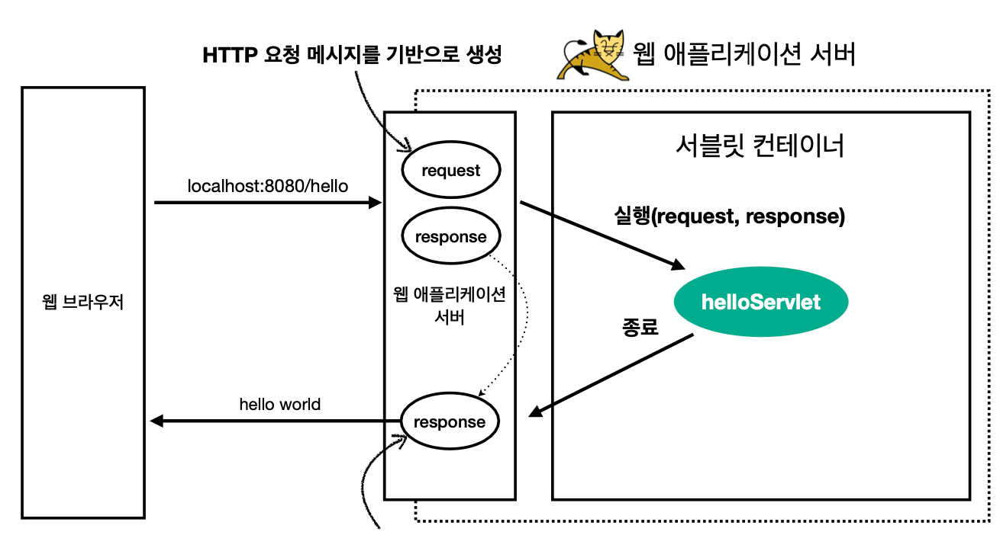

# 웹 - HTTP기반

모든 것이 HTTP 기반으로 전송

## web Server

* HTTP 기반으로 동작
* 정적 리소스 제공

## Web Application Server

* HTTP기반 동작
* 웹 서버 기능 포함
* 애플리케이션 로직 수행

### web server Vs was

* 웹서버는 정적, was는 애플리케이션 로직
* 자바는 서블릿 컨테이너 기능을 쓰면 was
* was는 애플리케이션 코드를 실행하는데 특화

### 웹 시스템 구성 - web, was ,db

* 정적 리소스는 웹 서버
* 웹 서버는 애플리케이션 로직같은 동적인 처리가 필요하면 WAS에 요청
* WAS는 중요한 애플리케이션 로직 처리 전담
* 효율적인 리소스
    * 정적 리소스가 많이 사용되면 web 서버 증설
    * 애플리케이션 리소스가 많이 사용되면 was 증설

* 정적 리소스만 제공하는 웹 서버는 잘 안죽음
* 애플리케이션 로직이 동작하는 was는 잘 죽음

## 서블릿

서버에서 처리해야 하는 업무

서블릿의 특징

~~~java
@WebServlet(name = "helloServlet", urlPatterns = "/hello")
public class HelloServlet extends HttpServlet {
@Override
protected void service(HttpServletRequest request, HttpServletResponse response){

}}
~~~

* urlPattern의 url이 호출되면 서블릿 코드 실행
* HTTP 요청 정보를 편리하게 사용  HttpServletRequest
*  HTTP 응답 정보를 편리하게 제공할 수 있는 HttpServletResponse

**서블릿의 흐름**

* WAS는 Request, Response 객체를 새로 만들어서 서블릿 객체 호출
* 개발자는 Request 객체에서 HTTP 요청 정보를 편리하게 꺼내서 사용
* 개발자는 Response 객체에 HTTP 응답 정보를 편리하게 입력
* WAS는 Response 객체에 담겨있는 내용으로 HTTP 응답 정보 생성

**특징**

* 톰캣처럼 서블릿을 지원하는 WAS를 서블릿 컨테이너라고 함
* 서블릿 컨테이너는 서블릿 객체를 생성, 초기화, 호출, 종료하는 생명주기 관리
* 서블릿 객체는 싱글톤으로 관리
    * 고객의 요청이 올 때 마다 계속 객체를 생성하는 것은 비효율
    * 최초 로딩 시점에 서블릿 객체를 미리 만들어두고 재활용
    * 모든 고객 요청은 동일한 서블릿 객체 인스턴스에 접근
* ❗️공유 변수 사용 주의
* 서블릿 컨테이너 종료시 함께 종료
* JSP도 서블릿으로 변환 되어서 사용
* 동시 요청을 위한 멀티 쓰레드 처리 지원

## 쓰레드

* 코드를 하나하나 순차적으로 실행하는 것은 쓰레드
* 동시 처리가 필요하면 쓰레드를 추가로 생성

장점
* 동시 요청을 처리할 수 있다.
* 리소스(CPU, 메모리)가 허용할 때 까지 처리가능
* 하나의 쓰레드가 지연 되어도, 나머지 쓰레드는 정상 동작한다.

단점
* 쓰레드는 생성 비용은 매우 비싸다.
    * 고객의 요청이 올 때 마다 쓰레드를 생성하면, 응답 속도가 늦어진다.
* 쓰레드는 컨텍스트 스위칭 비용이 발생한다.
* 쓰레드 생성에 제한이 없다.
* 고객 요청이 너무 많이 오면, CPU, 메모리 임계점을 넘어서 서버가 죽을 수 있다.

### 쓰레드 풀
**요청마다 쓰레드 생성**

**특징**

* 필요한 쓰레드를 쓰레드 풀에 보관, 관리
* 쓰레드 풀에 생성 가능한 쓰레드의 최대치 관리

* 사용
    * 필요하면 생성되어 있는 쓰레드를 쓰레드 폴에서 꺼내서 사용
    * 종료시에 반납
    * 다 찼으면 -> 대기 or 삭제

* 장점
    * 비용 절약, 시간 빠름
    * 기존 요청 안전하게 처리가능

WAS의 멀티 쓰레드 지원
핵심
* 멀티 쓰레드에 대한 부분은 WAS가 처리
* 개발자가 멀티 쓰레드 관련 코드를 신경쓰지 않아도 됨
* 개발자는 마치 싱글 쓰레드 프로그래밍을 하듯이 편리하게 소스 코드를 개발
* 멀티 쓰레드 환경이므로 싱글톤 객체(서블릿, 스프링 빈)는 주의해서 사용

### SSR - 서버 사이드 랜더링

* HTML 최종 결과를 서버에서 만들어서 웹 브라우저에 전달
* 주로 정적인 화면에 사용
* 관련기술: JSP, 타임리프 -> 백엔드 개발자

### CSR - 클라이언트 사이드 렌더링
* HTML 결과를 자바스크립트를 사용해 웹 브라우저에서 동적으로 생성해서 적용
* 주로 동적인 화면에 사용, 웹 환경을 마치 앱 처럼 필요한 부분부분 변경할 수 있음
* 관련기술: React, Vue.js -> 웹 프론트엔드 개발자