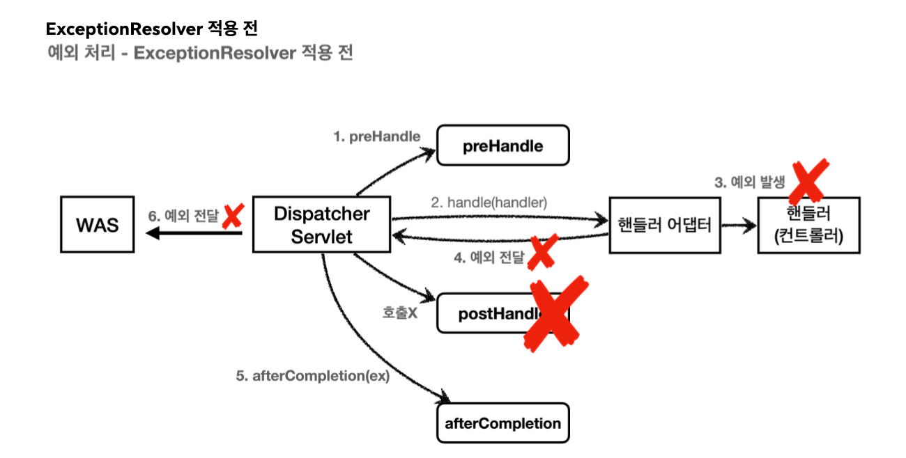
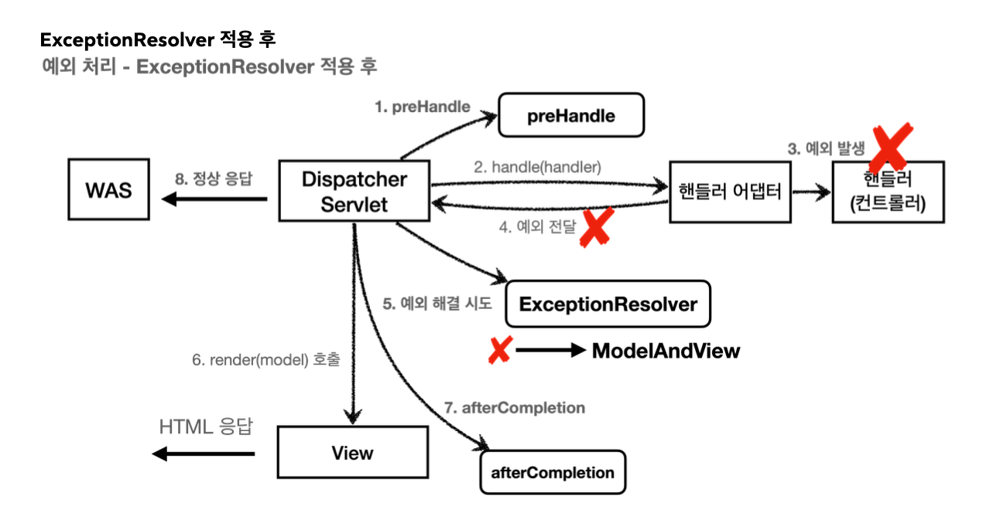

# API - Exception

**API 예외 처리는 어떻게 할까**

HTML : 4xx, 5xx와 같은 오류 페이지만 있으면 대부분의 문제를 해결할 수 있다.

API : 오류페이지는 고객에게 오류 화면 but API는 각 오류 상황에 맞는 오류 응답 스팩 + JSON으로 데이터 주기

**API - 예외 컨트롤러**

~~~java
 @Slf4j
 @RestController
 public class ApiExceptionController {
     @GetMapping("/api/members/{id}")
     public MemberDto getMember(@PathVariable("id") String id) {
if (id.equals("ex")) {
throw new RuntimeException("잘못된 사용자");
}
         return new MemberDto(id, "hello " + id);
     }
    @Data
    @AllArgsConstructor
     static class MemberDto {
         private String memberId;
         private String name;
     }
}
~~~

정상 호출 -> 제대로 호출된다.
~~~
{
     "memberId": "spring",
     "name": "hello spring"
}
~~~

**예외 발생 호출** -> HTML로 반환이 된다

오류 페이지 컨ㄴ트롤러가 아직 JSON을 응답하지 못하기 때문이다.

**ErrorPageController -api 응답 추가**

~~~java
 @RequestMapping(value = "/error-page/500", produces =
 MediaType.APPLICATION_JSON_VALUE)
 public ResponseEntity<Map<String, Object>> errorPage500Api(HttpServletRequest
 request, HttpServletResponse response) {
     log.info("API errorPage 500");
     Map<String, Object> result = new HashMap<>();
     Exception ex = (Exception) request.getAttribute(ERROR_EXCEPTION);
     result.put("status", request.getAttribute(ERROR_STATUS_CODE));
     result.put("message", ex.getMessage());
     Integer statusCode = (Integer)
 request.getAttribute(RequestDispatcher.ERROR_STATUS_CODE);
     return new ResponseEntity(result, HttpStatus.valueOf(statusCode));
 }
~~~

produces = MediaType.APPLICATION_JSON_VALUE의 뜻은 클라이언트가 요청하는 HTTP Header의 Accpet의 값이 application/json 일 때 해당 메서드가 호출된다는 것

## 스프링 부트 기본 오류 처리

**스프링 부트의 예외 처리**
* 스프링 부트의 기본 설정은 오류 발생시 /error를 오류 페이지로 요청

**HTML 페이지 vs API 오류**

`BasicErrorController`를 확장하면 JSON 메시지도 변경할 수 있다.

## API 예외 처리 - HandlerExceptionResolver

**목표**

발생하는 예외에 따라서 다른 상태코드로 처리하고 싶다.

**상태코드 변환**
예를 들어서 `IllegalArgumentException`을 처리하지 못해서 컨트롤러 밖으로 넘어가는 일이 발생하면 HTTP 상태코드를 400으로 처리

**ApiExceptionController**

~~~java
 @GetMapping("/api/members/{id}")
 public MemberDto getMember(@PathVariable("id") String id) {
if (id.equals("ex")) {
throw new RuntimeException("잘못된 사용자");
     }
     if (id.equals("bad")) {
throw new IllegalArgumentException("잘못된 입력 값"); }
     return new MemberDto(id, "hello " + id);
 }
~~~

**HandlerExceptionResolver**

스프링 Mvc는 컨트롤러 밖으로 예외가 던져진 경우 예외를 해결하고, 동작을 새로 정의할 수 있는 방법을 제공

-> 동작 방식을 변경하고 싶으면 `HandlerExceptionResolver`를 사용하면 된다.

**MyHandlerExceptionResolver**

~~~java
 @Slf4j
 public class MyHandlerExceptionResolver implements HandlerExceptionResolver {
@Override
     public ModelAndView resolveException(HttpServletRequest request,
 HttpServletResponse response, Object handler, Exception ex) {
         try {
             if (ex instanceof IllegalArgumentException) {
                 log.info("IllegalArgumentException resolver to 400");
                 response.sendError(HttpServletResponse.SC_BAD_REQUEST,
 ex.getMessage());
                 return new ModelAndView();
             }
         } catch (IOException e) {
             log.error("resolver ex", e);
}
         return null;
     }
}
~~~

* ExceptionResolver가 ModelAndView를 반환하는 이유는 try, catch를 하듯이, Exception을 처리해서 정상 흐름 처럼 변경하는것이 목적이다.

여기서는 IllegalArgumentException이 발생하면 response.sendErro(400)를 호출해서 HTTP 상태 코드를 400으로 지정, 빈 ModelAndView를 반환한다.

**반환 값에 따른 동작 방식**

* **빈 ModelAndView** : new ModelAndView() 처럼 빈 ModelAndView를 반환하면 뷰를 렌더링 하지 않고, 정상 흐름으로 서블릿이 리턴된다.

* **ModelandView 지정** : ModelAndView에 View, Model 등의 정보를 지정해서 반환하면 뷰를 렌더링 한다.

* **null** : null을 반환하면 ExceptionReolsver를 찾아서 실행.
만약 처리할 수 있는 ExceptionResolver가 없으면 예외 x

기존에 발생한 예외를 서블릿 밖으로 던진다.

## API 예외 처리 - HandlerExceptionResolver 활용

**UserException**

~~~java
 public class UserException extends RuntimeException {
     public UserException() {
         super();
}
     public UserException(String message) {
         super(message);
}
     public UserException(String message, Throwable cause) {
         super(message, cause);
}
     public UserException(Throwable cause) {
         super(cause);
}
 protected UserException(String message, Throwable cause, boolean
 enableSuppression, boolean writableStackTrace) {
         super(message, cause, enableSuppression, writableStackTrace);
     }
}
~~~

**ApiException - 예외 추가**

~~~java
 @RestController
 public class ApiExceptionController {
     @GetMapping("/api/members/{id}")
     public MemberDto getMember(@PathVariable("id") String id) {
if (id.equals("ex")) {
throw new RuntimeException("잘못된 사용자");
         }
         if (id.equals("bad")) {
throw new IllegalArgumentException("잘못된 입력 값"); }
if (id.equals("user-ex")) {
throw new UserException("사용자 오류");
}
         return new MemberDto(id, "hello " + id);
     }
     @Data
     @AllArgsConstructor
     static class MemberDto {
private String memberId;   private String name;
     }
}
~~~
UserException이 발생할 수 있다.

~~~java
@Override
     public ModelAndView resolveException(HttpServletRequest request,
 HttpServletResponse response, Object handler, Exception ex) {
 try {
    if (ex instanceof UserException) {
    log.info ("UserException resolver to 400");
    String acceptHeader = request.getHeader("accept");
    response.setStatus(HttpServletResponse.SC_BAD_REQUEST);
    if ("application/json".equals(acceptHeader)) {
                Map<String, Object> errorResult = new HashMap<>();
                errorResult.put("ex", ex.getClass());errorResult.put("message", ex.getMessage());
                String result =
 objectMapper.writeValueAsString(errorResult);
    response.setContentType("application/json");
    response.setCharacterEncoding("utf-8");
    response.getWriter().write(result);
    return new ModelAndView();
        } else {
                     //TEXT/HTML
        return new ModelAndView("error/400");
                 }
             }
         } catch (IOException e) {
             log.error("resolver ex", e);
         }
         return null;
}
~~~

**WebCofig에 UserHandelrException**

~~~java
@Override
 public void extendHandlerExceptionResolvers(List<HandlerExceptionResolver>
 resolvers) {
     resolvers.add(new MyHandlerExceptionResolver());
     resolvers.add(new UserHandlerExceptionResolver());
 }
~~~

**정리**

ExceptionResolver를 사용하면 컨트롤러에서 예외가 발생해도 ExceptionResolver에서 예외를 처리해버린다.

서블릿 컨테이너까지 예외가 올라가면 복잡하고 지저분하게 추가 프로세스가 실행된다. 반면에 `ExceptionResolver` 를 사용하면 예외처리가 상당히 깔끔해진다.

## 스프링이 제공하는 ExceptionResolver

`ExceptionResolver`

1. `ExceptionHandlerExceptionResolver`
2. `ResponseStatusExceptionResolver`
3. `DefaultHandlerExceptionResolver`

**ResponseStatusExceptionResolver** :예외에 따라서 Http 상태코드를 지정해주는 역할을 한다.

* @ResponseStatus가 달린 예외
* responseStatusException 예외

~~~java

@ResponseStatus(code = HttpStatus.BAD_REQUEST, reason = "잘못된 요청 오류") public class BadRequestException extends RuntimeException {
}
~~~

BadRequestException예외가 컨트롤러 밖으로 넘어가면 `ResponseStatusExceptionResolver` 예외가 해당 애노테이션을 확인해서 오류 코드를 변경하고 메시지도 담는다.

결국 respose.sendError(statusCode, reslovedReason)를 호풀하는 것을 확인 할 수 있다.

**ApiExceptionController - 추가**

~~~java
@GetMapping("/api/response-status-ex1")
 public String responseStatusEx1() {
      throw new BadRequestException();
 }
~~~

@ResonseStatus는 개발자가 직접 변경할 수 없는 예외에는 적용 x

애노테이션을 사용해서 동적으로 변경하는 것이 어렵지만 responseStatusException 예외를 사용하면 된다.

## ExceptionResolver2

`DefaultHandlerExceptionResolver` : 스프링 내부에서 발생하는 스프링 예외를 해결
타입 미스 매치 오류는 그냥 두면 서블릿 컨테이너까지 오류가 올라가고 500오류가 발생

하지만 클라이언트가 정보를 잘못 입력했기 때문에 400으로 변경되어야 된다.

**ApiExceptionController - 추가**

~~~java
 @GetMapping("/api/default-handler-ex")
 public String defaultException(@RequestParam Integer data) {
     return "ok";
 }
~~~

**정리**
`ResponseStatusExceptionResolver` -> HTTP응답코드변경
`DefaultHandlerExceptionResolver` -> 스프링내부예외처리

## @ExceptionHandler

**HTML vs API**

웹 브라우저에 HTML 화면을 제공할 때는 오류가 발생하면 `BasicErrorController`를 사용하는게 편하다.

but api는 각 시스템 마다 응답의 모양도 다르고, 스펙도 모두 다르다.

예외 상황에 단순히 오류 화면을 보여주는 것이 아니라, 예외에 따라서 각각 다른 데이터를 출력해야 된다. -> 매우 세밀하게 제어를 해야한다.

**API 예외처리의 어려운 점**

1. `HandlerExceptionResolver` 를 떠올려 보면 `ModelAndView` 를 반환해야 했다. 이것은 API 응답에는 필
요하지 않다.
2. API 응답을 위해서 `HttpServletResponse` 에 직접 응답 데이터를 넣어주었다. 이것은 매우 불편하다. 스프 링 컨트롤러에 비유하면 마치 과거 서블릿을 사용하던 시절로 돌아간 것 같다.
3. 링 컨트롤러에 비유하면 마치 과거 서블릿을 사용하던 시절로 돌아간 것 같다.
특정 컨트롤러에서만 발생하는 예외를 별도로 처리하기 어렵다. 예를 들어서 회원을 처리하는 컨트롤러에서 발생 하는 `RuntimeException` 예외와 상품을 관리하는 컨트롤러에서 발생하는 동일한 `RuntimeException` 예 외를 서로 다른 방식으로 처리하고 싶다면 어떻게 해야할까?

**@ExceptionHandler**

스프링은 API 예외 처리 문제를 해결하기 위해 애노테이션을 사용하는 매우 편리한 예외 처리를 제공한다. -> `ExceptionHandlerExceptionResolver`

**ErrorResult**
~~~java
 package hello.exception.exhandler;
 import lombok.AllArgsConstructor;
 import lombok.Data;
 @Data
 @AllArgsConstructor
 public class ErrorResult {
     private String code;
     private String message;
 }
~~~

~~~java
 @RestController
 public class ApiExceptionV2Controller {
     @ResponseStatus(HttpStatus.BAD_REQUEST)
     @ExceptionHandler(IllegalArgumentException.class)
     public ErrorResult illegalExHandle(IllegalArgumentException e) {
         log.error("[exceptionHandle] ex", e);
         return new ErrorResult("BAD", e.getMessage());
     }
     @ExceptionHandler
     public ResponseEntity<ErrorResult> userExHandle(UserException e) {
         log.error("[exceptionHandle] ex", e);
         ErrorResult errorResult = new ErrorResult("USER-EX", e.getMessage());
         return new ResponseEntity<>(errorResult, HttpStatus.BAD_REQUEST);
     }
@ResponseStatus(HttpStatus.INTERNAL_SERVER_ERROR)
@ExceptionHandler
public ErrorResult exHandle(Exception e) {
    log.error("[exceptionHandle] ex", e);
return new ErrorResult("EX", "내부 오류"); }

@GetMapping("/api2/members/{id}")
public MemberDto getMember(@PathVariable("id") String id) {
if (id.equals("ex")) {
throw new RuntimeException("잘못된 사용자");
    }
    if (id.equals("bad")) {
throw new IllegalArgumentException("잘못된 입력 값"); }
if (id.equals("user-ex")) {
throw new UserException("사용자 오류");
}
    return new MemberDto(id, "hello " + id);
}
~~~

**@ExceptionHandler 예외처리 방법**

컨트롤러에서 예외가 발생하면 메서드가 호출

~~~java
@ExceptionHandler(IllegalArgumentException.class)
 public ErrorResult illegalExHandle(IllegalArgumentException e) {
         log.error("[exceptionHandle] ex", e);
     return new ErrorResult("BAD", e.getMessage());
 }
 ~~~

 ## @ControllerAdvice

 ~~~java
  @Slf4j
 @RestControllerAdvice
 public class ExControllerAdvice {
     @ResponseStatus(HttpStatus.BAD_REQUEST)
     @ExceptionHandler(IllegalArgumentException.class)
     public ErrorResult illegalExHandle(IllegalArgumentException e) {
         log.error("[exceptionHandle] ex", e);
         return new ErrorResult("BAD", e.getMessage());
     }
     @ExceptionHandler
     public ResponseEntity<ErrorResult> userExHandle(UserException e) {
         log.error("[exceptionHandle] ex", e);
         ErrorResult errorResult = new ErrorResult("USER-EX", e.getMessage());
         return new ResponseEntity<>(errorResult, HttpStatus.BAD_REQUEST);
}
     @ResponseStatus(HttpStatus.INTERNAL_SERVER_ERROR)
     @ExceptionHandler
     public ErrorResult exHandle(Exception e) {
         log.error("[exceptionHandle] ex", e);
return new ErrorResult("EX", "내부 오류"); }
}

 @RestController
 public class ApiExceptionV2Controller {
     @GetMapping("/api2/members/{id}")
     public MemberDto getMember(@PathVariable("id") String id) {
if (id.equals("ex")) {
throw new RuntimeException("잘못된 사용자");
         }
         if (id.equals("bad")) {
throw new IllegalArgumentException("잘못된 입력 값"); }
if (id.equals("user-ex")) {
throw new UserException("사용자 오류");
}
         return new MemberDto(id, "hello " + id);
     }
     @Data
     @AllArgsConstructor
     static class MemberDto {
         private String memberId;
         private String name;
     }

~~~
**@ControllerAdvice**

* @ControllerAdvice는 대상으로 지정한 여러 컨트롤러에 @InitBinder, @ExceptionHandler 기능을 부여해주는 역할을 한다.
* @ControllerAdvice에 대상을 지정하지 않으면 모든 컨트롤러에 적용
* @RestControllerAdvice == @ControllerAdvice
그리고 @Controller와 @RestController의 차이

**대상 컨트롤러 지정 방법** 
~~~java
 // Target all Controllers annotated with @RestController
 @ControllerAdvice(annotations = RestController.class)
 public class ExampleAdvice1 {}
 // Target all Controllers within specific packages
 @ControllerAdvice("org.example.controllers")
 public class ExampleAdvice2 {}
 // Target all Controllers assignable to specific classes
 @ControllerAdvice(assignableTypes = {ControllerInterface.class,
 AbstractController.class})
public class ExampleAdvice3 {}
~~~

**정리**
`@ExceptionHandler` 와 `@ControllerAdvice` 를 조합하면 예외를 깔끔하게 해결할 수 있다.
