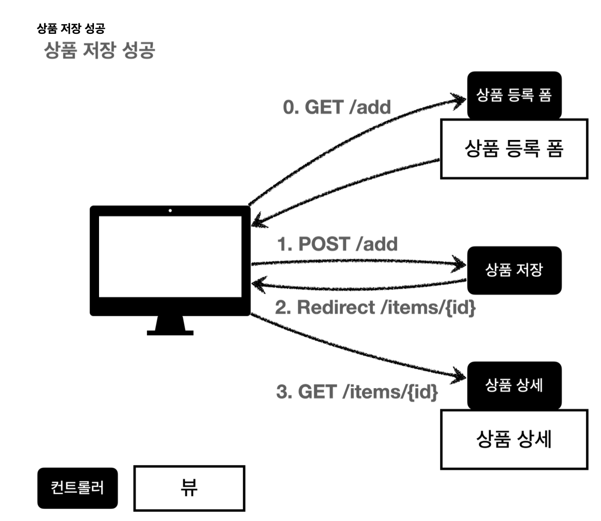
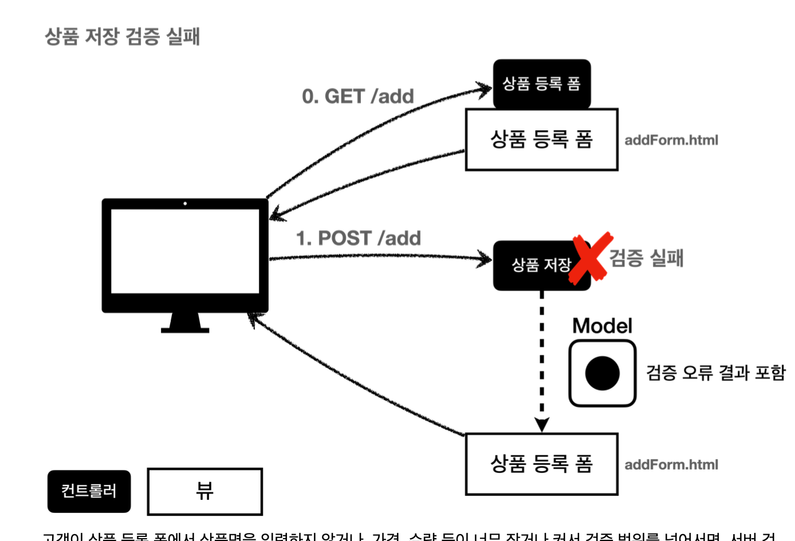

# Validation

검증 요구사항

**요구사항 : 검증 로직 추가**

* 타입 검증
    * 가격, 수량에 문자가 들어가면 오류
* 필드 검증
    * 삼품명 : 필수, 공백x
    * 가격: 1000원 이상, 1백만원 이하
    * 수량 : 최대 9999
* 특정 필드의 범위를 넘어서는 검증
    * 가격*수량의 합은 10,000 이상

**컨트롤러의 중요한 역할중 하나는 HTTP 요청이 정상인지 검증하는 것이다.** 그리고 정상 로직보다 이런 검증 로직을 잘 개발하는 것이 어쩌면 더 어려울 수 있다.

## 프로젝트 설정 V1

**검증 직접 처리 - 소개**

상품 등록 폼에서 상품명을 입력하지 않거나, 가격 수량 등이 너무 작거나 커서 검증 범위를 넘어서면 검증 로직이 실패!!

**상품 등록 검증**

**V1**

~~~java
public String addItem(@ModelAttribute Item item, RedirectAttributes
 redirectAttributes, Model model) {
   //검증 오류 결과를 보관
Map<String, String> errors = new HashMap<>();
//검증 로직
if (!StringUtils.hasText(item.getItemName())) { errors.put("itemName", "상품 이름은 필수입니다."); }
     if (item.getPrice() == null || item.getPrice() < 1000 || item.getPrice() >
 1000000) {
errors.put("price", "가격은 1,000 ~ 1,000,000 까지 허용합니다."); }
if (item.getQuantity() == null || item.getQuantity() > 9999) { errors.put("quantity", "수량은 최대 9,999 까지 허용합니다.");
}
//특정 필드가 아닌 복합 룰 검증
if (item.getPrice() != null && item.getQuantity() != null) {
         int resultPrice = item.getPrice() * item.getQuantity();
         if (resultPrice < 10000) {
errors.put("globalError", "가격 * 수량의 합은 10,000원 이상이어야 합니다. 현재 값 = " + resultPrice);
} }
//검증에 실패하면 다시 입력 폼으로 if (!errors.isEmpty()) {
         model.addAttribute("errors", errors);
         return "validation/v1/addForm";
     }
~~~

**검증 오류 보관**
`Map<String, String> errors = new HashMap<>();`

만약 검증시 오류가 발생하면 어떤 오류가 발생했는지 정보를 담아둠.

**검증 로직**

~~~
if (!StringUtils.hasText(item.getItemName())) { errors.put("itemName", "상품 이름은 필수입니다.");
}
~~~

검증시 오류가 발생하면 `errors`에 담아둔다.

**필드 오류 처리**

~~~html
<input type="text" th:classappend="${errors?.containsKey('itemName')} ? 'field-
 error' : _"
class="form-control">
~~~

**정리**

* 만약 검증 오류가 발생하면 입력 폼을 다시 보여줌
* 오류를 안내해서 다시 입력할 수 있게 함
* 고객이 입력한 데이터 유지

**남은 문제점**
* 중복이 많음
* 타입 오류 처리가 x
* 타입 오류가 발생해도 고객이 입력한 문자를 화면에 남겨야됨
* 고객 입력한 값도 별도로 관라

## BuildingResult1

**V2**

~~~java

if (!StringUtils.hasText(item.getItemName())) {
bindingResult.addError(new FieldError("item", "itemName", "상품 이름은 필수입니
다.")); }
~~~

**FiledError 요약**

~~~java
public FieldError(String objectName, String field, String defaultMessage) {}
~~~
필드에 오류가 있으면 `FieldError` 객체를 생성해서
 `bindingResult` 에 담아두면 된다
 * `objectName` : `@ModelAttribute` 이름
* `field` : 오류가 발생한 필드 이름
* `defaultMessage` : 오류 기본 메시지

**Global Error**

~~~java
bindingResult.addError(new ObjectError("item", "가격 * 수량의 합은 10,000원 이상이어야 합니다. 현재 값 = " + resultPrice));
~~~

**ObjectError**
~~~java
 public ObjectError(String objectName, String defaultMessage) {}
~~~

* 특정 필드를 넘어서는 오류가 있으면 `ObjectError` 객체를 생성해서 `bindingResult` 에 담아두면 된다. 
* `objectName` : `@ModelAttribute` 의 이름
* `defaultMessage` : 오류 기본 메시지

## BuildingResult2

* 스프링이 제공하는 검증 오류를 보관하는 객체
* BindingResult가 있으면 @ModelAttribute에 데이터 바인딩 시 오류가 발생해도 컨트롤러가 호출

**BindingREsult에 검증 오류를 적용하는 3가지 방법**

* `@ModelAttribute` 의 객체에 타입 오류 등으로 바인딩이 실패하는 경우 스프링이 `FieldError` 생성해서 `BindingResult` 에 넣어준다.
* 개발자가 직접 넣어준다.
* `Validator` 사용 이것은 뒤에서 설명

**주의**

* `BindResult`는 검증할 대상 바로 다음에 와야된다. 예를 들어서 `@ModelAttribute Item item` 바로 다음에 바로 `BindingResult`가 와야 된다.

BindingResult는 인터페이스, Errors는 인테페이스를 상속

실제로 넘어노는 구현체는 BeanPropertyBindgResult라는 것이다. 하지만 Errors 인터페이스는 단순한 오류 저장과 조회 기능을 제공
BindingResult는 여기에 더해서 추가적인 기능을 제공.

addErr()도 BindingResult가 제공하기 때문에 BindingResult를 많이 사용

**정리**
오류가 발생하는 경우 고객이 입력한 내용이 모두 사라짐

## FieldError, ObjectError

**목표**
* 사용자 입력 오류 메시지가 화면에 남도록 하자.
* FieldErrlr, ObjectError에 대해 자세히 보자

~~~java
if (item.getQuantity() == null || item.getQuantity() >= 10000) {
bindingResult.addError(new FieldError("item", "quantity", item.getQuantity(), false, null, null, "수량은 최대 9,999 까지 허용합니다."));
}
~~~

**FieldError 생성자**

~~~java
 public FieldError(String objectName, String field, String defaultMessage);
 public FieldError(String objectName, String field, @Nullable Object
 rejectedValue, boolean bindingFailure, @Nullable String[] codes, @Nullable
 Object[] arguments, @Nullable String defaultMessage)
~~~

**오류 발생시 사용자 입력 값 유지**

사용자의 입력 데이터가 컨트롤러의 @ModelAttribute에 바인딩되는 시점에 오류가 발생하면 모델 객체에 사용자 입력 값을 유지하기 어렵다. -> 그래서 오류가 발생한 경우 사용자의 입력 값을 보관하는 별도의 방법이 필요하다. -> 이렇게 보관한 사용자 입력 값을 검증 오류 발생시 화면에 다시 출력한다.

**FieldError**는 오류 발생시 사용자 입력 값을 저장하는 기능을 제공한다.

여기서 `rejectedValue` 가 바로 오류 발생시 사용자 입력 값을 저장하는 필드다.
`bindingFailure` 는 타입 오류 같은 바인딩이 실패했는지 여부를 적어주면 된다. 여기서는 바인딩이 실패한 것은 아
니기 때문에 `false` 를 사용한다

## 오류 코드와 메시지 처리3

단순 vs 복잡
단순 : 단순하게 만들면 범용성이 좋아서 여러곳에서 사용 가능 but 세밀 작성 x

복잡 : 세밀하게 작성하면 범용성 x

예를 들어 required라고 오류 코드를 사용하면
`required: 필수 값입니다.`
그런데 오류 메세지에 required.item.imteName과 같이 객체명과 필드명을 조합한 세밀한 코드가 있으면 메시지 우선 순의를 더 높일 수 있다.

~~~
#Level1
required.item.itemName: 상품 이름은 필수 입니다. #Level2
required: 필수 값 입니다.
~~~
-> MessageCodesResolover라는 것으로 이러한 기능을 지원한다.

## 오류 코드와 메시지 처리4

~~~java
 void messageCodesResolverField() {
        String[] messageCodes = codesResolver.resolveMessageCodes("required",
"item", "itemName", String.class);
        assertThat(messageCodes).containsExactly(
); }
~~~

## 오류 코드와 메시지 처리5

**구체적인 것에서 덜 구체적인것으로**

**errors.properties**
~~~
#required.item.itemName=상품 이름은 필수입니다. #range.item.price=가격은 {0} ~ {1} 까지 허용합니다. #max.item.quantity=수량은 최대 {0} 까지 허용합니다. #totalPriceMin=가격 * 수량의 합은 {0}원 이상이어야 합니다. 현재 값 = {1}
#==ObjectError==
#Level1
totalPriceMin.item=상품의 가격 * 수량의 합은 {0}원 이상이어야 합니다. 현재 값 = {1}
#Level2 - 생략
totalPriceMin=전체 가격은 {0}원 이상이어야 합니다. 현재 값 = {1}
#==FieldError==
#Level1
required.item.itemName=상품 이름은 필수입니다. 
#Level2 - 생략
#Level3
required.java.lang.String = 필수 문자입니다.
~~~~

ex) itemName의 경우
1. required.item.itemName
2. required.itemName
3. required.java.lang.String
4. required

구체적인 것에서 덜 구체적인 순서대로 찾는다. 메시지에 1번이 없으면 2번을 찾고, 2->3을 찾는다. 이렇게 되면 만약에 크게 중요하지 않은 오류 메시지는 기존에 정의된 것을 그냥 **재활용**한다.

## V6

검증 오류 코드는 다음과 같이 2가지로 나눌 수 있다.
개발자가 직접 설정한 오류 코드 `rejectValue()` 를 직접 호출 스프링이 직접 검증 오류에 추가한 경우(주로 타입 정보가 맞지 않음)

#추가
typeMismatch.java.lang.Integer=숫자를 입력해주세요.
typeMismatch=타입 오류입니다.

이런식으로 소스코드를 하나도 건들지 않고, 원하는 메시지를 단계별로 설정 가능하다.
