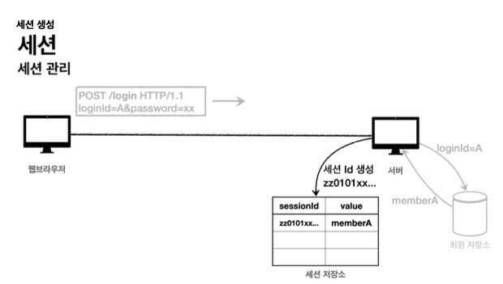
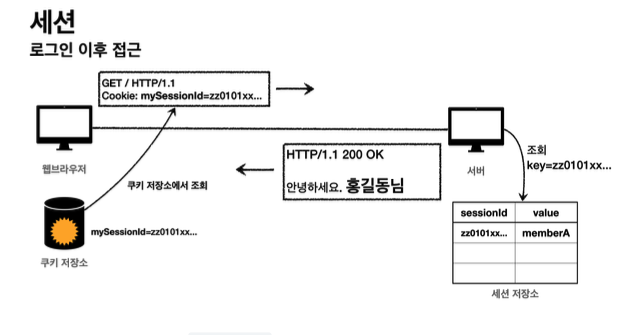

# login

* 홈 화면 - 로그인 전
    * 회원 가입
    * 로그인
* 홈 화면 - 로그인 후
    * 본인 이름
    * 상품 관리
    * 로그 아웃
* 보안 요구사항
    * 로그인 사용자만 상품에 접근하고, 관리할 수 있음
    * 로그인 하지 않은 사용자가 상품 관리에 접근하면 로그인 화면으로 이동
* 회원 가입, 상품 관리


~~~java

private final LoginService loginService;
     @GetMapping("/login")
     public String loginForm(@ModelAttribute("loginForm") LoginForm form) {
         return "login/loginForm";
     }
     @PostMapping("/login")
     public String login(@Valid @ModelAttribute LoginForm form, BindingResult
 bindingResult) {
         if (bindingResult.hasErrors()) {
             return "login/loginForm";
}
         Member loginMember = loginService.login(form.getLoginId(),
 form.getPassword());
         log.info("login? {}", loginMember);
if (loginMember == null) {
bindingResult.reject("loginFail", "아이디 또는 비밀번호가 맞지 않습니다."); return "login/loginForm";
}
//로그인 성공 처리
 TODO return "redirect:/";
}
~~~
로그인 컨트롤러는 로그인 서비스를 호출해서 로그인에 성공하면 홈 화면으로 이동 실패하면 `bindingResult.reject()`를 사용해서 ObjectError를 생성

**실행**

로그인이 성공하면 홈으로 이동하고, 로그인에 실패하면 "아이디 또는 비밀번호가 맞지 않습니다."라는 경고와 함께 로그인 폼이 나타난다.


## 로그인 처리 - 쿠키 사용

**로그인 상태 유지**
쿼리 파라미터를 계속 유지하면서 보내는 것은 매우 어렵다. 쿠키를 사용해보자.

**쿠키에는 영속 쿠키와 세션 쿠키가 있다.**

* 영속 쿠키 : 만료 날짜를 입력하면 해당 날짜까지 유지
* 세션 쿠키 : 만료 날짜를 생력하면 브라우저 종료시 까지만 유지

**LoginController-login()**

~~~java

 @PostMapping("/login")
 public String login(@Valid @ModelAttribute LoginForm form, BindingResult
 bindingResult, HttpServletResponse response) {
     if (bindingResult.hasErrors()) {
         return "login/loginForm";
}
     Member loginMember = loginService.login(form.getLoginId(),
 form.getPassword());
     log.info("login? {}", loginMember);
if (loginMember == null) {
bindingResult.reject("loginFail", "아이디 또는 비밀번호가 맞지 않습니다.");
  return "login/loginForm";
     }
//로그인 성공 처리
//쿠키에 시간 정보를 주지 않으면 세션 쿠키(브라우저 종료시 모두 종료)
     Cookie idCookie = new Cookie("memberId",
 String.valueOf(loginMember.getId()));
     response.addCookie(idCookie);
     return "redirect:/";
}
~~~

**쿠키 생성 로직**
~~~java
 Cookie idCookie = new Cookie("memberId", String.valueOf(loginMember.getId()));
 response.addCookie(idCookie);
~~~

로그인에 성공하면 쿠키를 생성하고 Response에 담는다. 쿠키 이름은 memberId 값은 회원의 id를 담아둔다. 웹 브라우저는 종료 전까지 회원의 id를 서버에 계속 보내줄 것이다.

~~~java
   @CookieValue(name = "memberId", required = false) Long memberId,
Model model) {
        if (memberId == null) {
            return "home";
}
//로그인
Member loginMember = memberRepository.findById(memberId); if (loginMember == null) {
            return "home";
        }
        model.addAttribute("member", loginMember);
        return "loginHome";
    }
~~~
* @CookieValue를 사용하면 편리하게 쿠키를 조회할 수 있다.
* 로그인 하지 않은 사용자도 홈에 접근할 수 있기 때문에 required = false를 사용한다.

**로직**
* 로그인 쿠키가 없는 사용자는 home으로 보낸다. 추가로 로그인 쿠키가 있어도 회원이 없으면 home
* 로그인 쿠키가 있는 사용자는 로그인 사용자 전용 홈 화면인 loginHome으로 보내고 홈 화면에 회원 관련 정보도 출력해야 해서 member 데이터도 모델에 담아서 전달.

**실행**
로그인에 성공하면 사용자 이름이 출력되면서 상품 관리, 로그아웃 버튼을 확인 사능.
로그인에 성공시 세션 쿠키가 지속해서 유지 되고 웹 브라우저에서 서버에 요청시 memberID 쿠키를 계속 보내준다.

**로그 아웃**
~~~java
 private void expireCookie(HttpServletResponse response, String cookieName) {
     Cookie cookie = new Cookie(cookieName, null);
     cookie.setMaxAge(0);
     response.addCookie(cookie);
}
~~~
* 세션 쿠키이므로 웹 브라우저 종료시
* 서버에서 해당 쿠키 종료 날짜를 0으로 지정

**실행**
해당 쿠키는 즉시 종료

## 쿠키의 보안 문제

쿠키를 사용해서 memberId를 전달하면 로그인을 유지할 수 있지만 심각한 보안 문제가 발생한다.

**보안 문제**

* 쿠키 값을 임의로 변경
    * 클라이언트가 쿠키를 변경하여 다른 사용자가 될 수 있다.
    * 쿠키에 보관된 정보는 훔쳐갈 수 있다.

**대안**
* 쿠키에 중요한 값을 노출하지 않고, 사용자 별로 예측 불가능한 임의의 토큰을 노출하고, 서버에소 토큰과 사용자 id를 매피앟여 인식
* 토큰은 해커가 임의의 값을 넣어도 찾을 수 없도로 예상 불가능 해야된다.
* 해커가 토큰을 털어가도 시간이 지나면 사용할 수 없도록 서버에서 토큰의 만료시간을 짧게 유지한다.

## 로그인 처리하기 - 세션 동작 방식

**목표**
앞서 쿠키에 중요한 정보를 보관하는 방법은 여러가지 보안 이슈가 있었다. 이 문제를 해결하려면 결국 중요한 정보를 모두 서버에 저장해야 된다. 그리고 클라이언트와 서버는 추정 불가능한 임의의 식별자 값으로 연결 한다.




* 세션 ID를 생성 + 추정 불가능
* UUID는 불가능
* 생성된 세션 ID와 세션에 보관할 값을 서버의 저장소에 보관한다.

**클라이언트와 서버는 결국 쿠키로 연결**
* 서버는 클라이언트에 mySessionId라는 이름으로 세션 ID만 쿠키에 담아서 전달한다.
* 클라이언트는 쿠키 저장소에 mySessionId 쿠키를 보관한다.

**중요**

* 여기서 중요한 포인트는 회원과 관련된 정보는 전혀 클라이언트에 전달하지 않는 것
* 오직 추정 불가능한 세션 ID만 쿠키를 통해 클라이언트에 전달한다.


**로그인 이후**


* 클라이언트는 요청시 항상 mySessionId 쿠키를 전달
* 서버에서는 클라이언트가 전달한 mySessionId 쿠키 정보로 세션 저장소를 조회해서 로그인시 보관한 세션 정보 사용

**정리**

세션을 사용해서 서버에서 중요한 정보를 관리하게 됐다. 덕분에 다음과 같은 보안 문제 해결 가능
* 쿠키 값을 변조 가능 -> 예상 불가능한 복잡한 세션 ID 사용
* 쿠키에 보관하는 정보는 클라이언트 해킹시 털릴 수 있음 -> 세션 id가 털려도 중요한 정보가 없다.
* 쿠키 탈취 후 사용 -> 헤커가 토큰을 텅러가도 시간이 지나면 사용할 수 없도록 세션의 만료시간을 짧게 유지

## 로그인 처리하기

* 생성
    * sessionID 생성
    * 세션 저장소에 sessionid와 보관할 값 저장
    * sessionId로 응답 쿠키 생성 후 클라이언트에 전달.

* 세션 조회
    * 클라이언트가 요청한 sessionId 쿠키의 값으로, 세션 저장소에 보관한 값 조회

* 세션 완료
    * 클라이언트가 요청한 sessionId 쿠키의 값으로 세션 저장소에 보관한 sessionId와 값 제거

~~~java

     public void createSession(Object value, HttpServletResponse response) {
//세션 id를 생성하고, 값을 세션에 저장
String sessionId = UUID.randomUUID().toString(); sessionStore.put(sessionId, value);
//쿠키 생성
Cookie mySessionCookie = new Cookie(SESSION_COOKIE_NAME, sessionId);
   response.addCookie(mySessionCookie);
     }
/**
* 세션 조회 */
     public Object getSession(HttpServletRequest request) {
         Cookie sessionCookie = findCookie(request, SESSION_COOKIE_NAME);
         if (sessionCookie == null) {
             return null;
         }
         return sessionStore.get(sessionCookie.getValue());
     }
/**
* 세션 만료 */
     public void expire(HttpServletRequest request) {
         Cookie sessionCookie = findCookie(request, SESSION_COOKIE_NAME);
         if (sessionCookie != null) {
             sessionStore.remove(sessionCookie.getValue());
         }
}
     private Cookie findCookie(HttpServletRequest request, String cookieName) {
         if (request.getCookies() == null) {
             return null;
         }
         return Arrays.stream(request.getCookies())
                 .filter(cookie -> cookie.getName().equals(cookieName))
                 .findAny()
                 .orElse(null);
} }
```
~~~

* @Component : 스프링 빈으로 등록
* ConcurrentHashMap : HashMap은 동시 요청에 안전하지 않다.

**정리**
쿠키의 개념을 명확하게 이해하기 위해 직접 만들어 봤다. 세션이 특별한 것이 아니라 쿠키를 사용하는데 서버에서 데이터를 유지하는 방법일 뿐이라는 것을 이해했다.

## 로그인 처리 - HTTP 세션 1


**HttpSession 소개**
서블릿이 제공하는 `HttpSession` 도 결국 우리가 직접 만든 `SessionManager` 와 같은 방식으로 동작한다. 서블릿을 통해 `HttpSession` 을 생성하면 다음과 같은 쿠키를 생성한다. 쿠키 이름이 `JSESSIONID` 이고, 값은 추정 불가능한 랜덤 값이다.

**SessionConst**

~~~java
 package hello.login.web;
 public class SessionConst {
     public static final String LOGIN_MEMBER = "loginMember";
}
~~~

~~~java
 @PostMapping("/login")
 public String loginV3(@Valid @ModelAttribute LoginForm form, BindingResult
 bindingResult, HttpServletRequest request) {
     if (bindingResult.hasErrors()) {
         return "login/loginForm";
}
   Member loginMember = loginService.login(form.getLoginId(),
 form.getPassword());
     log.info("login? {}", loginMember);
if (loginMember == null) {
bindingResult.reject("loginFail", "아이디 또는 비밀번호가 맞지 않습니다."); return "login/loginForm";
}
//로그인 성공 처리
//세션이 있으면 있는 세션 반환, 없으면 신규 세션 생성
HttpSession session = request.getSession();
//세션에 로그인 회원 정보 보관 session.setAttribute(SessionConst.LOGIN_MEMBER, loginMember);
     return "redirect:/";
 }
 ~~~

**세션 생성과 조회**
세션을 생성하려면 request.getSession(true)를 사용하면 된다.

**create option**

* request.getSession(true)
    * 세션이 있으면 기존 세션 반환
    * 세션이 없으면 새로운 세션 생성 후 반환

* request.getSession(false)
    * 세션이 있으면 기존 세션 반환
    * 세션이 없으면 새로운 세션을 생성하지 않는다.

* request.getSession() == true

**세션에 로그인 회원 정보 보관**
seesion.setAttribute(SessionCons.LogIn_MEMBER, loginMember);
세션에 데이터를 보관하는 방법은 reqeust.setAttribute와 비슷하다. 하나의 세션에 여러 값을 저장할 수 있다.

~~~java
 @GetMapping("/")
 public String homeLoginV3Spring(
         @SessionAttribute(name = SessionConst.LOGIN_MEMBER, required = false)
 Member loginMember,
         Model model) {
//세션에 회원 데이터가 없으면 home if (loginMember == null) {
         return "home";
     }
//세션이 유지되면 로그인으로 이동 model.addAttribute("member", loginMember); return "loginHome";
}
  @GetMapping("/")
 public String homeLoginV3(HttpServletRequest request, Model model) {
//세션이 없으면 home
HttpSession session = request.getSession(false); if (session == null) {
         return "home";
     }
     Member loginMember = (Member)
 session.getAttribute(SessionConst.LOGIN_MEMBER);
//세션에 회원 데이터가 없으면 home if (loginMember == null) {
         return "home";
     }
//세션이 유지되면 로그인으로 이동 model.addAttribute("member", loginMember); return "loginHome";
}
~~~
스프링은 세션을 더 편리하게 사용할 수 있게 @SessionAttribute를 지원한다.

이미 로그인 된 사용자를 찾을 때는
`@SessionAttribute(name = "loginMember", required = false) Member loginMember`
이렇게 사용하고 이 기능은 세션을 생성하지 않는다.

세션에 들어있는 데이터를 찾는 번거러운 과정을 스프링이 한번에 편리하게 처리해주는 것이다.

**세션 타임아웃 시점**
session.setMaxInactiveInterval(1800); //1800초 이런식으로 설정하면 된다.

**정리**

서블릿의 `HttpSession` 이 제공하는 타임아웃 기능 덕분에 세션을 안전하고 편리하게 사용할 수 있다.  주의 할 점은 세션에는 최소한의 데이터만 보관해야 한다는 점이다. 보관한 데이터 용량 * 사용자 수로 세션의 메모리 사용량 이 급격하게 늘어나서 장애로 이어질 수 있다. 추가로 세션의 시간을 너무 길게 가져가면 메모리 사용이 계속 누적 될 수 있으므로 적당한 시간을 선택하는 것이 필요하다. 기본이 30분이라는 것을 기준으로 고민하면 된다.
