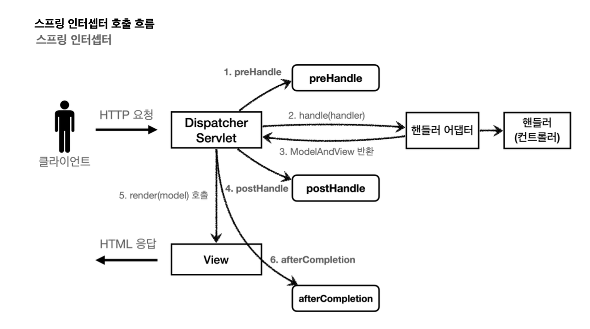
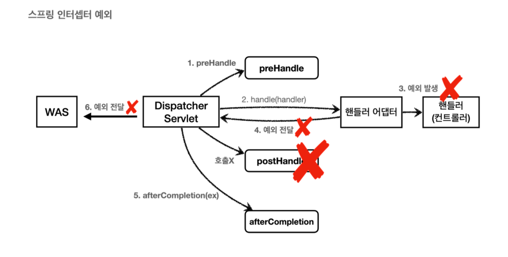

# Interceptor

스프링 인터셉터도 서블릿 필터와 같이 웹과 관련된 공통 관심 사항을 효과적으로 해결할 수 있다.

서블릿 -> 서블릿 필터 제공
스프링 mvc -> 스프링 인터셉터 제공

**스프링 인터셉터 흐름**
~~~
HTTp 요청 -> WAS -> 필터 -> 서블릿 -> 스프링 인터셉터 -> 컨트롤러
~~~

* spring interceptor는 디스패치 서블릿과 컨트롤러 사이에서 컨트롤러 호출 직전에 호출
* spring interceptor는 spring mvc가 제공하는 기능이기 때문에 결국  서블릿 -> sprint interceptor가 된다.
* url 패턴도 적용하지만 서블릿 보다 더 상세하게 제공할 수 있다.

**spring interceptor 제한**
~~~
HTTP 요청 -> WAS -> 필터 -> 서블릿 -> 스프링 인터셉터 -> 컨트롤러

HTTP 요청 -> WAS -> 필터 -> 서블릿 -> 스프링 인터셉터(컨트롤러 호출 x)
~~~

**스프링 인터셉터 체인**
~~~
HTTP 요청 -> WAS -> 필터 -> 서블릿 -> 인터셉터1 -> 인터셉터2 -> 컨트롤러
~~~

스프링 인터셉터는 체인으로 구성 -> 중간에 인터셉터를 자유롭게 추가 가능

서블릿보다 편하고 더 정교한 기능을 제공할 수 있다.

**스프링 인터셉터 인터페이스**

~~~java
public interface HandlerInterceptor {
default boolean preHandle(HttpServletRequest request, HttpServletResponse
response, Object handler) throws Exception {}

default void postHandle(HttpServletRequest request, HttpServletResponse
response,
Object handler, @Nullable ModelAndView modelAndView)throws Exception 
{}

default void afterCompletion(HttpServletRequest request, HttpServletResponse
response,Object handler, @Nullable Exception ex) throws Exception()
}
~~~

* 서블릿은 단순히 doFilter만 제공했지만, 인터셉터는 pre(전),호출후(post), 완료 이후(afterCompletion)와 같이 단계적으로 잘 세분화

* 서블릿 필터의 경우 단순히 request, response만 제공하지만, 인터셉터는 어떤 handler가 호출되는지 호출 정보도 받을 수 있다.

**정상 흐름**

* preHandle : 컨트롤러 호출 전에 호출
    * preHandle의 응답값이 true이면 next false면 stop

* postHandle : 컨트롤러 호출 후 호출
* afterCompletion : 뷰가 렌더링 된 이후 호출

**예외가 발생시**

* preHandle : 컨트롤러 호출 전에 호출된다.
* postHandle : 컨트롤러에서 예외가 발생하면 postHandle은 호출되지 않는다.
* afterCompletion : afterCompletion은 항상 호출 이 경우 예외를 파라미터로 받아서 어떤 예외가 발생했는지 로그로 출력 가능

**after은 예외가 발생해도 호출**

* 예외가 발생하면 post는 호출되지 않으므로 예외와 무관하게 공통 처리 하려면 afterCompletion을 사용

**정리**
인터셉터는 스프링 mvc 구조에 특화된 필터 기능을 제공
필터를 꼭 사용해야 하는 상황이 아니라면 인터셉터를 사용

## 요청 로그

~~~java
@Slf4j
public class LogInterceptor implements HandlerInterceptor {
    public static final String LOG_ID = "logId";
@Override
    public boolean preHandle(HttpServletRequest request, HttpServletResponse
response, Object handler) throws Exception {
        String requestURI = request.getRequestURI();
        String uuid = UUID.randomUUID().toString();
        request.setAttribute(LOG_ID, uuid);
//@RequestMapping: HandlerMethod
//정적 리소스: ResourceHttpRequestHandler if (handler instanceof HandlerMethod) {
HandlerMethod hm = (HandlerMethod) handler; //호출할 컨트롤러 메서드의 모든 정보가 포함되어 있다.
}
        log.info("REQUEST  [{}][{}][{}]", uuid, requestURI, handler);
return true; //false 진행X }
@Override
    public void postHandle(HttpServletRequest request, HttpServletResponse
response, Object handler, ModelAndView modelAndView) throws Exception {
        log.info("postHandle [{}]", modelAndView);
    }
@Override
    public void afterCompletion(HttpServletRequest request, HttpServletResponse
response, Object handler, Exception ex) throws Exception {
String requestURI = request.getRequestURI();
        String logId = (String)request.getAttribute(LOG_ID);
        log.info("RESPONSE [{}][{}]", logId, requestURI);
        if (ex != null) {
            log.error("afterCompletion error!!", ex);
        }
} }
~~~

* String uuid
    * 요청 로그를 구분하기 위한 uuid 생성
* request.setAttribute(LOG_ID,uuid)
    * 서블릿 필터의 경우 지역변수로 해결 가능
    하지만 스프링 인터셉터는 호출 시점이 완전히 분리

    따라서 prehandle에서 지정한 값을 postHandle, afterCompletetion에서 함께 사용하려면 어딘가에 담아 둬야 된다.

    LogInterceptor도 싱글톤 처럼 사용되기 때문에 멤버변수를 사용하면 위험

    request에 담아두는게 젤 안전하다.
    따라서 afterCompleteion에서 request.getAttrivute로 찾아서 사용
* return true
    * true면 정상 호출

**HandlerMethod**
핸들러 정보는 어떤 핸들러 매핑을 사용하는가에 따라 달라짐. 스프링을 사용하면 일반적으로 @Controller, @RequestMappoing을 활용한 핸들러 매핑 사용 HandlerMethod가 넘어온다.

**postHandle, afterCompletion**
종료 로그를 `postHandle`이 아니라 `afterCompletion`에서 실행한 이유는 예외가 발생한 경우 `postHandler`가 호출되지 않기 떄문

~~~java
@Configuration
public class WebConfig implements WebMvcConfigurer {
    @Override
    public void addInterceptors(InterceptorRegistry registry) {
        registry.addInterceptor(new LogInterceptor())
                .order(1)
.addPathPatterns("/**")
.excludePathPatterns("/css/**", "/*.ico", "/error");
    }
}
~~~
* registry.addInterceptor(new LogIterceptor()) : 인터셉터 등록
* order(1) : 인터셉터의 호출 순서 지정
* addPathPatterns("/**") : 인터셉터를 적용할 URL 패턴 지정
* exclude~~~ : 인터셉터에서 제외할 패턴 지정

## 인증 체크

**LoginCheckInterceptor**

~~~java
 @Slf4j
 public class LoginCheckInterceptor implements HandlerInterceptor {
@Override
     public boolean preHandle(HttpServletRequest request, HttpServletResponse
 response, Object handler) throws Exception {
String requestURI = request.getRequestURI(); log.info("인증 체크 인터셉터 실행 {}", requestURI);
         HttpSession session = request.getSession(false);
         if (session == null || session.getAttribute(SessionConst.LOGIN_MEMBER)
== null) {
log.info("미인증 사용자 요청");
//로그인으로 redirect response.sendRedirect("/login?redirectURL=" + requestURI); return false;
}
         return true;
     }
}
~~~

인증이라는 것은 컨트롤러 호출 전에만 호출 -> preHanle만 구현하면 된다.
~~~java
 @Configuration
 public class WebConfig implements WebMvcConfigurer {
     @Override
     public void addInterceptors(InterceptorRegistry registry) {
         registry.addInterceptor(new LogInterceptor())
                 .order(1)
.addPathPatterns("/**")
 @Configuration
 public class WebConfig implements WebMvcConfigurer {
     @Override
     public void addInterceptors(InterceptorRegistry registry) {
         registry.addInterceptor(new LogInterceptor())
                .order(1)
                .addPathPatterns("/**");
     }
        }
    }
}
~~~

**정리**
서블릿 필터와 스프링 인터셉터는 웹과 관련된 공통 관심사를 해결하는 기술

## ArgumentResolver 활용

코드로 확인